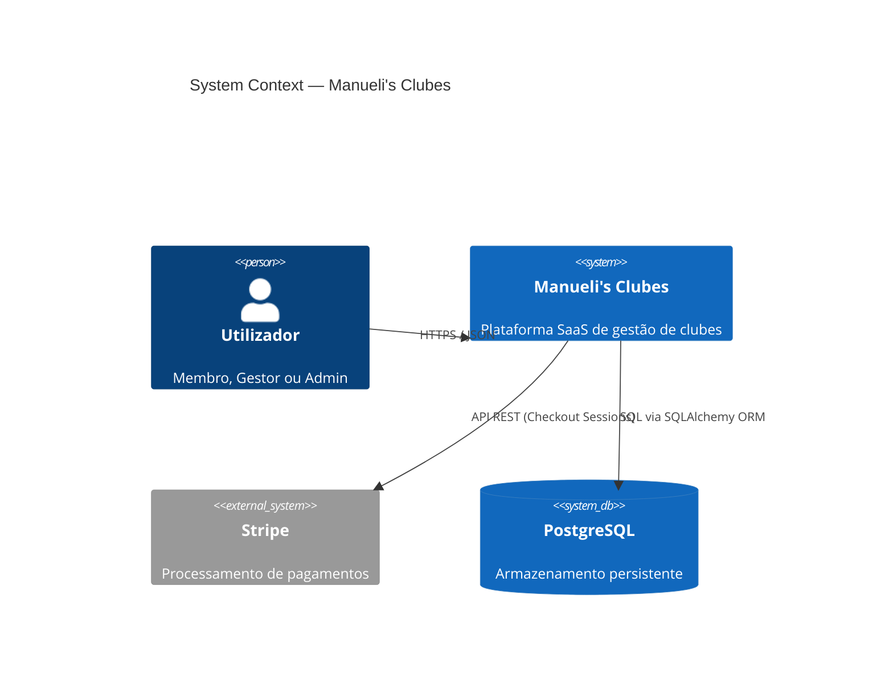
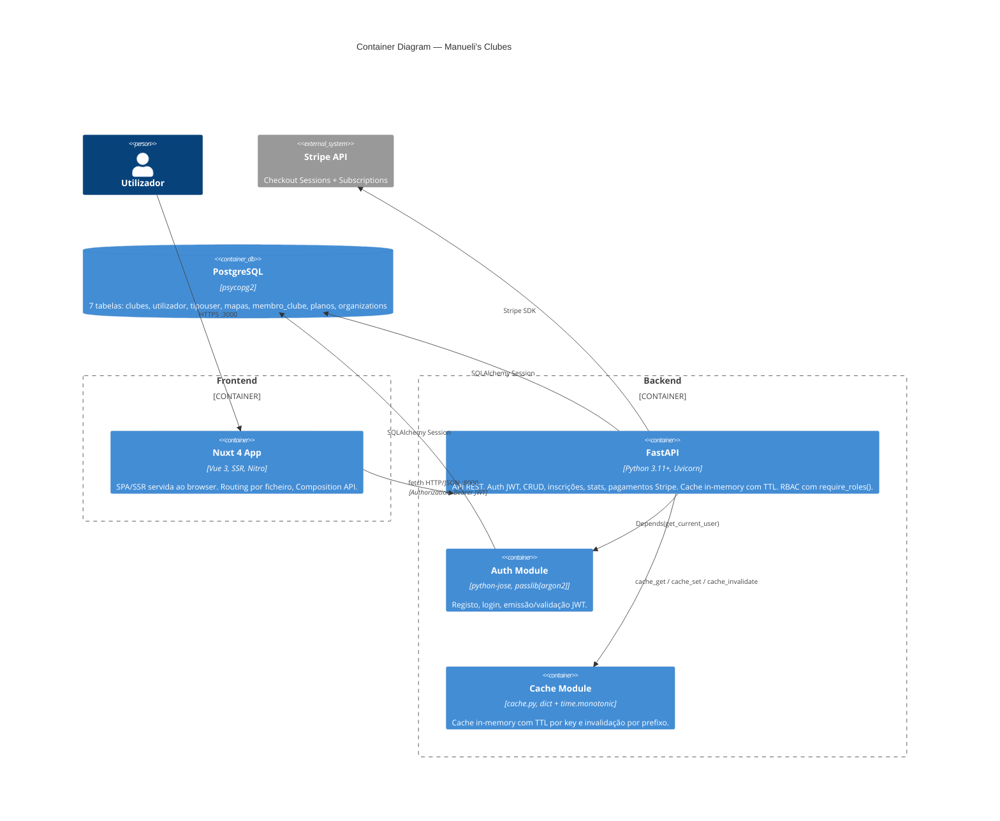
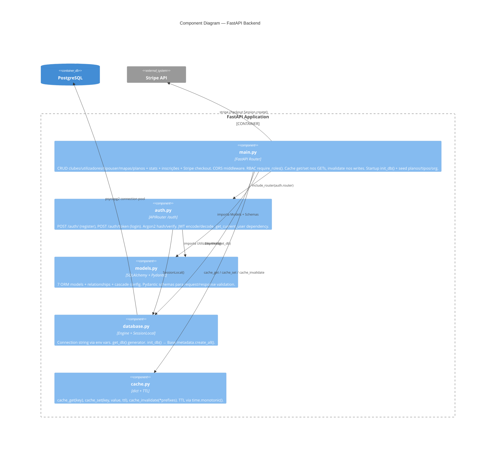
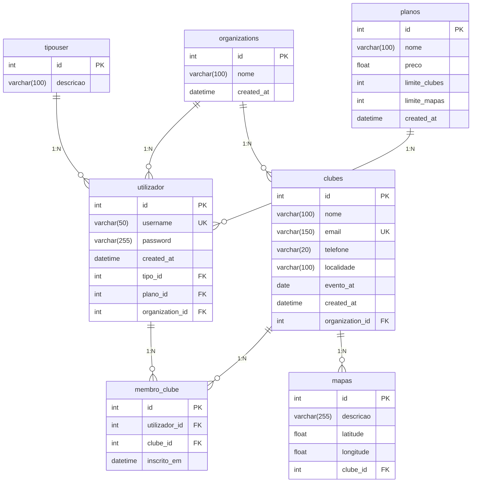
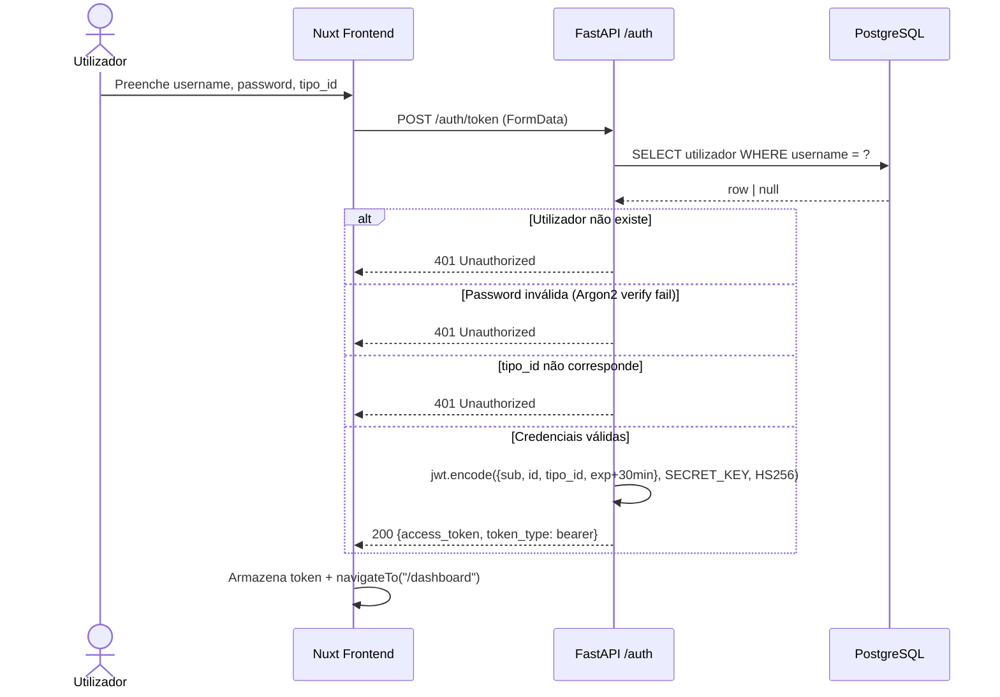
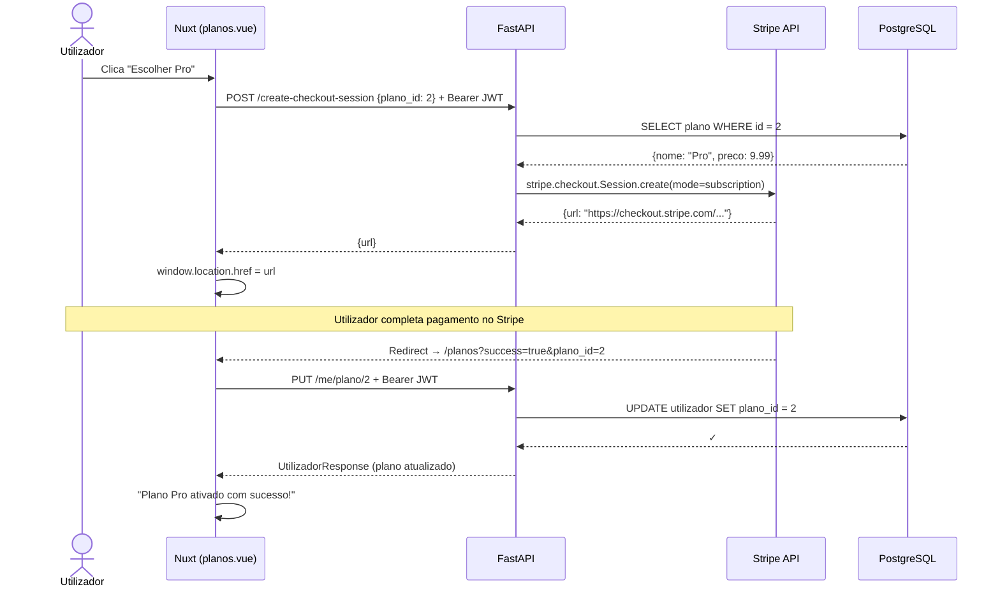
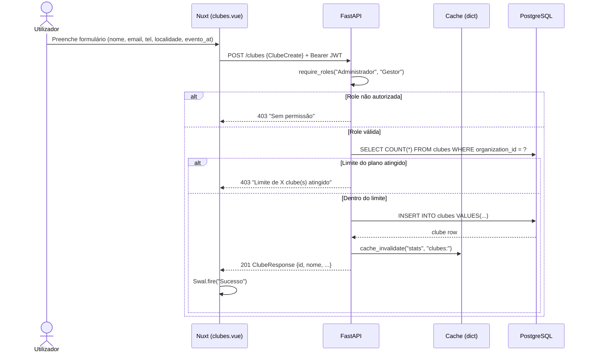
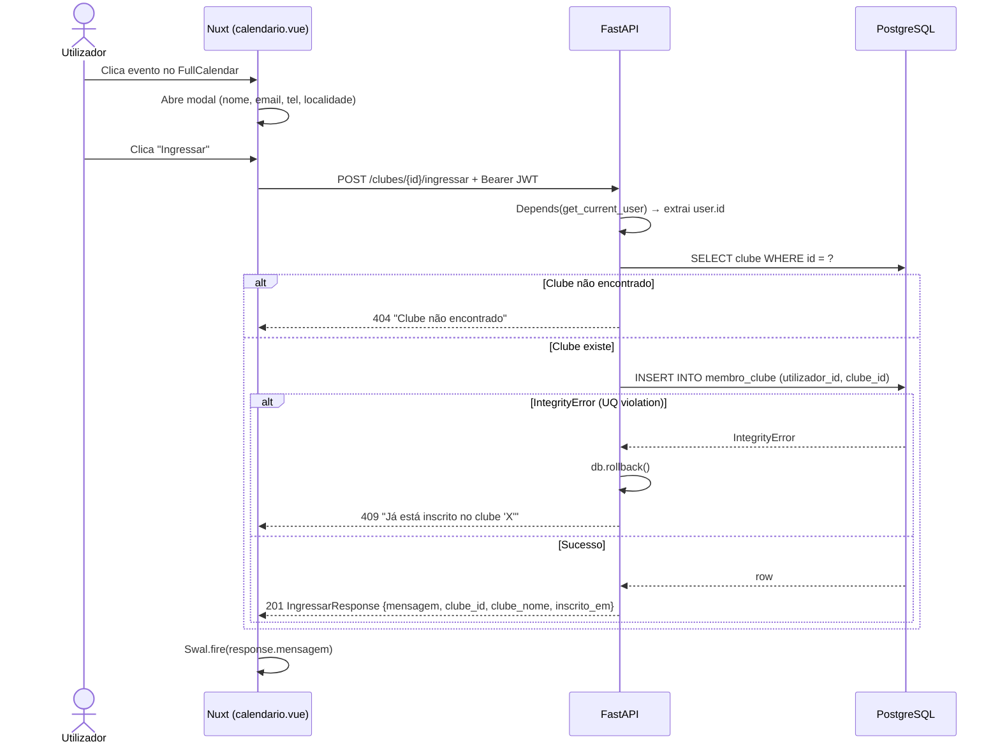
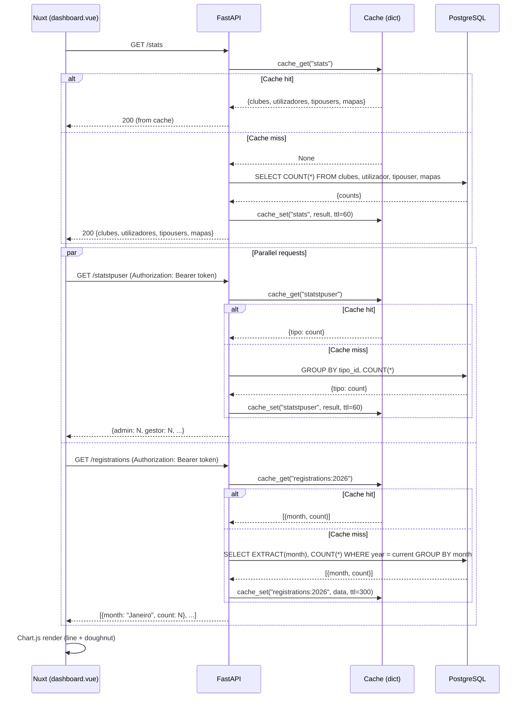

<div align="center">

# ✦ Manueli's Clubes

### Plataforma SaaS full-stack de gestão de clubes com pagamentos Stripe, multi-tenancy e RBAC

*Criar clubes · Gerir membros · Calendário de eventos · Mapa interativo · Planos de subscrição*


<p>
  
  
  
  
  
  
  
  
  
</p>

</div>

---

## Porquê este projeto?

> A maioria dos projetos de portfólio mostra um CRUD genérico.  
> Este vai **muito além** — é uma plataforma SaaS multi-tenant com pagamentos reais, RBAC, cache inteligente e 35 testes automatizados.

| Métrica | Valor |
|---------|-------|
| Endpoints REST | **27+** (auth, CRUD, stats, pagamentos, perfil) |
| Testes automatizados | **35/35 passed** (pytest + httpx) |
| Segurança | JWT + Argon2id + RBAC (3 roles) |
| Pagamentos | Stripe Checkout (subscrições recorrentes) |
| Multi-tenancy | Isolamento de dados por organização |
| Dashboard | KPIs em tempo real + Chart.js (line + doughnut) |
| Mapa interativo | Leaflet.js com marcadores GPS dos clubes |
| Calendário | FullCalendar com inscrição em eventos (409 anti-duplicação) |
| Performance | Cache in-memory com TTL + invalidação por prefixo |
| Infraestrutura | Docker Compose (3 containers: DB + API + Frontend) |

---

## Funcionalidades

### Dashboard — KPIs e Gráficos em Tempo Real

Painel de administração com cards de métricas (clubes, utilizadores, mapas), gráfico de linha (registos mensais) e doughnut (distribuição por tipo de utilizador) — tudo alimentado pela API com cache.


---

### Gestão de Clubes — CRUD com RBAC e Multi-Tenancy

Tabela interativa com criação, edição inline e eliminação. **Permissões por role** (Admin vê tudo via `/clubesAdmin`, Gestor pode criar/editar na sua organização). Limites de criação enforced pelo plano ativo do utilizador. SweetAlert2 para confirmações.

---

### Planos & Pagamentos — Stripe Checkout

Página de subscrição com 3 tiers (Free · Pro · Enterprise). Pagamento via **Stripe Checkout** com subscrições recorrentes. Após pagamento, o plano é ativado automaticamente e os limites de clubes/mapas são atualizados em tempo real.

| Plano | Preço | Clubes | Mapas |
|-------|-------|--------|-------|
| Free | 0 €/mês | 3 | 1 |
| Pro | 9.99 €/mês | 15 | 20 |
| Enterprise | 29.99 €/mês | ∞ | ∞ |

---

### Mapa Interativo — Leaflet.js

Mapa dark-themed com marcadores dos clubes, painel lateral com lista de pontos e formulário para adicionar novas localizações por coordenadas GPS.


---

### Calendário de Eventos — FullCalendar

Calendário mensal com eventos dos clubes em cores diferentes. Clicar num evento abre um painel com detalhes e botão "Ingressar" — inscrição com proteção de duplicação (HTTP 409).

---

### Autenticação — JWT + Argon2 + RBAC

Login com username, password e seleção de tipo de utilizador. Passwords hashed com Argon2id. Token JWT (30 min) no header `Authorization: Bearer`. **3 roles com permissões granulares:**

| Role | Permissões |
|------|-----------|
| Administrador | CRUD completo, gestão de utilizadores, ver todas as organizações |
| Gestor | Criar/editar clubes e mapas na sua organização |
| Cliente | Visualizar, ingressar em clubes |


---

### Landing Page e About Us

Página inicial com hero section, call-to-action e barra de estatísticas em tempo real (total de clubes, utilizadores, mapas). Página "Sobre nós" com missão, valores e equipa.

---

## Quick Start

```bash
# 1. Clonar
git clone https://github.com/<user>/Manueli-s-Clubes.git
cd Manueli-s-Clubes

# 2. Configurar variáveis de ambiente
#    → .env (raiz): DB_USER, DB_PASSWORD, DB_NAME
#    → api/.env:   MYSQL_HOST, MYSQL_PORT, MYSQL_USER, MYSQL_PASSWORD,
#                  MYSQL_DATABASE, SECRET_KEY, ALGORITHM, STRIPE_SECRET_KEY

# 3. Lançar tudo
docker compose up --build
```

| Serviço    | URL                          |
|------------|------------------------------|
| Frontend   | http://localhost:3000         |
| API (Swagger) | http://localhost:8000/docs |
| PostgreSQL | localhost:5432               |

---

## Testes — 35/35 Passed

```bash
cd api && pytest tests/ -v --tb=short
```

```
tests/test_auth.py         ✅ 5 passed   (registo, login, token, password errada, rota protegida)
tests/test_clubes.py       ✅ 8 passed   (CRUD + inscrição + duplicação 409 + 404)
tests/test_utilizadores.py ✅ 4 passed   (list, update, delete, 404)
tests/test_tipouser.py     ✅ 6 passed   (CRUD + 404)
tests/test_mapas.py        ✅ 7 passed   (CRUD + clube inexistente + 404)
tests/test_stats.py        ✅ 5 passed   (stats, statstpuser, registrations, auth guard)
```

---

## 🛠️ Tech Stack

| Camada     | Tecnologia                         | Versão    |
|------------|------------------------------------|-----------| 
| Runtime    | Python                             | 3.11      |
| API        | FastAPI + Uvicorn                  | 0.115.6   |
| ORM        | SQLAlchemy                         | 2.0.36    |
| DB         | PostgreSQL (psycopg2)              | 15+       |
| Auth       | python-jose (JWT) + Argon2         | —         |
| Payments   | Stripe API (Checkout + subscrições)| 8.4.0     |
| Cache      | In-memory dict (TTL + invalidação) | —         |
| Frontend   | Nuxt 4 (Vue 3, SSR)               | 4.3.x     |
| UI         | Bootstrap 5, SweetAlert2           | —         |
| Viz        | Chart.js, Leaflet.js, FullCalendar | —         |
| Container  | Docker + Docker Compose            | —         |

---

## Estrutura do Projeto

```
-Manueli-s-Clubes/
├── docker-compose.yml               # Orquestração: db + api + frontend
├── package.json                     # deps globais (Bootstrap, Chart.js, Leaflet)
│
├── api/                             # Backend (FastAPI)
│   ├── Dockerfile                   # python:3.11-slim → uvicorn :8000
│   ├── app/
│   │   ├── main.py                  # CRUD, stats, inscrições, pagamentos, cache, RBAC
│   │   ├── auth.py                  # JWT + Argon2 + get_current_user
│   │   ├── models.py               # 7 ORM models + Pydantic schemas
│   │   ├── database.py             # PostgreSQL connection
│   │   ├── cache.py                # TTL + invalidação por prefixo
│   │   └── requirements.txt
│   └── tests/                       # 35 testes (pytest + httpx)
│
└── nuxt-app/                        # Frontend (Nuxt 4)
    ├── Dockerfile                   # node:20 → :3000
    ├── pages/
    │   ├── index.vue                # Landing — stats públicas
    │   ├── login.vue                # Auth
    │   ├── dashboard.vue            # KPIs + Chart.js
    │   ├── clubes.vue               # CRUD table (scoped por organização)
    │   ├── mapas.vue                # Leaflet map
    │   ├── calendario.vue           # FullCalendar + inscrição
    │   ├── planos.vue               # Subscrições Stripe (Free/Pro/Enterprise)
    │   └── aboutus.vue              # Sobre nós
    └── components/
        ├── Header.vue               # Header global
        └── Navbar.vue               # Nav sidebar
```

---

<!-- ═══════════════════════════════════════════════════════════ -->
<!-- DEEP DIVE — Secções técnicas em detalhes colapsáveis       -->
<!-- ═══════════════════════════════════════════════════════════ -->

<details>
<summary><strong>Arquitetura — Diagramas C4</strong></summary>

### Nível 1 — Contexto do Sistema



### Nível 2 — Containers



### Nível 3 — Componentes (API)



</details>

<details>
<summary><strong>Modelo de Dados (ER)</strong></summary>



> **Constraints:** `UniqueConstraint("utilizador_id", "clube_id")` em `membro_clube` — impede inscrição duplicada a nível de BD. `unique=True` em `utilizador.username` e `clubes.email`.

</details>

<details>
<summary><strong>Cache — Estratégia de TTL e Invalidação</strong></summary>

O sistema usa cache in-memory (`cache.py`) com TTL por key e invalidação automática por prefixo em operações de escrita.

### Módulo `cache.py`

```python
import time
from typing import Any

_cache: dict[str, tuple[float, Any]] = {}

def cache_get(key: str) -> Any | None:
    entry = _cache.get(key)
    if entry is None:
        return None
    expires_at, value = entry
    if time.monotonic() > expires_at:
        del _cache[key]
        return None
    return value

def cache_set(key: str, value: Any, ttl: int) -> None:
    _cache[key] = (time.monotonic() + ttl, value)

def cache_invalidate(*prefixes: str) -> None:
    keys_to_delete = [k for k in _cache if any(k.startswith(p) for p in prefixes)]
    for k in keys_to_delete:
        del _cache[k]
```

### Tabela de TTL e Invalidação

| Endpoint GET          | Cache Key              | TTL    | Invalidado por                           |
|-----------------------|------------------------|--------|------------------------------------------|
| `GET /stats`          | `stats`                | 60 s   | POST/PUT/DELETE clubes, utilizadores, mapas, tipouser |
| `GET /statstpuser`    | `statstpuser`          | 60 s   | POST/PUT/DELETE utilizadores, tipouser   |
| `GET /registrations`  | `registrations:{year}` | 300 s  | DELETE/PUT utilizadores                  |
| `GET /clubes`         | `clubes:org:{id}:list` | 30 s   | POST/PUT/DELETE clubes                   |
| `GET /clubesAdmin`    | `clubes:admin:list`    | 30 s   | POST/PUT/DELETE clubes                   |
| `GET /tipouser`       | `tipouser:list`        | 120 s  | POST/PUT/DELETE tipouser                 |
| `GET /mapas`          | `mapas:list`           | 60 s   | POST/PUT/DELETE mapas                    |
| `GET /planos`         | `planos:list`          | 120 s  | POST/PUT/DELETE planos                   |
| `GET /utilizadores`   | `utilizadores:list`    | 30 s   | PUT /me/plano, DELETE utilizadores       |

</details>

<details>
<summary><strong>Endpoints da API</strong></summary>

### Auth (`/auth`)

| Método | Rota           | Body / Params                              | Response          | Auth |
|--------|----------------|--------------------------------------------|-------------------|------|
| POST   | `/auth/`       | `{username, password, tipo_id}`            | `201` message     | —    |
| POST   | `/auth/token`  | FormData: `username, password, tipo_id`    | `{access_token, token_type}` | — |

### Perfil (`/me`)

| Método | Rota              | Body / Params | Response            | Auth | Status Codes |
|--------|--------------------|---------------|---------------------|------|--------------|
| GET    | `/me`              | —             | `UtilizadorResponse`| JWT  | 200          |
| PUT    | `/me/plano/{id}`   | —             | `UtilizadorResponse`| JWT  | 200, 404     |

### Clubes (`/clubes`)

| Método | Rota                     | Body / Params       | Response            | Auth         | Status Codes     | Cache                              |
|--------|--------------------------|---------------------|---------------------|--------------|------------------|-------------------------------------|
| POST   | `/clubes`                | `ClubeCreate`       | `ClubeResponse`     | Admin/Gestor | 201, 403, 409    | invalidate `stats`, `clubes:`       |
| GET    | `/clubes`                | —                   | `[ClubeResponse]`   | JWT          | 200              | `clubes:org:{id}:list` TTL 30 s     |
| GET    | `/clubesAdmin`           | —                   | `[ClubeResponse]`   | Admin        | 200              | `clubes:admin:list` TTL 30 s        |
| PUT    | `/clubes/{id}`           | `ClubeCreate`       | `ClubeResponse`     | Admin/Gestor | 200, 404         | invalidate `stats`, `clubes:`       |
| DELETE | `/clubes/{id}`           | —                   | —                   | Admin        | 204, 404         | invalidate `stats`, `clubes:`       |
| POST   | `/clubes/{id}/ingressar` | —                   | `IngressarResponse` | JWT          | 201, 404, 409    | —                                   |

### Utilizadores (`/utilizadores`)

| Método | Rota                  | Body / Params       | Response               | Auth  | Status Codes | Cache                                        |
|--------|-----------------------|---------------------|------------------------|-------|--------------|----------------------------------------------|
| GET    | `/utilizadores`       | —                   | `[UtilizadorResponse]` | Admin | 200          | `utilizadores:list` TTL 30 s                 |
| PUT    | `/utilizadores/{id}`  | `UtilizadorCreate`  | `UtilizadorResponse`   | Admin | 200, 404     | invalidate `stats`, `statstpuser`            |
| DELETE | `/utilizadores/{id}`  | —                   | —                      | Admin | 204, 404     | invalidate `stats`, `statstpuser`, `registrations:` |

### Tipos de Utilizador (`/tipouser`)

| Método | Rota              | Body / Params    | Response             | Auth | Status Codes | Cache                                         |
|--------|--------------------|------------------|----------------------|------|--------------|-----------------------------------------------|
| POST   | `/tipouser`        | `TipoUserCreate` | `TipoUserResponse`  | JWT  | 200          | invalidate `stats`, `statstpuser`, `tipouser:` |
| GET    | `/tipouser`        | —                | `[TipoUserResponse]` | —    | 200          | `tipouser:list` TTL 120 s                     |
| PUT    | `/tipouser/{id}`   | `TipoUserCreate` | `TipoUserResponse`  | JWT  | 200, 404     | invalidate `stats`, `statstpuser`, `tipouser:` |
| DELETE | `/tipouser/{id}`   | —                | —                    | JWT  | 204, 404     | invalidate `stats`, `statstpuser`, `tipouser:` |

### Mapas (`/mapas`)

| Método | Rota           | Body / Params | Response          | Auth         | Status Codes | Cache                          |
|--------|----------------|---------------|-------------------|--------------|--------------|--------------------------------|
| POST   | `/mapas`       | `MapaCreate`  | `MapaResponse`    | Admin/Gestor | 200, 404     | invalidate `stats`, `mapas:`   |
| GET    | `/mapas`       | —             | `[MapaResponse]`  | JWT          | 200          | `mapas:list` TTL 60 s          |
| PUT    | `/mapas/{id}`  | `MapaCreate`  | `MapaResponse`    | Admin/Gestor | 200, 404     | invalidate `stats`, `mapas:`   |
| DELETE | `/mapas/{id}`  | —             | message           | Admin/Gestor | 200, 404     | invalidate `stats`, `mapas:`   |

### Planos (`/planos`)

| Método | Rota           | Body / Params | Response           | Auth | Status Codes | Cache                  |
|--------|----------------|---------------|--------------------|------|--------------|------------------------|
| GET    | `/planos`      | —             | `[PlanoResponse]`  | —    | 200          | `planos:list` TTL 120 s|
| POST   | `/planos`      | `PlanoCreate` | `PlanoResponse`    | JWT  | 201          | invalidate `planos:`   |
| PUT    | `/planos/{id}` | `PlanoCreate` | `PlanoResponse`    | JWT  | 200, 404     | invalidate `planos:`   |
| DELETE | `/planos/{id}` | —             | —                  | JWT  | 204, 404     | invalidate `planos:`   |

### Organizations (`/organizations`)

| Método | Rota              | Body / Params | Response  | Auth  | Status Codes |
|--------|--------------------|---------------|-----------|-------|--------------|
| POST   | `/organizations`   | `nome`        | Org data  | Admin | 201          |
| GET    | `/organizations`   | —             | `[Org]`   | Admin | 200          |

### Pagamentos (Stripe)

| Método | Rota                      | Body / Params    | Response     | Auth | Status Codes     |
|--------|---------------------------|------------------|--------------|------|------------------|
| POST   | `/create-checkout-session` | `{plano_id}`    | `{url}`      | JWT  | 200, 400, 404, 502 |

### Estatísticas

| Método | Rota             | Response                                        | Auth | Cache                          |
|--------|-------------------|-------------------------------------------------|------|--------------------------------|
| GET    | `/stats`          | `{clubes, utilizadores, tipousers, mapas}`      | —    | `stats` TTL 60 s               |
| GET    | `/statstpuser`    | `{tipo_descricao: count, ...}`                  | JWT  | `statstpuser` TTL 60 s         |
| GET    | `/registrations`  | `[{month: str, count: int}]` (12 meses)        | JWT  | `registrations:{year}` TTL 300 s |

</details>

<details>
<summary><strong>Pydantic Schemas (Contratos)</strong></summary>

```python
# ──── Request ────
class ClubeCreate(BaseModel):
    nome: str
    email: str | None = None
    telefone: str | None = None
    localidade: str | None = None
    evento_at: Optional[date] = None

class UtilizadorCreate(BaseModel):
    username: str
    password: str
    tipo_id: int

class TipoUserCreate(BaseModel):
    descricao: str

class MapaCreate(BaseModel):
    descricao: str | None = None
    latitude: float
    longitude: float
    clube_id: int

class PlanoCreate(BaseModel):         
    nome: str
    preco: float = 0.0
    limite_clubes: int = -1
    limite_mapas: int = -1

class CheckoutRequest(BaseModel):     
    plano_id: int

# ──── Response ────
class ClubeResponse(ClubeCreate):
    id: int
    organization_id: int              # multi-tenancy

class UtilizadorResponse(BaseModel):
    id: int
    username: str
    tipo: TipoUserResponse
    plano: PlanoResponse | None      
    organization: OrganizationResponse | None  
    created_at: datetime

class PlanoResponse(BaseModel):      
    id: int
    nome: str | None
    preco: float
    limite_clubes: int
    limite_mapas: int

class OrganizationResponse(BaseModel): 
    id: int
    nome: str
    created_at: datetime | None

class MapaResponse(BaseModel):
    id: int
    descricao: str | None = None
    latitude: float
    longitude: float
    clube_id: int

class IngressarResponse(BaseModel):
    mensagem:    str
    clube_id:    int
    clube_nome:  str
    inscrito_em: datetime
```

</details>

<details>
<summary><strong>Sequence Diagrams</strong></summary>

### Autenticação (Login + Acesso Protegido)



### Stripe Checkout — Subscrição de Plano



### CRUD — Criar Clube (com RBAC + limites de plano)



### Inscrição em Clube (via Calendário)



### Dashboard — Carregamento de Estatísticas (com cache)



</details>

<details>
<summary><strong>Testes — Código Completo</strong></summary>

### Estrutura

```
api/tests/
├── conftest.py          # Fixtures: TestClient, BD em memória, token helper
├── test_auth.py         # Registo, login, token inválido
├── test_clubes.py       # CRUD clubes + inscrição + duplicação
├── test_utilizadores.py # CRUD utilizadores
├── test_tipouser.py     # CRUD tipos
├── test_mapas.py        # CRUD mapas
└── test_stats.py        # Endpoints de estatísticas
```

### `conftest.py`

```python
import os
os.environ["SECRET_KEY"] = "test-secret-key-do-not-use-in-production"
os.environ["ALGORITHM"] = "HS256"
os.environ.setdefault("MYSQL_HOST", "localhost")
os.environ.setdefault("MYSQL_PORT", "5432")
os.environ.setdefault("MYSQL_USER", "test")
os.environ.setdefault("MYSQL_PASSWORD", "test")
os.environ.setdefault("MYSQL_DATABASE", "test_db")

import pytest
from fastapi.testclient import TestClient
from sqlalchemy import create_engine
from sqlalchemy.orm import sessionmaker
from database import Base, get_db
import auth, database

database.init_db = lambda: None

from main import app
from models import TipoUserModel

import main as _main_module
_main_module.init_db = lambda: None

SQLALCHEMY_TEST_URL = "sqlite:///./test.db"
engine = create_engine(SQLALCHEMY_TEST_URL, connect_args={"check_same_thread": False})
TestSession = sessionmaker(autocommit=False, autoflush=False, bind=engine)

@pytest.fixture(autouse=True)
def setup_db():
    Base.metadata.create_all(bind=engine)
    yield
    Base.metadata.drop_all(bind=engine)

@pytest.fixture()
def db():
    session = TestSession()
    try:
        yield session
    finally:
        session.close()

@pytest.fixture()
def client(db):
    def override_get_db():
        yield db
    app.dependency_overrides[get_db] = override_get_db
    app.dependency_overrides[auth.get_db] = override_get_db
    with TestClient(app) as c:
        yield c
    app.dependency_overrides.clear()

def _seed_tipo(db, descricao="admin"):
    tipo = TipoUserModel(descricao=descricao)
    db.add(tipo)
    db.commit()
    db.refresh(tipo)
    return tipo

@pytest.fixture()
def tipo(db):
    return _seed_tipo(db)

@pytest.fixture()
def auth_headers(client, db):
    tipo = _seed_tipo(db)
    client.post("/auth/", json={"username": "testuser", "password": "Str0ng!Pass", "tipo_id": tipo.id})
    resp = client.post("/auth/token", data={"username": "testuser", "password": "Str0ng!Pass", "tipo_id": str(tipo.id)})
    token = resp.json()["access_token"]
    return {"Authorization": f"Bearer {token}"}
```

### `test_auth.py`

```python
from tests.conftest import _seed_tipo

def test_register_success(client, db):
    _seed_tipo(db)
    resp = client.post("/auth/", json={"username": "newuser", "password": "Str0ng!Pass", "tipo_id": 1})
    assert resp.status_code == 201

def test_register_duplicate_username(client, db):
    _seed_tipo(db)
    client.post("/auth/", json={"username": "dup", "password": "Pass1!abc", "tipo_id": 1})
    resp = client.post("/auth/", json={"username": "dup", "password": "Pass2!abc", "tipo_id": 1})
    assert resp.status_code == 400

def test_login_returns_jwt(client, db):
    _seed_tipo(db)
    client.post("/auth/", json={"username": "testuser", "password": "Str0ng!Pass", "tipo_id": 1})
    resp = client.post("/auth/token", data={"username": "testuser", "password": "Str0ng!Pass", "tipo_id": "1"})
    assert resp.status_code == 200
    assert "access_token" in resp.json()

def test_login_wrong_password(client, db):
    _seed_tipo(db)
    client.post("/auth/", json={"username": "testuser", "password": "Str0ng!Pass", "tipo_id": 1})
    resp = client.post("/auth/token", data={"username": "testuser", "password": "wrong", "tipo_id": "1"})
    assert resp.status_code == 401

def test_protected_route_without_token(client):
    resp = client.get("/clubes")
    assert resp.status_code == 401
```

### `test_clubes.py`

```python
def test_create_clube(client, auth_headers):
    resp = client.post("/clubes", json={"nome": "Clube Teste", "email": "teste@clube.pt", "telefone": "912345678", "localidade": "Lisboa", "evento_at": "2026-06-15"}, headers=auth_headers)
    assert resp.status_code == 200
    assert resp.json()["nome"] == "Clube Teste"

def test_list_clubes(client, auth_headers):
    client.post("/clubes", json={"nome": "C1"}, headers=auth_headers)
    client.post("/clubes", json={"nome": "C2"}, headers=auth_headers)
    resp = client.get("/clubes", headers=auth_headers)
    assert len(resp.json()) == 2

def test_update_clube(client, auth_headers):
    create = client.post("/clubes", json={"nome": "Old"}, headers=auth_headers)
    resp = client.put(f"/clubes/{create.json()['id']}", json={"nome": "New"}, headers=auth_headers)
    assert resp.json()["nome"] == "New"

def test_delete_clube(client, auth_headers):
    create = client.post("/clubes", json={"nome": "ToDelete"}, headers=auth_headers)
    resp = client.delete(f"/clubes/{create.json()['id']}", headers=auth_headers)
    assert resp.status_code == 204

def test_delete_clube_404(client, auth_headers):
    assert client.delete("/clubes/9999", headers=auth_headers).status_code == 404

def test_ingressar_clube(client, auth_headers):
    create = client.post("/clubes", json={"nome": "Ingresso"}, headers=auth_headers)
    resp = client.post(f"/clubes/{create.json()['id']}/ingressar", headers=auth_headers)
    assert resp.status_code == 201

def test_ingressar_duplicate_409(client, auth_headers):
    create = client.post("/clubes", json={"nome": "Dup"}, headers=auth_headers)
    cid = create.json()["id"]
    client.post(f"/clubes/{cid}/ingressar", headers=auth_headers)
    assert client.post(f"/clubes/{cid}/ingressar", headers=auth_headers).status_code == 409

def test_ingressar_clube_inexistente_404(client, auth_headers):
    assert client.post("/clubes/9999/ingressar", headers=auth_headers).status_code == 404
```

### Cobertura

```bash
pytest tests/ --cov=. --cov-report=term-missing
```

| Módulo       | Cobertura Alvo |
|--------------|----------------|
| `auth.py`    | ≥ 90%          |
| `main.py`    | ≥ 85%          |
| `models.py`  | ≥ 95%          |
| `database.py`| ≥ 80%          |
| `cache.py`   | ≥ 90%          |

</details>

<details>
<summary><strong>Architecture Decision Records (ADR)</strong></summary>

### ADR-001: FastAPI em vez de Django REST / Flask

**Status:** Aceite  
**Decisão:** FastAPI com Pydantic + SQLAlchemy — documentação OpenAPI automática, validação nativa, DI com `Depends()`, performance ASGI.

### ADR-002: Argon2 em vez de bcrypt

**Status:** Aceite  
**Decisão:** Argon2id via `passlib[argon2]` — vencedor da Password Hashing Competition, resistente a GPU/ASIC, parâmetros configuráveis.

### ADR-003: JWT via Bearer token

**Status:** Aceite  
**Decisão:** JWT no header `Authorization: Bearer <token>`. Login devolve `{access_token, token_type}`, frontend gere armazenamento. Stateless, compatível com `OAuth2PasswordBearer` do FastAPI.

### ADR-004: UniqueConstraint em membro_clube

**Status:** Aceite  
**Decisão:** `UniqueConstraint("utilizador_id", "clube_id")` a nível de BD + catch `IntegrityError` → HTTP 409. Impossível bypass via SQL direto ou race conditions.

### ADR-005: SSR (Nuxt) com `<ClientOnly>`

**Status:** Aceite  
**Decisão:** SSR por default para SEO. FullCalendar e Leaflet renderizados apenas client-side via `<ClientOnly>` com skeleton fallback.

### ADR-006: CORS wildcard em dev

**Status:** Aceite  
**Decisão:** `allow_origins=["*"]` com `allow_credentials=False` em dev (Bearer tokens não precisam de cookies). Em produção, restringir ao domínio real.

### ADR-007: Monólito modular

**Status:** Aceite  
**Decisão:** Monorepo com módulos separados (`main.py`, `auth.py`, `models.py`, `database.py`, `cache.py`). Deploy simples, sem overhead de microserviços.

### ADR-008: Cache in-memory com TTL

**Status:** Aceite  
**Decisão:** `dict` Python com `time.monotonic()`. Zero dependências externas, latência ~0 para cache hits, invalidação por prefixo em writes. Redis evitado por overhead operacional desnecessário para single-instance.

### ADR-009: Stripe Checkout para pagamentos

**Status:** Aceite  
**Decisão:** Stripe Checkout Sessions com modo `subscription` para planos recorrentes. Evita complexidade de PCI compliance — toda a UI de pagamento é hosted pelo Stripe. Redirect-based flow com `success_url` e `cancel_url` que inclui `plano_id`.

### ADR-010: Multi-tenancy por organização

**Status:** Aceite  
**Decisão:** Cada utilizador pertence a uma `organization`. Clubes são scoped à organização do utilizador (`ClubeModel.organization_id`). Admins podem ver todos via `/clubesAdmin`. Isolamento via query filter `WHERE organization_id = user.organization_id`.

### ADR-011: RBAC com require_roles()

**Status:** Aceite  
**Decisão:** Middleware `require_roles(*roles)` como FastAPI Dependency. 3 roles: Administrador (CRUD total), Gestor (criar/editar), Cliente (leitura). Enforcement a nível de endpoint, não de frontend.

</details>

<details>
<summary><strong>Docker — Configuração Completa</strong></summary>

### Serviços

| Serviço    | Imagem Base        | Container          | Porta  | Descrição                              |
|------------|--------------------|--------------------|--------|----------------------------------------|
| `db`       | `postgres:15`      | `clubes_db`        | 5432   | PostgreSQL com volume persistente      |
| `api`      | `python:3.11-slim` | `clubes_api`       | 8000   | FastAPI + Uvicorn                      |
| `frontend` | `node:20`          | `clubes_frontend`  | 3000   | Nuxt 4 (build + dev)                   |

### `docker-compose.yml`

```yaml
services:
  db:
    image: postgres:15
    container_name: clubes_db
    restart: always
    environment:
      POSTGRES_USER: ${DB_USER}
      POSTGRES_PASSWORD: ${DB_PASSWORD}
      POSTGRES_DB: ${DB_NAME}
    ports:
      - "5432:5432"
    volumes:
      - postgres_data:/var/lib/postgresql/data

  api:
    build: ./api
    container_name: clubes_api
    ports:
      - "8000:8000"
    env_file:
      - ./api/.env
    environment:
      MYSQL_HOST: host.docker.internal
      MYSQL_PORT: 5432
      MYSQL_USER: ${DB_USER}
      MYSQL_PASSWORD: ${DB_PASSWORD}
      MYSQL_DATABASE: ${DB_NAME}

  frontend:
    build: ./nuxt-app
    container_name: clubes_frontend
    ports:
      - "3000:3000"
    depends_on:
      - api

volumes:
  postgres_data:
```

### Dockerfiles

**API** (`api/Dockerfile`):
```dockerfile
FROM python:3.11-slim
WORKDIR /app
COPY app/ .
RUN pip install -r requirements.txt
CMD ["uvicorn", "main:app", "--host", "0.0.0.0", "--port", "8000"]
```

**Frontend** (`nuxt-app/Dockerfile`):
```dockerfile
FROM node:20
WORKDIR /app
COPY package*.json ./
RUN npm install
COPY . .
RUN npm run build
CMD ["npm", "run", "dev"]
```

### Diagrama de Rede


</details>

<details>
<summary><strong>Setup Local (sem Docker)</strong></summary>

### Variáveis de Ambiente

**`api/.env`** — Backend:
```env
MYSQL_HOST=localhost
MYSQL_PORT=5432
MYSQL_USER=<user>
MYSQL_PASSWORD=<password>
MYSQL_DATABASE=clubes_db
SECRET_KEY=<random-256-bit-hex>
ALGORITHM=HS256
STRIPE_SECRET_KEY=sk_test_...
FRONTEND_URL=http://localhost:3000
```

**`.env`** (raiz) — Docker Compose:
```env
DB_USER=<user>
DB_PASSWORD=<password>
DB_NAME=clubes_db
```

### Backend

```bash
cd api/app
pip install -r requirements.txt
uvicorn main:app --host 0.0.0.0 --port 8000 --workers 4
# → http://localhost:8000/docs (Swagger UI)
```

### Frontend

```bash
cd nuxt-app
npm install
npm run dev
# → http://localhost:3000
```

</details>

---

## Autor

**Manuel Silvestre**
