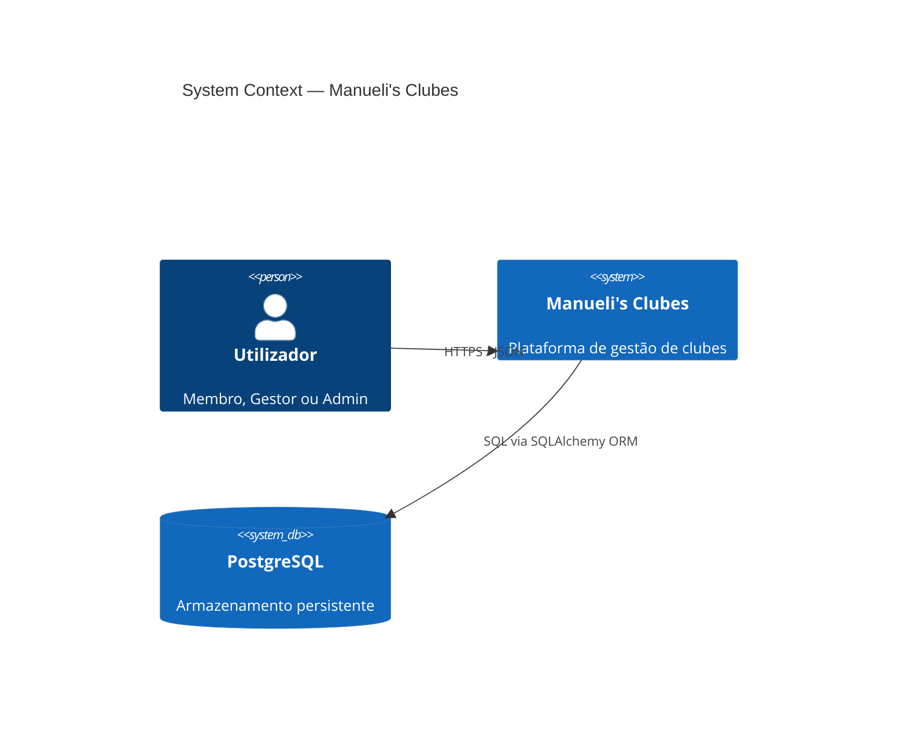
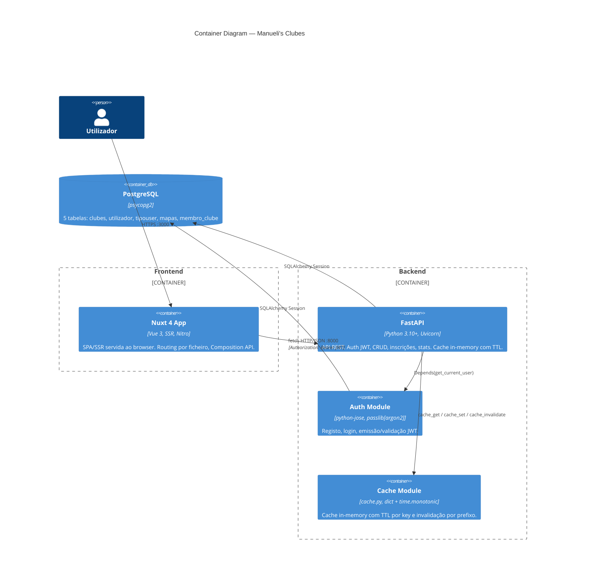
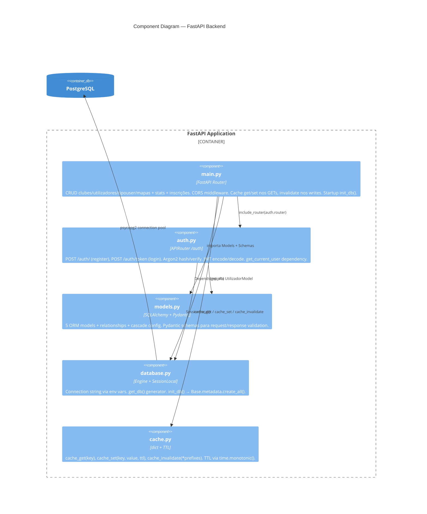
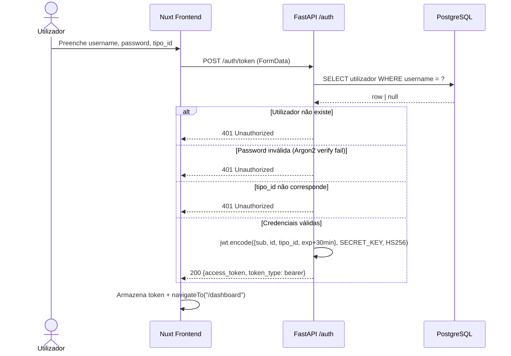
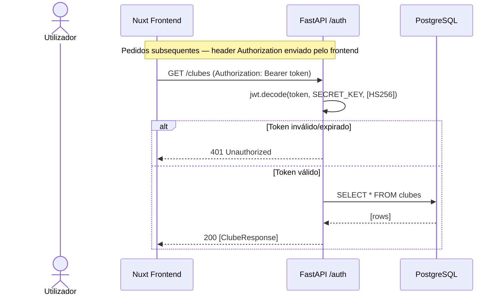
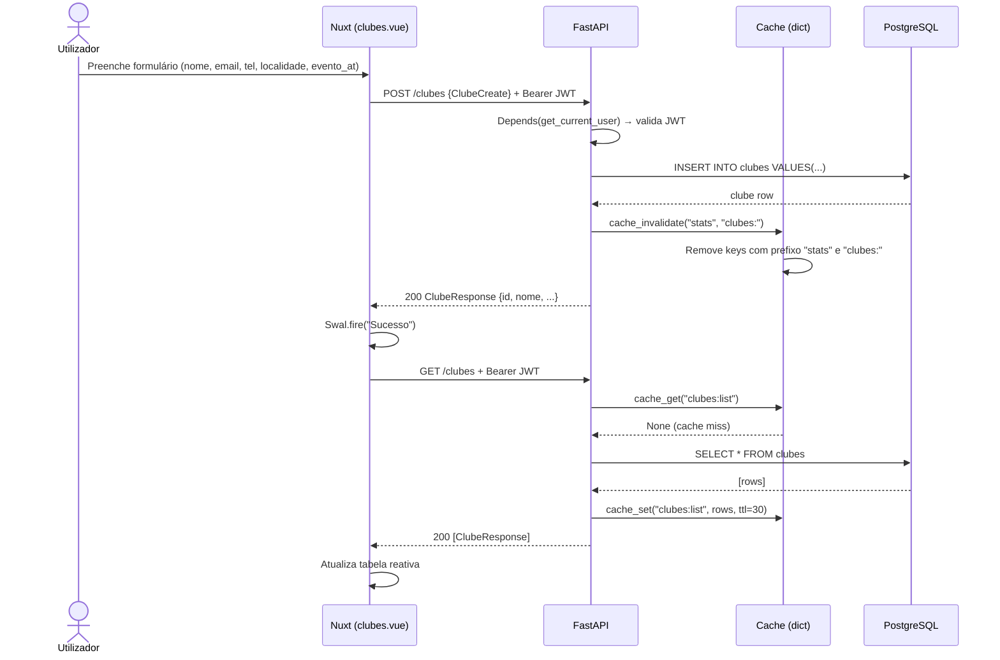
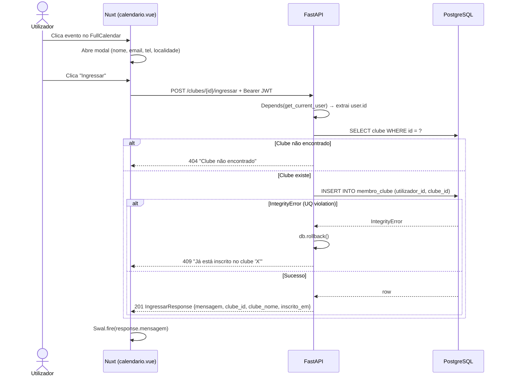
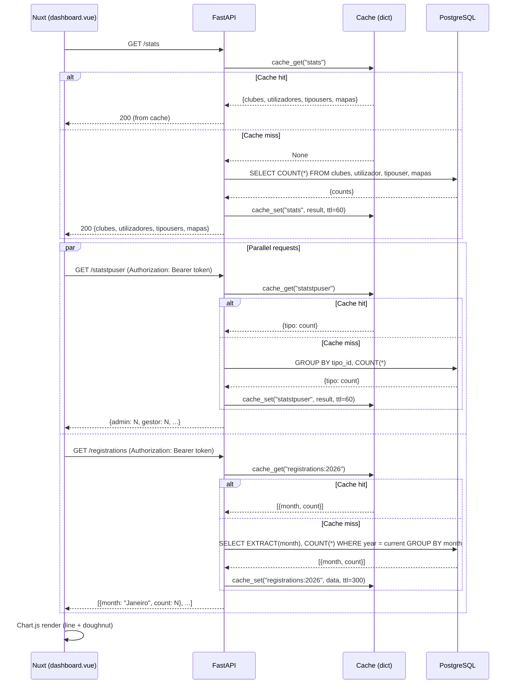
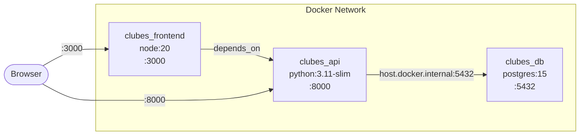

# Manueli's Clubes

Plataforma web full-stack de gestão de clubes — **Nuxt 4** + **FastAPI** + **PostgreSQL**.


## Tech Stack

| Camada     | Tecnologia                         | Versão    |
|------------|------------------------------------|-----------|
| Runtime    | Python                             | 3.11      |
| API        | FastAPI + Uvicorn                  | 0.115.6   |
| ORM        | SQLAlchemy                         | 2.0.36    |
| DB         | PostgreSQL (psycopg2)              | 15+       |
| Auth       | python-jose (JWT) + Argon2         | —         |
| Cache      | In-memory dict (TTL + invalidação) | —         |
| Frontend   | Nuxt 4 (Vue 3, SSR)               | 4.3.x     |
| UI         | Bootstrap 5, SweetAlert2           | —         |
| Viz        | Chart.js, Leaflet.js, FullCalendar | —         |
| Container  | Docker + Docker Compose            | —         |

---

## Arquitetura — Diagramas C4

### Nível 1 — Contexto do Sistema



### Nível 2 — Containers




### Nível 3 — Componentes (API)



---

## Modelo de Dados (ER)

```mermaid
erDiagram
    tipouser ||--o{ utilizador : "1:N"}
    utilizador ||--o{ membro_clube : "1:N"}
    clubes ||--o{ membro_clube : "1:N"}
    clubes ||--o{ mapas : "1:N"}

    tipouser {
        int id PK
        varchar(100) descricao
    }

    utilizador {
        int id PK
        varchar(50) username UK
        varchar(255) password
        datetime created_at
        int tipo_id FK
    }

    clubes {
        int id PK
        varchar(100) nome
        varchar(150) email UK
        varchar(20) telefone
        varchar(100) localidade
        date evento_at
        datetime created_at
    }

    membro_clube {
        int id PK
        int utilizador_id FK
        int clube_id FK
        datetime inscrito_em
    }

    mapas {
        int id PK
        varchar(255) descricao
        float latitude
        float longitude
        int clube_id FK
    }
```

> **Constraint:** `UniqueConstraint("utilizador_id", "clube_id")` em `membro_clube` — impede inscrição duplicada a nível de BD.

---

## Cache — Estratégia de TTL e Invalidação

O sistema usa uma cache in-memory (`cache.py`) com TTL por key e invalidação automática por prefixo em operações de escrita.

### Módulo `cache.py`

```python
import time
from typing import Any

_cache: dict[str, tuple[float, Any]] = {}

def cache_get(key: str) -> Any | None:
    entry = _cache.get(key)
    if entry is None:
        return None
    expires_at, value = entry
    if time.monotonic() > expires_at:
        del _cache[key]
        return None
    return value

def cache_set(key: str, value: Any, ttl: int) -> None:
    _cache[key] = (time.monotonic() + ttl, value)

def cache_invalidate(*prefixes: str) -> None:
    keys_to_delete = [k for k in _cache if any(k.startswith(p) for p in prefixes)]
    for k in keys_to_delete:
        del _cache[k]
```

### Tabela de TTL e Invalidação

| Endpoint GET        | Cache Key              | TTL    | Invalidado por                           |
|---------------------|------------------------|--------|------------------------------------------|
| `GET /stats`        | `stats`                | 60 s   | POST/PUT/DELETE clubes, utilizadores, mapas, tipouser |
| `GET /statstpuser`  | `statstpuser`          | 60 s   | POST/PUT/DELETE utilizadores, tipouser   |
| `GET /registrations`| `registrations:{year}` | 300 s  | DELETE/PUT utilizadores                  |
| `GET /clubes`       | `clubes:list`          | 30 s   | POST/PUT/DELETE clubes                   |
| `GET /tipouser`     | `tipouser:list`        | 120 s  | POST/PUT/DELETE tipouser                 |
| `GET /mapas`        | `mapas:list`           | 60 s   | POST/PUT/DELETE mapas                    |

### Fluxo de Leitura (GET)

```python
# Exemplo: GET /stats
cached = cache_get("stats")
if cached is not None:
    return cached          # responde sem tocar na BD

result = { ... }          # query à BD
cache_set("stats", result, ttl=60)
return result
```

### Fluxo de Escrita (POST/PUT/DELETE)

```python
# Exemplo: POST /clubes — após db.commit()
cache_invalidate("stats", "clubes:")
# Remove todas as keys que começam com "stats" ou "clubes:"
```

---

## Sequence Diagrams

### Autenticação (Login + Acesso Protegido)





### CRUD — Criar Clube (com invalidação de cache)



### Inscrição em Clube (via Calendário)



### Dashboard — Carregamento de Estatísticas (com cache)




---

## Endpoints da API

### Auth (`/auth`)

| Método | Rota           | Body / Params                              | Response          | Auth |
|--------|----------------|--------------------------------------------|-------------------|------|
| POST   | `/auth/`       | `{username, password, tipo_id}`            | `201` message     | —    |
| POST   | `/auth/token`  | FormData: `username, password, tipo_id`    | `{access_token, token_type}` | — |


### Clubes (`/clubes`)

| Método | Rota                     | Body / Params       | Response            | Auth  | Status Codes     | Cache                              |
|--------|--------------------------|---------------------|---------------------|-------|------------------|------------------------------------|
| POST   | `/clubes`                | `ClubeCreate`       | `ClubeResponse`     | JWT   | 200              | invalidate `stats`, `clubes:`      |
| GET    | `/clubes`                | —                   | `[ClubeResponse]`   | JWT   | 200              | `clubes:list` TTL 30 s             |
| PUT    | `/clubes/{id}`           | `ClubeCreate`       | `ClubeResponse`     | JWT   | 200, 404         | invalidate `stats`, `clubes:`      |
| DELETE | `/clubes/{id}`           | —                   | —                   | JWT   | 204, 404         | invalidate `stats`, `clubes:`      |
| POST   | `/clubes/{id}/ingressar` | —                   | `IngressarResponse` | JWT   | 201, 404, 409    | —                                  |


### Utilizadores (`/utilizadores`)

| Método | Rota                  | Body / Params       | Response               | Auth | Status Codes | Cache                                        |
|--------|-----------------------|---------------------|------------------------|------|--------------|----------------------------------------------|
| GET    | `/utilizadores`       | —                   | `[UtilizadorResponse]` | JWT  | 200          | `utilizadores:list` TTL 30 s                 |
| PUT    | `/utilizadores/{id}`  | `UtilizadorCreate`  | `UtilizadorResponse`   | JWT  | 200, 404     | invalidate `stats`, `statstpuser`            |
| DELETE | `/utilizadores/{id}`  | —                   | —                      | JWT  | 204, 404     | invalidate `stats`, `statstpuser`, `registrations:` |

### Tipos de Utilizador (`/tipouser`)

| Método | Rota              | Body / Params    | Response             | Auth | Status Codes | Cache                                         |
|--------|--------------------|------------------|----------------------|------|--------------|-----------------------------------------------|
| POST   | `/tipouser`        | `TipoUserCreate` | `TipoUserResponse`  | JWT  | 200          | invalidate `stats`, `statstpuser`, `tipouser:` |
| GET    | `/tipouser`        | —                | `[TipoUserResponse]` | —    | 200          | `tipouser:list` TTL 120 s                     |
| PUT    | `/tipouser/{id}`   | `TipoUserCreate` | `TipoUserResponse`  | JWT  | 200, 404     | invalidate `stats`, `statstpuser`, `tipouser:` |
| DELETE | `/tipouser/{id}`   | —                | —                    | JWT  | 204, 404     | invalidate `stats`, `statstpuser`, `tipouser:` |

### Mapas (`/mapas`)

| Método | Rota           | Body / Params | Response          | Auth | Status Codes | Cache                          |
|--------|----------------|---------------|-------------------|------|--------------|--------------------------------|
| POST   | `/mapas`       | `MapaCreate`  | `MapaResponse`    | JWT  | 200, 404     | invalidate `stats`, `mapas:`   |
| GET    | `/mapas`       | —             | `[MapaResponse]`  | JWT  | 200          | `mapas:list` TTL 60 s          |
| PUT    | `/mapas/{id}`  | `MapaCreate`  | `MapaResponse`    | JWT  | 200, 404     | invalidate `stats`, `mapas:`   |
| DELETE | `/mapas/{id}`  | —             | message           | JWT  | 200, 404     | invalidate `stats`, `mapas:`   |


### Estatísticas

| Método | Rota             | Response                                        | Auth | Cache                          |
|--------|-------------------|-------------------------------------------------|------|--------------------------------|
| GET    | `/stats`          | `{clubes, utilizadores, tipousers, mapas}`      | —    | `stats` TTL 60 s               |
| GET    | `/statstpuser`    | `{tipo_descricao: count, ...}`                  | JWT  | `statstpuser` TTL 60 s         |
| GET    | `/registrations`  | `[{month: str, count: int}]` (12 meses)        | JWT  | `registrations:{year}` TTL 300 s |


---

## Pydantic Schemas (Contratos)

```python
# Request
class ClubeCreate(BaseModel):
    nome: str
    email: str | None = None
    telefone: str | None = None
    localidade: str | None = None
    evento_at: Optional[date] = None

class UtilizadorCreate(BaseModel):
    username: str
    password: str
    tipo_id: int

class TipoUserCreate(BaseModel):
    descricao: str

class MapaCreate(BaseModel):
    descricao: str | None = None
    latitude: float
    longitude: float
    clube_id: int

# Response
class ClubeResponse(ClubeCreate):        # herda campos + id
    id: int

class UtilizadorResponse(BaseModel):      # inclui nested TipoUserResponse
    id: int
    username: str
    tipo: TipoUserResponse
    created_at: datetime

class MapaResponse(BaseModel):            # resposta de mapa
    id: int
    descricao: str | None = None
    latitude: float
    longitude: float
    clube_id: int

class IngressarResponse(BaseModel):       # resposta de inscrição
    mensagem: str
    clube_id: int
    clube_nome: str
    inscrito_em: datetime
```

---

## Testes

### Estrutura de Testes (pytest + httpx)

```
api/
├── tests/
│   ├── conftest.py          # Fixtures: TestClient, BD em memória, token helper
│   ├── test_auth.py         # Registo, login, token inválido
│   ├── test_clubes.py       # CRUD clubes + inscrição + duplicação
│   ├── test_utilizadores.py # CRUD utilizadores
│   ├── test_tipouser.py     # CRUD tipos
│   ├── test_mapas.py        # CRUD mapas
│   └── test_stats.py        # Endpoints de estatísticas
```

### `conftest.py` — Fixtures

```python
import os
os.environ["SECRET_KEY"] = "test-secret-key-do-not-use-in-production"
os.environ["ALGORITHM"] = "HS256"
os.environ.setdefault("MYSQL_HOST", "localhost")
os.environ.setdefault("MYSQL_PORT", "5432")
os.environ.setdefault("MYSQL_USER", "test")
os.environ.setdefault("MYSQL_PASSWORD", "test")
os.environ.setdefault("MYSQL_DATABASE", "test_db")

import pytest
from fastapi.testclient import TestClient
from sqlalchemy import create_engine
from sqlalchemy.orm import sessionmaker
from database import Base, get_db
import auth, database

database.init_db = lambda: None  # impedir ligação à BD de produção

from main import app
from models import TipoUserModel

import main as _main_module
_main_module.init_db = lambda: None

SQLALCHEMY_TEST_URL = "sqlite:///./test.db"
engine = create_engine(SQLALCHEMY_TEST_URL, connect_args={"check_same_thread": False})
TestSession = sessionmaker(autocommit=False, autoflush=False, bind=engine)


@pytest.fixture(autouse=True)
def setup_db():
    Base.metadata.create_all(bind=engine)
    yield
    Base.metadata.drop_all(bind=engine)


@pytest.fixture()
def db():
    session = TestSession()
    try:
        yield session
    finally:
        session.close()


@pytest.fixture()
def client(db):
    def override_get_db():
        yield db
    app.dependency_overrides[get_db] = override_get_db
    app.dependency_overrides[auth.get_db] = override_get_db
    with TestClient(app) as c:
        yield c
    app.dependency_overrides.clear()


def _seed_tipo(db, descricao="admin"):
    """Insere um TipoUser diretamente na BD."""
    tipo = TipoUserModel(descricao=descricao)
    db.add(tipo)
    db.commit()
    db.refresh(tipo)
    return tipo


@pytest.fixture()
def tipo(db):
    """Fixture que insere um TipoUser 'admin'."""
    return _seed_tipo(db)


@pytest.fixture()
def auth_headers(client, db):
    """Regista utilizador e devolve headers com JWT."""
    tipo = _seed_tipo(db)
    client.post("/auth/", json={
        "username": "testuser",
        "password": "Str0ng!Pass",
        "tipo_id": tipo.id,
    })
    resp = client.post("/auth/token", data={
        "username": "testuser",
        "password": "Str0ng!Pass",
        "tipo_id": str(tipo.id),
    })
    assert resp.status_code == 200, f"Login failed: {resp.text}"
    token = resp.json()["access_token"]
    return {"Authorization": f"Bearer {token}"}
```

### `test_auth.py` — Autenticação

```python
from tests.conftest import _seed_tipo


def test_register_success(client, db):
    _seed_tipo(db)
    resp = client.post("/auth/", json={
        "username": "newuser",
        "password": "Str0ng!Pass",
        "tipo_id": 1,
    })
    assert resp.status_code == 201
    assert resp.json()["message"] == "Utilizador Criado com Sucesso"


def test_register_duplicate_username(client, db):
    _seed_tipo(db)
    client.post("/auth/", json={"username": "dup", "password": "Pass1!abc", "tipo_id": 1})
    resp = client.post("/auth/", json={"username": "dup", "password": "Pass2!abc", "tipo_id": 1})
    assert resp.status_code == 400


def test_login_returns_jwt(client, db):
    _seed_tipo(db)
    client.post("/auth/", json={
        "username": "testuser",
        "password": "Str0ng!Pass",
        "tipo_id": 1,
    })
    resp = client.post("/auth/token", data={
        "username": "testuser",
        "password": "Str0ng!Pass",
        "tipo_id": "1",
    })
    assert resp.status_code == 200
    body = resp.json()
    assert "access_token" in body
    assert body["token_type"] == "bearer"


def test_login_wrong_password(client, db):
    _seed_tipo(db)
    client.post("/auth/", json={
        "username": "testuser",
        "password": "Str0ng!Pass",
        "tipo_id": 1,
    })
    resp = client.post("/auth/token", data={
        "username": "testuser",
        "password": "wrong",
        "tipo_id": "1",
    })
    assert resp.status_code == 401


def test_protected_route_without_token(client):
    resp = client.get("/clubes")
    assert resp.status_code == 401
```

### `test_clubes.py` — CRUD + Inscrição

```python
def test_create_clube(client, auth_headers):
    resp = client.post("/clubes", json={
        "nome": "Clube Teste",
        "email": "teste@clube.pt",
        "telefone": "912345678",
        "localidade": "Lisboa",
        "evento_at": "2026-06-15",
    }, headers=auth_headers)
    assert resp.status_code == 200
    data = resp.json()
    assert data["nome"] == "Clube Teste"
    assert data["id"] is not None


def test_list_clubes(client, auth_headers):
    client.post("/clubes", json={"nome": "C1"}, headers=auth_headers)
    client.post("/clubes", json={"nome": "C2"}, headers=auth_headers)
    resp = client.get("/clubes", headers=auth_headers)
    assert resp.status_code == 200
    assert len(resp.json()) == 2


def test_update_clube(client, auth_headers):
    create = client.post("/clubes", json={"nome": "Old"}, headers=auth_headers)
    cid = create.json()["id"]
    resp = client.put(f"/clubes/{cid}", json={"nome": "New"}, headers=auth_headers)
    assert resp.status_code == 200
    assert resp.json()["nome"] == "New"


def test_delete_clube(client, auth_headers):
    create = client.post("/clubes", json={"nome": "ToDelete"}, headers=auth_headers)
    cid = create.json()["id"]
    resp = client.delete(f"/clubes/{cid}", headers=auth_headers)
    assert resp.status_code == 204


def test_delete_clube_404(client, auth_headers):
    resp = client.delete("/clubes/9999", headers=auth_headers)
    assert resp.status_code == 404


def test_ingressar_clube(client, auth_headers):
    create = client.post("/clubes", json={"nome": "Ingresso"}, headers=auth_headers)
    cid = create.json()["id"]
    resp = client.post(f"/clubes/{cid}/ingressar", headers=auth_headers)
    assert resp.status_code == 201
    data = resp.json()
    assert data["clube_id"] == cid
    assert "inscrito_em" in data


def test_ingressar_duplicate_409(client, auth_headers):
    create = client.post("/clubes", json={"nome": "Dup"}, headers=auth_headers)
    cid = create.json()["id"]
    client.post(f"/clubes/{cid}/ingressar", headers=auth_headers)
    resp = client.post(f"/clubes/{cid}/ingressar", headers=auth_headers)
    assert resp.status_code == 409


def test_ingressar_clube_inexistente_404(client, auth_headers):
    resp = client.post("/clubes/9999/ingressar", headers=auth_headers)
    assert resp.status_code == 404
```

### Executar Testes

```bash
cd api
pip install pytest httpx
pytest tests/ -v --tb=short
```

```
tests/test_auth.py::test_register_success               PASSED
tests/test_auth.py::test_register_duplicate_username     PASSED
tests/test_auth.py::test_login_returns_jwt               PASSED
tests/test_auth.py::test_login_wrong_password            PASSED
tests/test_auth.py::test_protected_route_without_token   PASSED
tests/test_clubes.py::test_create_clube                  PASSED
tests/test_clubes.py::test_list_clubes                   PASSED
tests/test_clubes.py::test_update_clube                  PASSED
tests/test_clubes.py::test_delete_clube                  PASSED
tests/test_clubes.py::test_delete_clube_404              PASSED
tests/test_clubes.py::test_ingressar_clube               PASSED
tests/test_clubes.py::test_ingressar_duplicate_409       PASSED
tests/test_clubes.py::test_ingressar_clube_inexistente_404 PASSED
tests/test_utilizadores.py::test_list_utilizadores       PASSED
tests/test_utilizadores.py::test_update_utilizador       PASSED
tests/test_utilizadores.py::test_delete_utilizador       PASSED
tests/test_utilizadores.py::test_delete_utilizador_404   PASSED
tests/test_tipouser.py::test_create_tipo_user            PASSED
tests/test_tipouser.py::test_list_tipo_user              PASSED
tests/test_tipouser.py::test_update_tipo_user            PASSED
tests/test_tipouser.py::test_update_tipo_user_404        PASSED
tests/test_tipouser.py::test_delete_tipo_user            PASSED
tests/test_tipouser.py::test_delete_tipo_user_404        PASSED
tests/test_mapas.py::test_create_mapa                    PASSED
tests/test_mapas.py::test_create_mapa_clube_inexistente  PASSED
tests/test_mapas.py::test_list_mapas                     PASSED
tests/test_mapas.py::test_update_mapa                    PASSED
tests/test_mapas.py::test_update_mapa_404                PASSED
tests/test_mapas.py::test_delete_mapa                    PASSED
tests/test_mapas.py::test_delete_mapa_404                PASSED
tests/test_stats.py::test_stats_public                   PASSED
tests/test_stats.py::test_statstpuser                    PASSED
tests/test_stats.py::test_registrations                  PASSED
tests/test_stats.py::test_statstpuser_no_auth            PASSED
tests/test_stats.py::test_registrations_no_auth          PASSED
```

### Cobertura

```bash
pytest tests/ --cov=. --cov-report=term-missing
```

| Módulo       | Cobertura Alvo |
|--------------|----------------|
| `auth.py`    | ≥ 90%          |
| `main.py`    | ≥ 85%          |
| `models.py`  | ≥ 95%          |
| `database.py`| ≥ 80%          |
| `cache.py`   | ≥ 90%          |

---

## Architecture Decision Records (ADR)

### ADR-001: FastAPI em vez de Django REST / Flask

**Status:** Aceite  
**Contexto:** O sistema precisa de uma API REST com validação de schemas, documentação automática e suporte assíncrono. Django REST Framework traz overhead de um ORM opinado e admin desnecessário. Flask requer muitos plugins adicionais.  
**Decisão:** Usar FastAPI com Pydantic para validação e SQLAlchemy como ORM independente.  
**Consequências:**
- (+) Documentação OpenAPI gerada automaticamente (`/docs`)
- (+) Validação request/response via Pydantic com type hints nativos
- (+) Dependency injection nativo (`Depends()`) para DB sessions e auth
- (+) Performance superior (Starlette + Uvicorn ASGI)
- (−) Ecossistema mais pequeno que Django (menos packages prontos)
- (−) Sem admin panel built-in

### ADR-002: Argon2 em vez de bcrypt para hashing de passwords

**Status:** Aceite  
**Contexto:** O sistema armazena passwords de utilizadores. bcrypt é o standard de facto, mas tem limitações conhecidas (truncagem a 72 bytes, sem resistência a side-channel em GPUs).  
**Decisão:** Usar Argon2id via `passlib[argon2]` + `argon2_cffi`.  
**Consequências:**
- (+) Vencedor da Password Hashing Competition (2015) — resistente a GPU/ASIC/side-channel
- (+) Parâmetros configuráveis: memory cost, time cost, parallelism
- (+) `passlib.CryptContext` permite migração transparente de algoritmos (`deprecated="auto"`)
- (−) Requer `argon2_cffi` como dependência nativa (compilação C)
- (−) Ligeiramente mais lento que bcrypt por default (por design — é a feature)

### ADR-003: JWT via Bearer token (Authorization header)

**Status:** Aceite  
**Contexto:** A arquitetura é SPA + API separada. O token JWT precisa de ser persistido no cliente entre requests. O FastAPI fornece `OAuth2PasswordBearer` como mecanismo nativo para autenticação via header `Authorization: Bearer <token>`, com integração automática no Swagger UI (`/docs`).  
**Decisão:** JWT transportado no header `Authorization: Bearer <token>`. O login devolve JSON `{access_token, token_type}` e o frontend armazena o token, enviando-o explicitamente em cada request protegido. Sem endpoint de logout — o frontend descarta o token localmente.

**Implementação:**

```python
# auth.py — login response
@router.post("/token", response_model=Token)
async def login(
    form_data: Annotated[OAuth2PasswordRequestFormWithTipo, Depends()],
    db: db_dependency,
):
    user = authenticate_user(db, form_data.username, form_data.password, form_data.tipo_id)
    if not user:
        raise HTTPException(status_code=401, detail="Invalid credentials")
    token = create_access_token(user, timedelta(minutes=30))
    return {"access_token": token, "token_type": "bearer"}

# auth.py — get_current_user extrai do header Authorization
oauth2_scheme = OAuth2PasswordBearer(tokenUrl="/auth/token")

async def get_current_user(token: Annotated[str, Depends(oauth2_scheme)]):
    try:
        payload = jwt.decode(token, SECRET_KEY, algorithms=[ALGORITHM])
        username: str = payload.get("sub")
        user_id: int = payload.get("id")
        tipo_id: int = payload.get("tipo_id")
        if username is None or user_id is None:
            raise HTTPException(status_code=401, detail="Invalid token")
        return {"username": username, "id": user_id, "tipo_id": tipo_id}
    except JWTError:
        raise HTTPException(status_code=401, detail="Invalid token")
```

```javascript
// Frontend — login
const resp = await fetch(`${API}/auth/token`, {
  method: 'POST',
  body: formData,
})
const { access_token } = await resp.json()

// Pedidos protegidos — token enviado no header
const clubes = await fetch(`${API}/clubes`, {
  headers: { 'Authorization': `Bearer ${access_token}` }
})

// Logout — descartar token no frontend
token.value = null
navigateTo('/login')
```

**Consequências:**
- (+) Compatível com `OAuth2PasswordBearer` nativo do FastAPI — integração automática com Swagger UI (`/docs`)
- (+) Stateless mantido — o servidor não guarda estado de sessão
- (+) Simples de implementar — sem configuração de cookies cross-origin
- (+) CORS simplificado — não requer `allow_credentials=True` nem origins explícitas
- (−) Token acessível via JavaScript — vulnerável a XSS se houver injection
- (−) Frontend tem de gerir manualmente o armazenamento e envio do token
- (−) Token não revogável antes do `exp` (sem blacklist)
- (−) Sem refresh token — re-login após 30 min

### ADR-004: UniqueConstraint na tabela de inscrição (membro_clube)

**Status:** Aceite  
**Contexto:** Utilizadores podem inscrever-se em clubes. Sem constraint, o mesmo utilizador pode inscrever-se N vezes no mesmo clube (bugs de UI, double-click, replay de requests).  
**Decisão:** `UniqueConstraint("utilizador_id", "clube_id")` a nível de BD + catch de `IntegrityError` na API com rollback e HTTP 409.  
**Consequências:**
- (+) Integridade garantida a nível de BD — impossível bypass via SQL direto ou race conditions
- (+) A API trata o erro graciosamente com mensagem localizada
- (+) Mais robusto que validação apenas em application layer (que sofre de TOCTOU)
- (−) Requer `try/except IntegrityError` + `db.rollback()` explícito no endpoint

```python
# Implementação do padrão
try:
    db.commit()
except IntegrityError:
    db.rollback()
    raise HTTPException(status_code=409, detail=f"Já está inscrito no clube '{clube.nome}'")
```

### ADR-005: SSR (Nuxt) com `<ClientOnly>` para componentes DOM-dependent

**Status:** Aceite  
**Contexto:** O Nuxt 4 usa SSR por default para SEO e performance. Mas bibliotecas como FullCalendar e Leaflet manipulam o DOM diretamente e falham em ambiente Node.js (sem `window`/`document`).  
**Decisão:** Usar `<ClientOnly>` wrapper do Nuxt para componentes incompatíveis com SSR, com skeleton de fallback.  
**Consequências:**
- (+) SSR funciona para páginas estáticas (index, aboutus, login) — melhor First Contentful Paint
- (+) Componentes client-only (calendar, maps) renderizam apenas no browser
- (+) Skeleton mantém layout estável durante hidratação (evita CLS)
- (−) Conteúdo client-only invisível para crawlers sem JavaScript
- (−) Ligeiro flash durante hidratação em conexões lentas

### ADR-006: CORS com wildcard origin

**Status:** Aceite (atualizado por ADR-003)  
**Contexto:** Com a adoção de Bearer tokens no header `Authorization` (ADR-003), o browser não precisa de enviar cookies cross-origin. Isto permite usar `allow_origins=["*"]` sem restrições, já que não é necessário `allow_credentials=True`.  
**Decisão:** `allow_origins=["*"]` com `allow_credentials=False` em dev. Em produção, restringir para o domínio real.  
**Consequências:**
- (+) Configuração simples — qualquer origin pode fazer requests à API em dev
- (+) Sem necessidade de listar origins explicitamente durante desenvolvimento
- (+) Compatível com qualquer frontend sem configuração adicional
- (−) Em produção, deve-se restringir `allow_origins` ao domínio real para reduzir superfície de ataque

```python
# Configuração atual (dev)
app.add_middleware(
    CORSMiddleware,
    allow_origins=["*"],
    allow_credentials=False,
    allow_methods=["*"],
    allow_headers=["*"],
)
```

### ADR-007: Monólito modular em vez de microserviços

**Status:** Aceite  
**Contexto:** O projeto é desenvolvido solo. A complexidade operacional de microserviços (deploy, networking, service discovery) não se justifica.  
**Decisão:** Monólito com separação clara em módulos (`main.py`, `auth.py`, `models.py`, `database.py`, `cache.py`) e repositório único (monorepo).  
**Consequências:**
- (+) Deploy simples — um processo `uvicorn` serve toda a API
- (+) Sem latência de rede entre serviços
- (+) Refactoring fácil — tudo no mesmo codebase
- (+) Frontend e backend no mesmo repo — versionamento conjunto
- (−) Escalabilidade limitada a vertical (mitigado pelo ASGI Uvicorn com workers)
- (−) Se o projeto crescer significativamente, pode precisar de decomposição

### ADR-008: Cache in-memory com TTL e invalidação por prefixo

**Status:** Aceite  
**Contexto:** Os endpoints de estatísticas (`/stats`, `/statstpuser`, `/registrations`) e listagens (`/clubes`, `/tipouser`, `/mapas`) executam queries agregadas a cada request. Para um projeto single-instance, Redis seria overhead operacional desnecessário.  
**Decisão:** Cache in-memory com `dict` Python em `cache.py`. Três funções: `cache_get(key)`, `cache_set(key, value, ttl)`, `cache_invalidate(*prefixes)`. TTL calculado com `time.monotonic()`. Invalidação automática em todos os endpoints de escrita (`POST`/`PUT`/`DELETE`), usando prefixos de key para limpar caches relacionadas.

**Implementação:**

```python
# cache.py
import time
from typing import Any

_cache: dict[str, tuple[float, Any]] = {}

def cache_get(key: str) -> Any | None:
    entry = _cache.get(key)
    if entry is None:
        return None
    expires_at, value = entry
    if time.monotonic() > expires_at:
        del _cache[key]
        return None
    return value

def cache_set(key: str, value: Any, ttl: int) -> None:
    _cache[key] = (time.monotonic() + ttl, value)

def cache_invalidate(*prefixes: str) -> None:
    keys_to_delete = [k for k in _cache if any(k.startswith(p) for p in prefixes)]
    for k in keys_to_delete:
        del _cache[k]
```

```python
# Uso em main.py — exemplo GET /stats
@app.get("/stats")
def get_stats(db: Session = Depends(get_db)):
    cached = cache_get("stats")
    if cached is not None:
        return cached
    result = {
        "clubes": db.query(ClubeModel).count(),
        "utilizadores": db.query(UtilizadorModel).count(),
        "tipousers": db.query(TipoUserModel).count(),
        "mapas": db.query(MapaModel).count(),
    }
    cache_set("stats", result, ttl=60)
    return result

# Uso em main.py — exemplo POST /clubes (invalidação)
db.commit()
db.refresh(db_clube)
cache_invalidate("stats", "clubes:")   # limpa stats e lista de clubes
return db_clube
```

**Consequências:**
- (+) Zero dependências externas — `dict` + `time.monotonic()` da stdlib
- (+) Latência ~0 para cache hits — sem I/O de rede
- (+) Invalidação precisa por prefixo — `cache_invalidate("stats", "clubes:")` limpa exatamente as keys afetadas
- (+) Implementação transparente — endpoints mantêm a mesma interface HTTP
- (−) Cache perdida ao reiniciar o processo (aceitável — cold start apenas)
- (−) Não partilhada entre workers Uvicorn (adequado para single-worker dev/staging)
- (−) Sem eviction policy — keys expiram passivamente no próximo `cache_get`

---

## Estrutura do Projeto

```
-Manueli-s-Clubes/
├── README.md
├── docker-compose.yml               # Orquestração: db + api + frontend
├── package.json                     # deps globais (Bootstrap, Chart.js, Leaflet)
│
├── api/                             # Backend (FastAPI)
│   ├── Dockerfile                   # python:3.11-slim → uvicorn :8000
│   ├── app/
│   │   ├── main.py                  # App factory, CRUD routes, stats, inscrições, cache integration
│   │   ├── auth.py                  # Router /auth, JWT, Argon2
│   │   ├── models.py                # ORM models + Pydantic schemas
│   │   ├── database.py              # Engine, SessionLocal, get_db(), init_db()
│   │   ├── cache.py                 # Cache in-memory: cache_get, cache_set, cache_invalidate
│   │   └── requirements.txt
│   └── tests/                       # pytest + httpx
│       ├── __init__.py
│       ├── conftest.py
│       ├── test_auth.py
│       ├── test_clubes.py
│       ├── test_utilizadores.py
│       ├── test_tipouser.py
│       ├── test_mapas.py
│       └── test_stats.py
│
└── nuxt-app/                        # Frontend (Nuxt 4)
    ├── Dockerfile                   # node:20 → nuxt build + dev :3000
    ├── nuxt.config.js
    ├── package.json
    ├── tsconfig.json
    ├── app/
    ├── components/
    │   └── Header.vue               # Nav global
    ├── pages/
    │   ├── index.vue                # Landing (SSR) — stats públicas
    │   ├── login.vue                # Auth — FormData → /auth/token
    │   ├── dashboard.vue            # KPIs + Chart.js (line + doughnut)
    │   ├── clubes.vue               # CRUD table + permissões por tipo_id
    │   ├── mapas.vue                # Leaflet <ClientOnly> + CRUD pontos
    │   ├── calendario.vue           # FullCalendar <ClientOnly> + ingressar
    │   └── aboutus.vue              # Sobre nós — stats em tempo real
    ├── assets/{css,js,images}/      # Bootstrap 5 (source + minified)
    └── public/robots.txt
```

---

## Setup

### Variáveis de Ambiente

#### `api/.env` — Backend

```env
MYSQL_HOST=localhost
MYSQL_PORT=5432
MYSQL_USER=<user>
MYSQL_PASSWORD=<password>
MYSQL_DATABASE=clubes_db
SECRET_KEY=<random-256-bit-hex>
ALGORITHM=HS256
```

#### `.env` (raiz) — Docker Compose

```env
DB_USER=<user>
DB_PASSWORD=<password>
DB_NAME=clubes_db
```

> As variáveis `DB_USER`, `DB_PASSWORD` e `DB_NAME` são usadas pelo `docker-compose.yml` para configurar o PostgreSQL e injetadas no serviço `api` como `MYSQL_*`.

### Backend (local)

```bash
cd api/app
pip install -r requirements.txt
uvicorn main:app --host 0.0.0.0 --port 8000 --workers 4
# → http://localhost:8000/docs (Swagger UI)
```

### Frontend (local)

```bash
cd nuxt-app
npm install
npm run dev
# → http://localhost:3000
```

---

## Docker

O projeto inclui `docker-compose.yml` com 3 serviços e Dockerfiles dedicados para API e Frontend.

### Serviços

| Serviço    | Imagem Base        | Container          | Porta  | Descrição                              |
|------------|--------------------|--------------------|--------|----------------------------------------|
| `db`       | `postgres:15`      | `clubes_db`        | 5432   | PostgreSQL com volume persistente      |
| `api`      | `python:3.11-slim` | `clubes_api`       | 8000   | FastAPI + Uvicorn                      |
| `frontend` | `node:20`          | `clubes_frontend`  | 3000   | Nuxt 4 (build + dev)                   |

### `docker-compose.yml`

```yaml
services:

  db:
    image: postgres:15
    container_name: clubes_db
    restart: always
    environment:
      POSTGRES_USER: ${DB_USER}
      POSTGRES_PASSWORD: ${DB_PASSWORD}
      POSTGRES_DB: ${DB_NAME}
    ports:
      - "5432:5432"
    volumes:
      - postgres_data:/var/lib/postgresql/data

  api:
    build: ./api
    container_name: clubes_api
    ports:
      - "8000:8000"
    env_file:
      - ./api/.env
    environment:
      MYSQL_HOST: host.docker.internal
      MYSQL_PORT: 5432
      MYSQL_USER: ${DB_USER}
      MYSQL_PASSWORD: ${DB_PASSWORD}
      MYSQL_DATABASE: ${DB_NAME}

  frontend:
    build: ./nuxt-app
    container_name: clubes_frontend
    ports:
      - "3000:3000"
    depends_on:
      - api

volumes:
  postgres_data:
```

### Dockerfiles

#### API (`api/Dockerfile`)

```dockerfile
FROM python:3.11-slim
WORKDIR /app
COPY app/ .
RUN pip install -r requirements.txt
CMD ["uvicorn", "main:app", "--host", "0.0.0.0", "--port", "8000"]
```

#### Frontend (`nuxt-app/Dockerfile`)

```dockerfile
FROM node:20
WORKDIR /app
COPY package*.json ./
RUN npm install
COPY . .
RUN npm run build
CMD ["npm", "run", "dev"]
```

### Executar com Docker

```bash
# Criar ficheiro .env na raiz com DB_USER, DB_PASSWORD, DB_NAME
# Criar ficheiro api/.env com MYSQL_*, SECRET_KEY, ALGORITHM

docker compose up --build
# → API:      http://localhost:8000/docs
# → Frontend: http://localhost:3000
# → DB:       localhost:5432
```

```bash
# Parar e remover containers
docker compose down

# Parar e remover containers + volume de dados
docker compose down -v
```

### Diagrama de Rede (Docker)



---

## Autor

**Manuel Silvestre**
