<div align="center">

# Manueli's Clubes

**Plataforma SaaS de gestão de clubes** — pagamentos Stripe reais, webhooks assíncronos, multi-tenancy e RBAC


<p>
  <a href="https://github.com/Wand-DenaXy/-Manueli-s-Clubes/actions"></a>
  
  
  
  
  
  
</p>

</div>

---

**34** endpoints REST · **72** testes · **93%** coverage · **9** modelos ORM · **5** Docker containers · **3** roles RBAC

---

## Porquê este projeto?

Queria construir algo que **funcionasse como um produto real**, não mais um CRUD académico. Clubes desportivos lidam com membros, eventos, mapas e pagamentos — complexo o suficiente para justificar multi-tenancy, RBAC, subscrições recorrentes e webhooks assíncronos. O objetivo: levar uma ideia de zero a produção com stack e práticas de empresa.

---

## O que o torna interessante

- **Stripe Checkout reais** — subscrições recorrentes (Free €0 · Pro €9.99 · Enterprise €29.99), não mocks
- **Webhooks assíncronos** — Celery com retry (backoff exponencial, max 5), idempotência por `event_id`
- **Emails transacionais** — confirmação de pagamento ou aviso de falha + rollback automático para Free
- **Multi-tenancy + RBAC** — isolamento por organização, 3 roles server-side (`require_roles()`)
- **Redis** — cache com TTL + invalidação por prefixo + broker Celery, numa instância
- **CI com 3 gates** — testes + coverage ≥ 75%, lint (ruff), Docker build — falha = bloqueia merge

---

## Planos

Limites enforced server-side. Falha de pagamento → plano revertido para Free + email.

| | Free | Pro | Enterprise |
|---|---|---|---|
| **Preço** | €0 | €9.99/mês | €29.99/mês |
| **Clubes** | 3 | 15 | ∞ |
| **Mapas** | 1 | 20 | ∞ |
| **Checkout** | — | Stripe → webhook → email | Stripe → webhook → email |

---

## Arquitetura

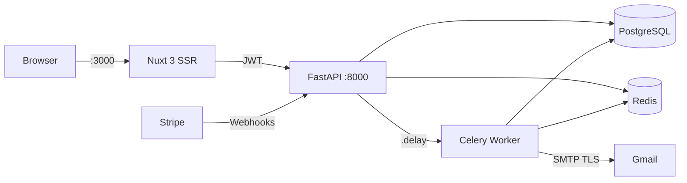

---

## Stack

| Backend | Frontend | Infra |
|---------|----------|-------|
| Python 3.11 · FastAPI · SQLAlchemy | Nuxt 3 · Vue 3 · Bootstrap 5 | PostgreSQL 15 · Redis 7 |
| Celery 5.4 · Stripe 8.4 | Chart.js · Leaflet · FullCalendar | Docker Compose · GitHub Actions |
| JWT (HS256) · Argon2id · SMTP | SweetAlert2 | ruff · pytest-cov |

---

## Qualidade

[](https://github.com/Wand-DenaXy/-Manueli-s-Clubes/actions)

```
72 tests · 93% coverage · lint clean · Docker OK
```

**Edge cases testados:** JWT forjado → 401 · limite plano → 403 · inscrição duplicada → 409 · webhook inválido → 400 · evento duplicado → idempotência · Stripe API error → 502 · SMTP off → no-op

<details>
<summary>Breakdown por ficheiro</summary>

```
test_auth.py          7    register, JWT, wrong password, tampered token
test_clubes.py        9    CRUD, ingressar, duplicate 409, plan limit 403
test_email.py         5    SMTP config, send ok/fail, payment emails
test_endpoints.py    14    /me, /clubesAdmin, /organizations, /notificacoes, /planos
test_mapas.py         7    CRUD + 404s
test_stats.py         5    stats, statstpuser, registrations + no auth
test_tipouser.py      6    CRUD + 404s
test_utilizadores.py  4    CRUD + 404
test_webhooks.py     15    webhook validation, checkout flow, Celery tasks
```

</details>

---

## Quick Start

```bash
git clone https://github.com/Wand-DenaXy/-Manueli-s-Clubes.git && cd -Manueli-s-Clubes
docker compose up --build
# http://localhost:3000 (frontend)   http://localhost:8000/docs (API)
```

---

## Screenshots

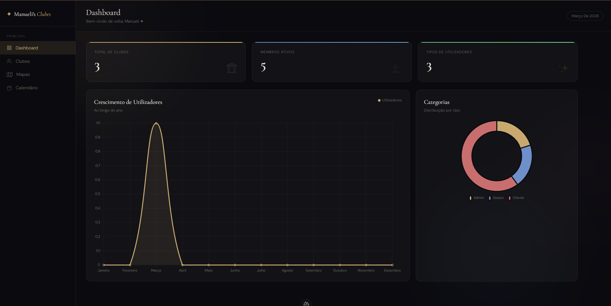

> **Dashboard** — KPIs + Chart.js (line + doughnut). Cache Redis.

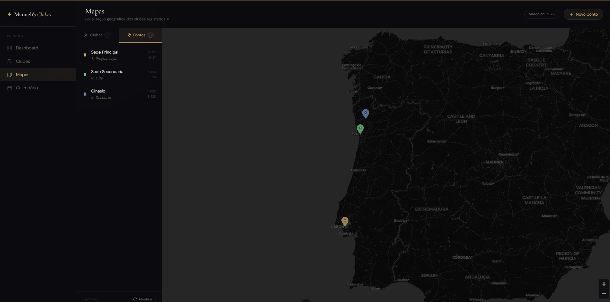

> **Mapa** — Leaflet.js, marcadores GPS, painel lateral.

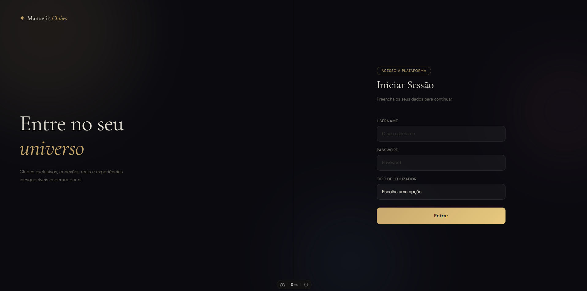

> **Login** — 3 roles · Argon2id · JWT 30 min.

---

<details>
<summary><strong>Estrutura do Projeto</strong></summary>

```
-Manueli-s-Clubes/
├── docker-compose.yml               # Orquestração: db + redis + api + worker + frontend
├── .env                             # Variáveis para Docker Compose (MYSQL_USER, etc.)
├── package.json                     # deps globais (Bootstrap, Chart.js, Leaflet)
├── .github/
│   └── workflows/
│       └── ci.yml                   # CI pipeline: testes + lint + Docker build
│
├── api/                             # Backend (FastAPI + Celery)
│   ├── Dockerfile                   # python:3.11-slim → uvicorn :8000
│   ├── .env                         # Variáveis da API (DB, Stripe, SMTP, JWT)
│   ├── app/
│   │   ├── main.py                  # 34 endpoints: CRUD, stats, inscrições, pagamentos, webhooks, RBAC, cache
│   │   ├── auth.py                  # JWT + Argon2 + get_current_user + require_roles
│   │   ├── models.py                # 9 ORM models + 16 Pydantic schemas
│   │   ├── database.py              # PostgreSQL connection pool (SQLAlchemy)
│   │   ├── cache.py                 # Redis cache com TTL + invalidação por prefixo
│   │   ├── celery_app.py            # Configuração Celery (broker Redis)
│   │   ├── task.py                  # Tarefa assíncrona: processamento de webhooks Stripe
│   │   ├── email_service.py         # Envio de emails HTML via SMTP (TLS)
│   │   └── requirements.txt
│   └── tests/                       # 72 testes (pytest + httpx)
│       ├── conftest.py
│       ├── test_auth.py
│       ├── test_clubes.py
│       ├── test_email.py
│       ├── test_endpoints.py
│       ├── test_mapas.py
│       ├── test_stats.py
│       ├── test_tipouser.py
│       ├── test_utilizadores.py
│       └── test_webhooks.py
│
└── nuxt-app/                        # Frontend (Nuxt 3)
    ├── Dockerfile                   # node:20 → :3000
    ├── pages/
    │   ├── index.vue                # Landing — stats públicas
    │   ├── login.vue                # Auth
    │   ├── dashboard.vue            # KPIs + Chart.js
    │   ├── clubes.vue               # CRUD table (scoped por organização)
    │   ├── mapas.vue                # Leaflet map
    │   ├── calendario.vue           # FullCalendar + inscrição
    │   ├── planos.vue               # Subscrições Stripe (Free/Pro/Enterprise)
    │   └── aboutus.vue              # Sobre nós
    └── components/
        ├── Header.vue               # Header global
        └── Navbar.vue               # Nav sidebar
```

</details>

---

<!-- ═══════════════════════════════════════════════════════════ -->
<!-- DEEP DIVE — Secções técnicas em detalhes colapsáveis       -->
<!-- ═══════════════════════════════════════════════════════════ -->

<details>
<summary><strong>Arquitetura — Diagramas C4</strong></summary>

### Nível 1 — Contexto do Sistema

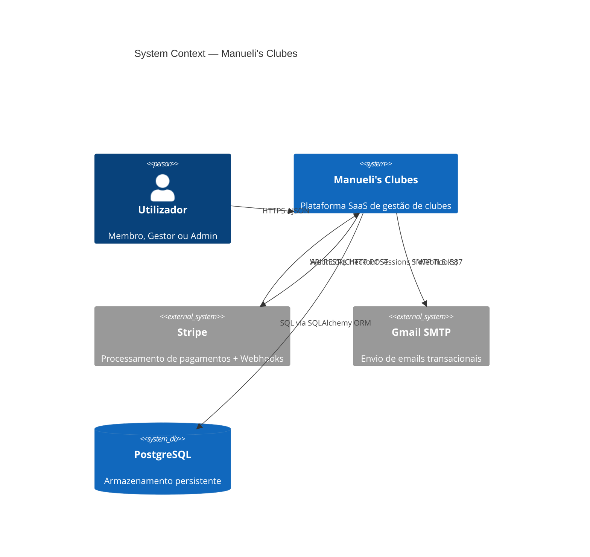

### Nível 2 — Containers

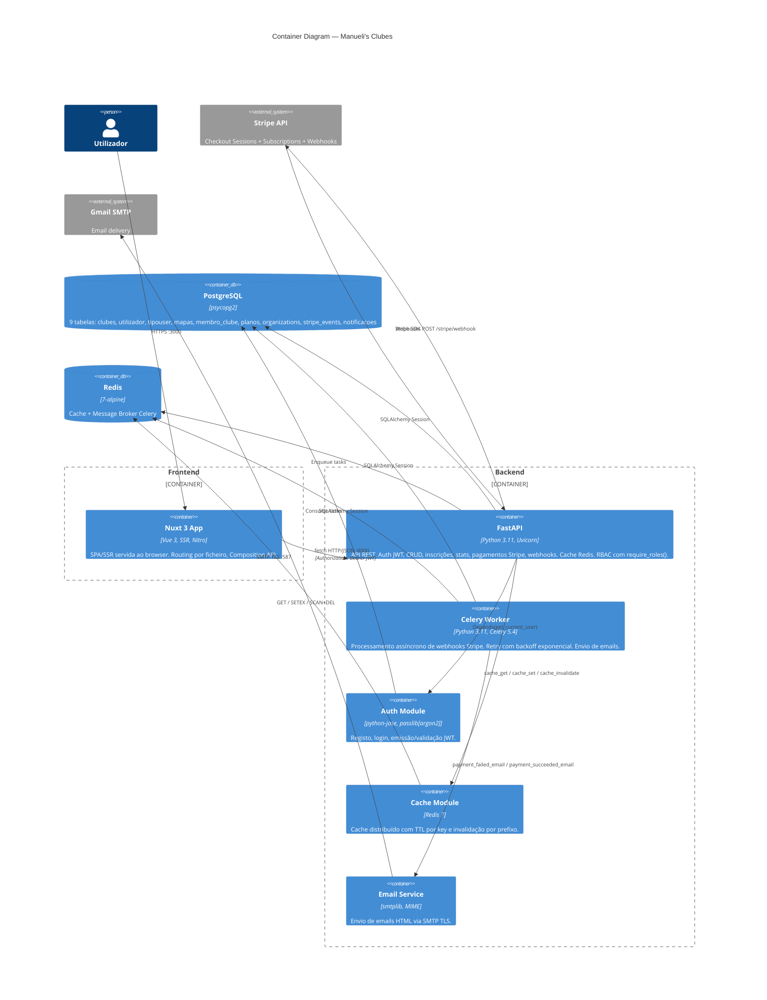

### Nível 3 — Componentes (API)

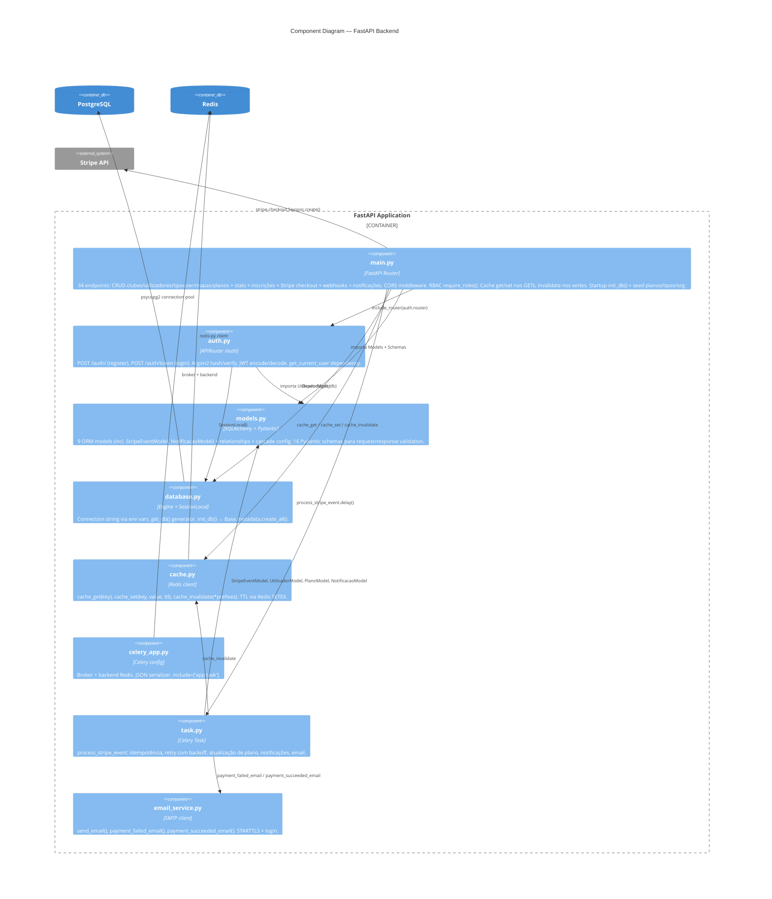

</details>

<details>
<summary><strong>Modelo de Dados (ER)</strong></summary>

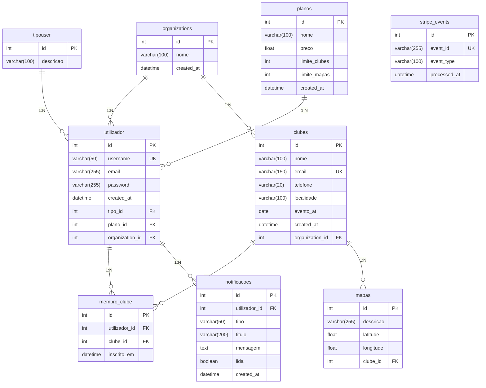

> **Constraints:** `UniqueConstraint("utilizador_id", "clube_id")` em `membro_clube` — impede inscrição duplicada a nível de BD. `unique=True` em `utilizador.username`, `clubes.email` e `stripe_events.event_id` (idempotência de webhooks).

</details>

<details>
<summary><strong>Cache — Redis com TTL e Invalidação por Prefixo</strong></summary>

Redis serve como cache (`SETEX` + `SCAN`/`DEL` por prefixo) e Celery broker numa única instância.

| Recurso          | Cache Key              | TTL    | Invalidado por       |
|------------------|------------------------|--------|----------------------|
| `/stats`         | `stats`                | 60 s   | CRUD clubes/users    |
| `/clubes`        | `clubes:org:{id}:list` | 30 s   | CRUD clubes          |
| `/tipouser`      | `tipouser:list`        | 120 s  | CRUD tipouser        |
| `/mapas`         | `mapas:list`           | 60 s   | CRUD mapas           |
| `/planos`        | `planos:list`          | 120 s  | CRUD planos          |
| `/utilizadores`  | `utilizadores:list`    | 30 s   | PUT /me/plano, DEL   |

</details>

<details>
<summary><strong>Endpoints da API</strong></summary>

### Auth (`/auth`)

| Método | Rota           | Body / Params                              | Response          | Auth |
|--------|----------------|--------------------------------------------|-------------------|------|
| POST   | `/auth/`       | `{username, password, tipo_id}`            | `201` message     | —    |
| POST   | `/auth/token`  | FormData: `username, password, tipo_id`    | `{access_token, token_type}` | — |

### Perfil (`/me`)

| Método | Rota              | Body / Params | Response            | Auth | Status Codes |
|--------|--------------------|---------------|---------------------|------|--------------|
| GET    | `/me`              | —             | `UtilizadorResponse`| JWT  | 200          |
| PUT    | `/me/plano/{id}`   | —             | `UtilizadorResponse`| JWT  | 200, 404     |

### Clubes (`/clubes`)

| Método | Rota                     | Body / Params       | Response            | Auth         | Status Codes     | Cache                              |
|--------|--------------------------|---------------------|---------------------|--------------|------------------|-------------------------------------|
| POST   | `/clubes`                | `ClubeCreate`       | `ClubeResponse`     | Admin/Gestor | 201, 403, 409    | invalidate `stats`, `clubes:`       |
| GET    | `/clubes`                | —                   | `[ClubeResponse]`   | JWT          | 200              | `clubes:org:{id}:list` TTL 30 s     |
| GET    | `/clubesAdmin`           | —                   | `[ClubeResponse]`   | Admin        | 200              | `clubes:admin:list` TTL 30 s        |
| PUT    | `/clubes/{id}`           | `ClubeCreate`       | `ClubeResponse`     | Admin/Gestor | 200, 404         | invalidate `stats`, `clubes:`       |
| DELETE | `/clubes/{id}`           | —                   | —                   | Admin        | 204, 404         | invalidate `stats`, `clubes:`       |
| POST   | `/clubes/{id}/ingressar` | —                   | `IngressarResponse` | JWT          | 201, 404, 409    | —                                   |

### Utilizadores (`/utilizadores`)

| Método | Rota                  | Body / Params       | Response               | Auth  | Status Codes | Cache                                        |
|--------|-----------------------|---------------------|------------------------|-------|--------------|----------------------------------------------|
| GET    | `/utilizadores`       | —                   | `[UtilizadorResponse]` | Admin | 200          | `utilizadores:list` TTL 30 s                 |
| PUT    | `/utilizadores/{id}`  | `UtilizadorCreate`  | `UtilizadorResponse`   | Admin | 200, 404     | invalidate `stats`, `statstpuser`            |
| DELETE | `/utilizadores/{id}`  | —                   | —                      | Admin | 204, 404     | invalidate `stats`, `statstpuser`, `registrations:` |

### Tipos de Utilizador (`/tipouser`)

| Método | Rota              | Body / Params    | Response             | Auth | Status Codes | Cache                                         |
|--------|--------------------|------------------|----------------------|------|--------------|-----------------------------------------------|
| POST   | `/tipouser`        | `TipoUserCreate` | `TipoUserResponse`  | JWT  | 200          | invalidate `stats`, `statstpuser`, `tipouser:` |
| GET    | `/tipouser`        | —                | `[TipoUserResponse]` | —    | 200          | `tipouser:list` TTL 120 s                     |
| PUT    | `/tipouser/{id}`   | `TipoUserCreate` | `TipoUserResponse`  | JWT  | 200, 404     | invalidate `stats`, `statstpuser`, `tipouser:` |
| DELETE | `/tipouser/{id}`   | —                | —                    | JWT  | 204, 404     | invalidate `stats`, `statstpuser`, `tipouser:` |

### Mapas (`/mapas`)

| Método | Rota           | Body / Params | Response          | Auth         | Status Codes | Cache                          |
|--------|----------------|---------------|-------------------|--------------|--------------|--------------------------------|
| POST   | `/mapas`       | `MapaCreate`  | `MapaResponse`    | Admin/Gestor | 200, 404     | invalidate `stats`, `mapas:`   |
| GET    | `/mapas`       | —             | `[MapaResponse]`  | JWT          | 200          | `mapas:list` TTL 60 s          |
| PUT    | `/mapas/{id}`  | `MapaCreate`  | `MapaResponse`    | Admin/Gestor | 200, 404     | invalidate `stats`, `mapas:`   |
| DELETE | `/mapas/{id}`  | —             | message           | Admin/Gestor | 200, 404     | invalidate `stats`, `mapas:`   |

### Planos (`/planos`)

| Método | Rota           | Body / Params | Response           | Auth | Status Codes | Cache                  |
|--------|----------------|---------------|--------------------|------|--------------|------------------------|
| GET    | `/planos`      | —             | `[PlanoResponse]`  | —    | 200          | `planos:list` TTL 120 s|
| POST   | `/planos`      | `PlanoCreate` | `PlanoResponse`    | JWT  | 201          | invalidate `planos:`   |
| PUT    | `/planos/{id}` | `PlanoCreate` | `PlanoResponse`    | JWT  | 200, 404     | invalidate `planos:`   |
| DELETE | `/planos/{id}` | —             | —                  | JWT  | 204, 404     | invalidate `planos:`   |

### Organizations (`/organizations`)

| Método | Rota              | Body / Params | Response  | Auth  | Status Codes |
|--------|--------------------|---------------|-----------|-------|--------------|
| POST   | `/organizations`   | `nome`        | Org data  | Admin | 201          |
| GET    | `/organizations`   | —             | `[Org]`   | Admin | 200          |

### Pagamentos e Webhooks (Stripe)

| Método | Rota                       | Body / Params    | Response     | Auth | Status Codes       |
|--------|----------------------------|------------------|--------------|------|--------------------|
| POST   | `/create-checkout-session` | `{plano_id}`     | `{url}`      | JWT  | 200, 400, 404, 502 |
| POST   | `/stripe/webhook`          | Stripe payload   | `{status}`   | —    | 200, 400           |

### Notificações (`/notificacoes`)

| Método | Rota            | Body / Params | Response                | Auth | Status Codes |
|--------|-----------------|---------------|-------------------------|------|--------------|
| GET    | `/notificacoes` | —             | `[NotificacaoResponse]` | JWT  | 200          |

### Estatísticas

| Método | Rota             | Response                                        | Auth | Cache                          |
|--------|-------------------|-------------------------------------------------|------|--------------------------------|
| GET    | `/stats`          | `{clubes, utilizadores, tipousers, mapas}`      | —    | `stats` TTL 60 s               |
| GET    | `/statstpuser`    | `{tipo_descricao: count, ...}`                  | JWT  | `statstpuser` TTL 60 s         |
| GET    | `/registrations`  | `[{month: str, count: int}]` (12 meses)        | JWT  | `registrations:{year}` TTL 300 s |

</details>

<details>
<summary><strong>Sequence Diagrams</strong></summary>

### Autenticação (Login + Acesso Protegido)

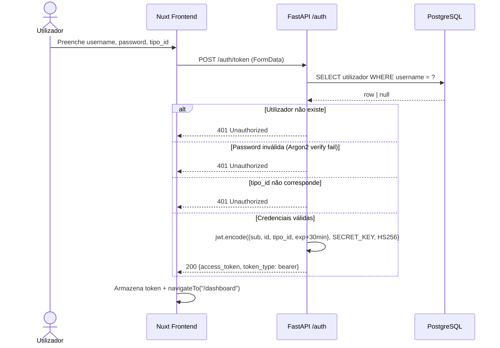

### Stripe Checkout — Subscrição de Plano

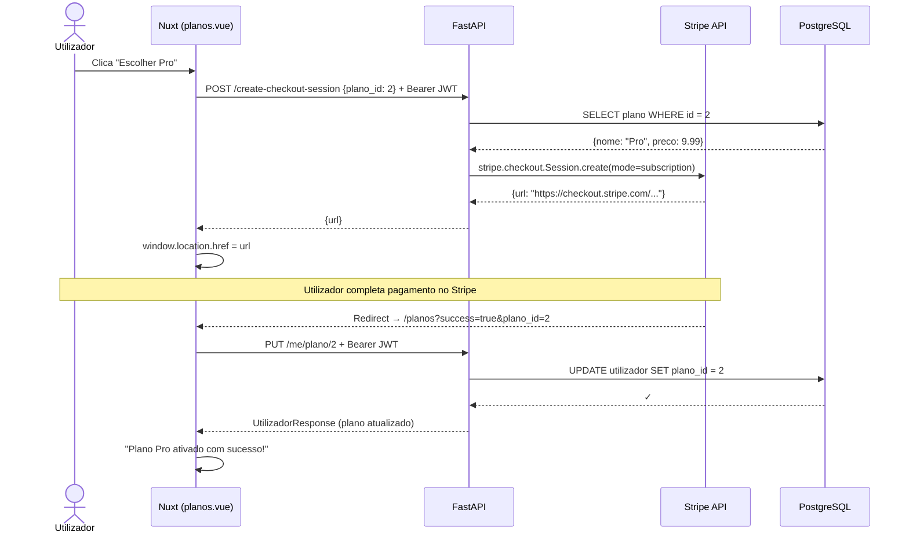

### Stripe Webhook — Processamento Assíncrono de Eventos

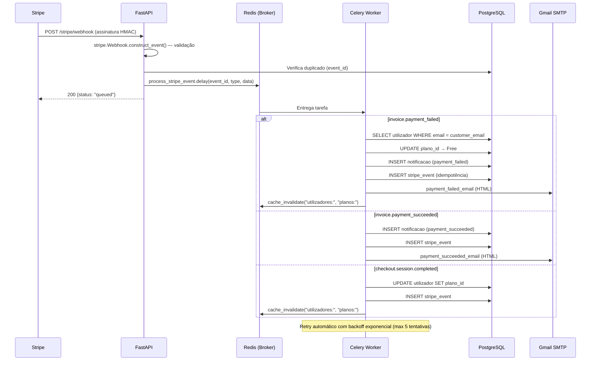

### CRUD — Criar Clube (com RBAC + limites de plano)

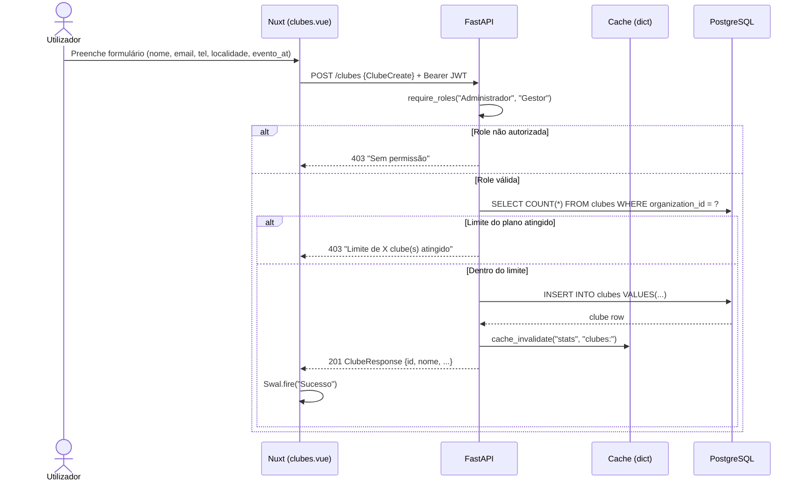

### Inscrição em Clube (via Calendário)

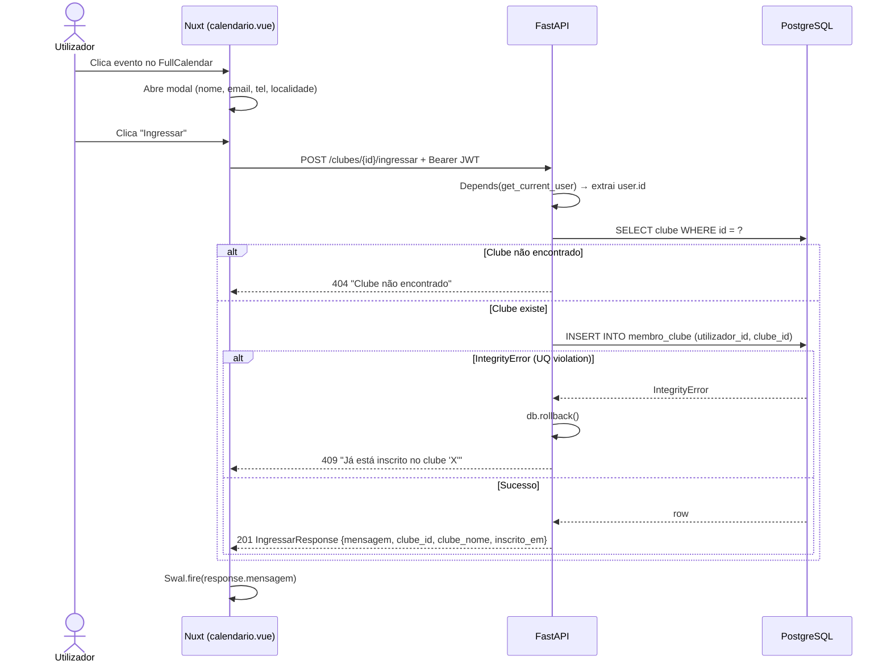

### Dashboard — Carregamento de Estatísticas (com cache Redis)


</details>

<details>
<summary><strong>Testes — Detalhe</strong></summary>

### Estratégia

- **SQLite** para BD de testes (sem PostgreSQL)
- **Redis mockado** no conftest (`_redis = MagicMock()`) — testes passam sem Redis local
- **Redis service container** no CI (GitHub Actions)
- **Dependency override** do `get_db` para injetar sessão de teste
- **Celery tasks** testadas diretamente (sem broker) com `SessionLocal` mockado
- Startup event desativado em testes (`on_startup.clear()`)
- Coverage gate: build falha se < 75%

### Edge Cases Testados

| Cenário | Status Code | Ficheiro |
|---------|-------------|----------|
| Token JWT forjado/adulterado | 401 | `test_auth.py` |
| Login com utilizador inexistente | 401 | `test_auth.py` |
| Acesso a rota protegida sem token | 401 | `test_auth.py` |
| Username duplicado no registo | 400 | `test_auth.py` |
| Limite de clubes do plano atingido | 403 | `test_clubes.py` |
| Inscrição duplicada em clube (UniqueConstraint) | 409 | `test_clubes.py` |
| CRUD em recurso inexistente (clube, mapa, tipo, user, plano) | 404 | `test_*.py` |
| Webhook secret vazio (não configurado) | 500 | `test_webhooks.py` |
| Payload Stripe inválido | 400 | `test_webhooks.py` |
| Assinatura Stripe inválida (HMAC) | 400 | `test_webhooks.py` |
| Evento webhook duplicado (idempotência) | 200 duplicate | `test_webhooks.py` |
| Checkout em plano gratuito (preço = 0) | 400 | `test_webhooks.py` |
| Stripe API error durante checkout | 502 | `test_webhooks.py` |
| Task: evento duplicado no Celery worker | skipped | `test_webhooks.py` |
| Task: metadata incompleta no checkout | skipped | `test_webhooks.py` |
| Task: user não encontrado no payment_failed | skipped | `test_webhooks.py` |
| SMTP não configurado | False (no-op) | `test_email.py` |
| Falha de envio SMTP | False | `test_email.py` |

</details>

<details>
<summary><strong>Decisões Técnicas (ADR)</strong></summary>

| Decisão | Porquê |
|---------|--------|
| **FastAPI** vs Django/Flask | OpenAPI automático, validação Pydantic nativa, DI com `Depends()`, ASGI async |
| **Argon2id** vs bcrypt | Vencedor da PHC, resistente a GPU/ASIC |
| **Stripe Checkout** (hosted) | Zero PCI compliance, subscrições recorrentes com redirect flow |
| **Celery + Redis** para webhooks | Resposta < 200 ms ao Stripe, retry com backoff, idempotência por `event_id` |
| **Multi-tenancy** por organização | `WHERE organization_id = user.organization_id` em queries, sem schema separation |
| **RBAC** via `require_roles()` | FastAPI Dependency, enforcement server-side (3 roles: Admin/Gestor/Cliente) |
| **UniqueConstraint** em `membro_clube` | Anti-duplicação a nível de BD, catch `IntegrityError` → 409 |

</details>

<details>
<summary><strong>Docker — Visão Geral</strong></summary>

| Serviço    | Imagem             | Porta | Função                            |
|------------|--------------------| ------|-----------------------------------|
| `db`       | `postgres:15`      | 5432  | PostgreSQL + healthcheck          |
| `redis`    | `redis:7-alpine`   | 6379  | Cache + Celery broker             |
| `api`      | `python:3.11-slim` | 8000  | FastAPI + Uvicorn                 |
| `worker`   | `python:3.11-slim` | —     | Celery worker (webhooks + emails) |
| `frontend` | `node:20`          | 3000  | Nuxt 3 SSR                        |

```bash
docker compose up --build        # sobe os 5 containers
docker compose logs -f api       # logs do backend
```

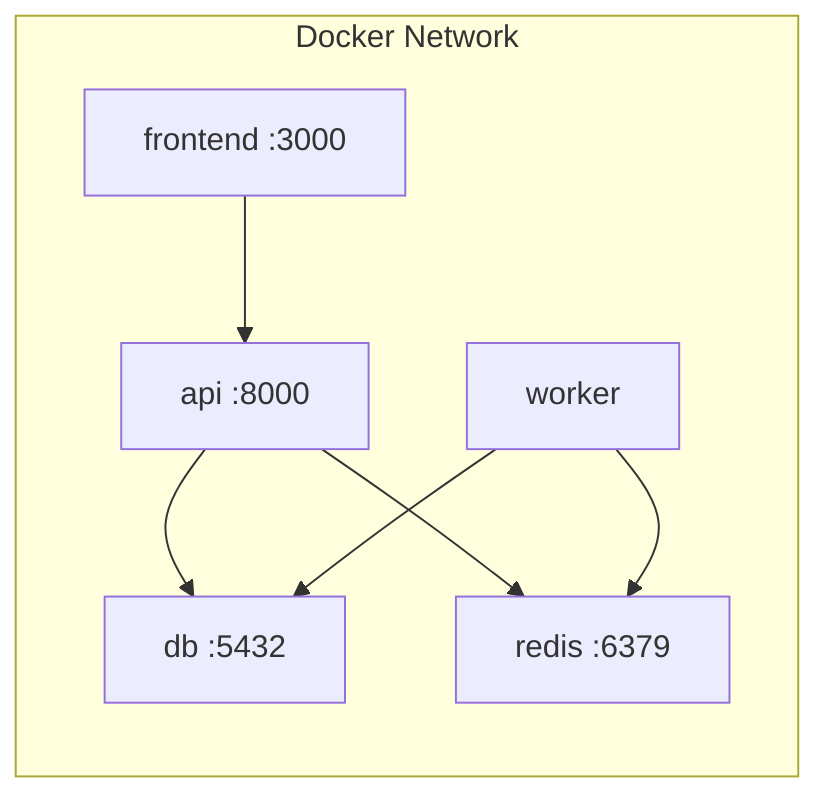

</details>

<details>
<summary><strong>Setup Local (sem Docker)</strong></summary>

```bash
# Copiar .env de exemplo e preencher
cp api/.env.example api/.env

# Backend
cd api/app && pip install -r requirements.txt
uvicorn main:app --host 0.0.0.0 --port 8000
# → http://localhost:8000/docs

# Worker (noutra tab)
cd api && celery -A app.celery_app:celery worker --loglevel=info

# Frontend (noutra tab)
cd nuxt-app && npm install && npm run dev
# → http://localhost:3000

# Stripe webhooks locais (noutra tab)
stripe listen --forward-to localhost:8000/stripe/webhook
```

Variáveis necessárias: `MYSQL_HOST`, `MYSQL_PORT`, `MYSQL_USER`, `MYSQL_PASSWORD`, `MYSQL_DATABASE`, `SECRET_KEY`, `ALGORITHM`, `STRIPE_SECRET_KEY`, `STRIPE_WEBHOOK_SECRET`, `REDIS_URL`, `SMTP_*`.

</details>

---

## Autor

**Manuel Silvestre**
