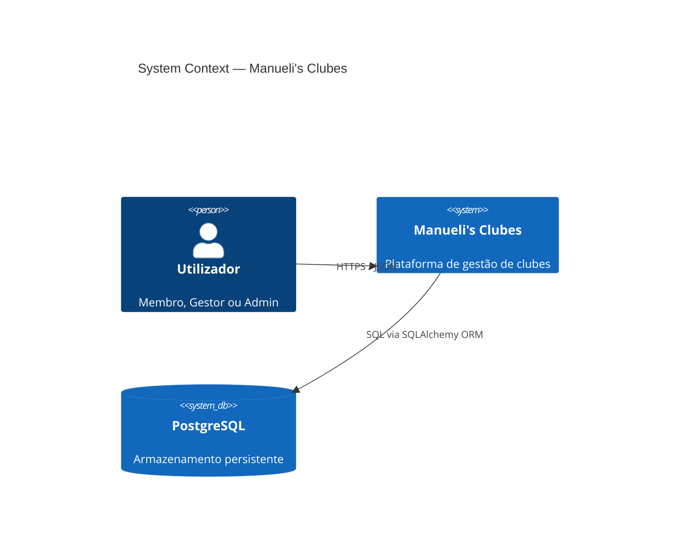
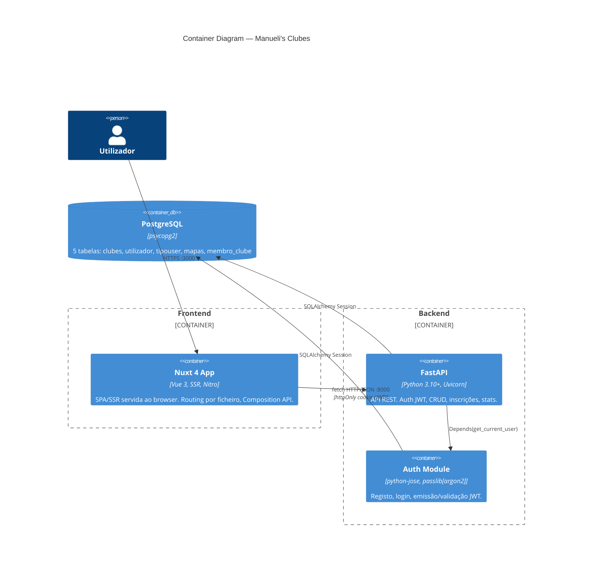
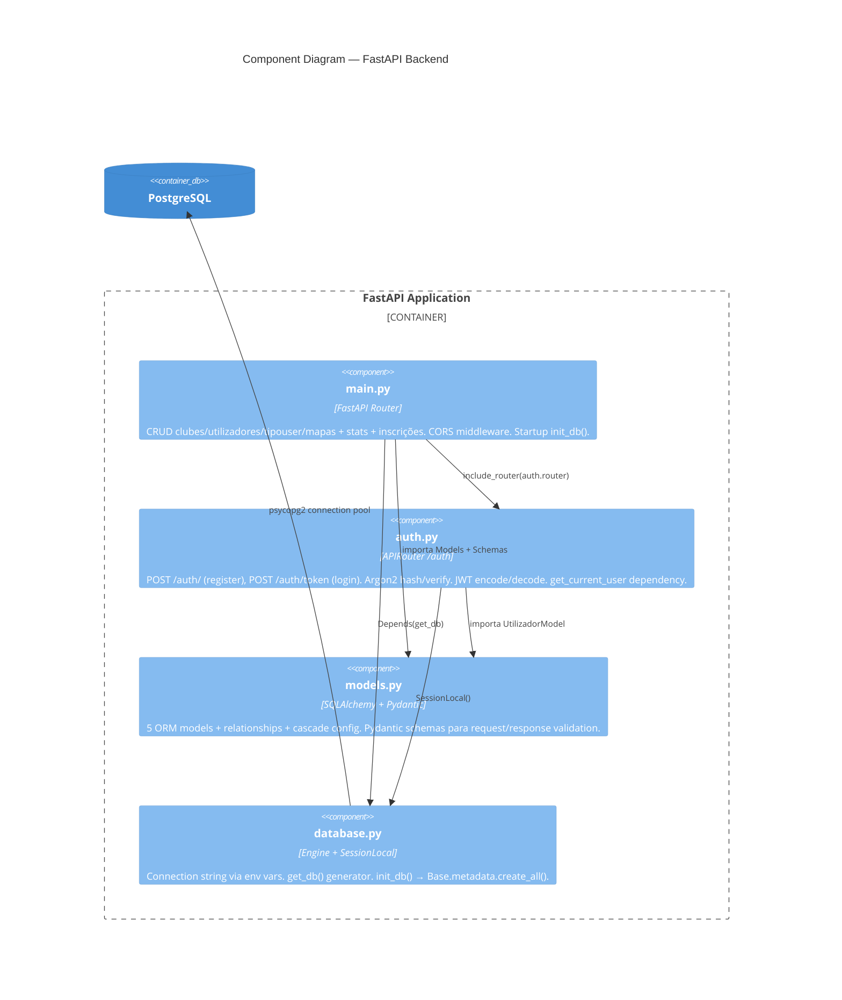
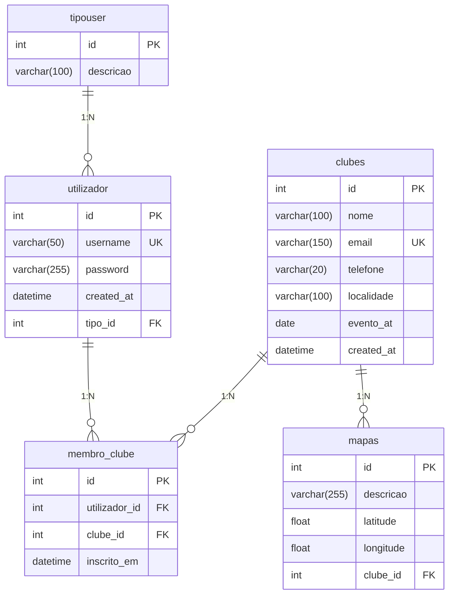
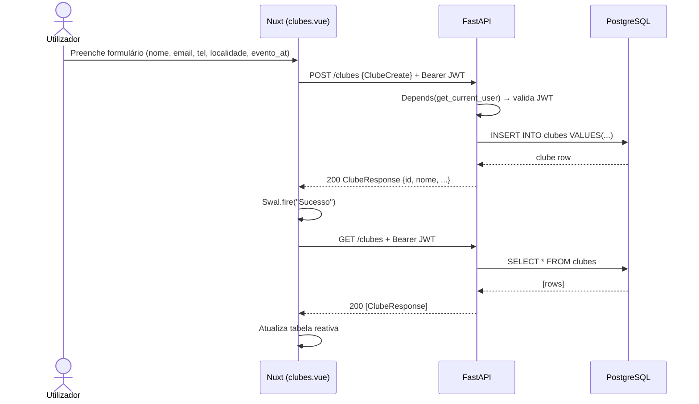
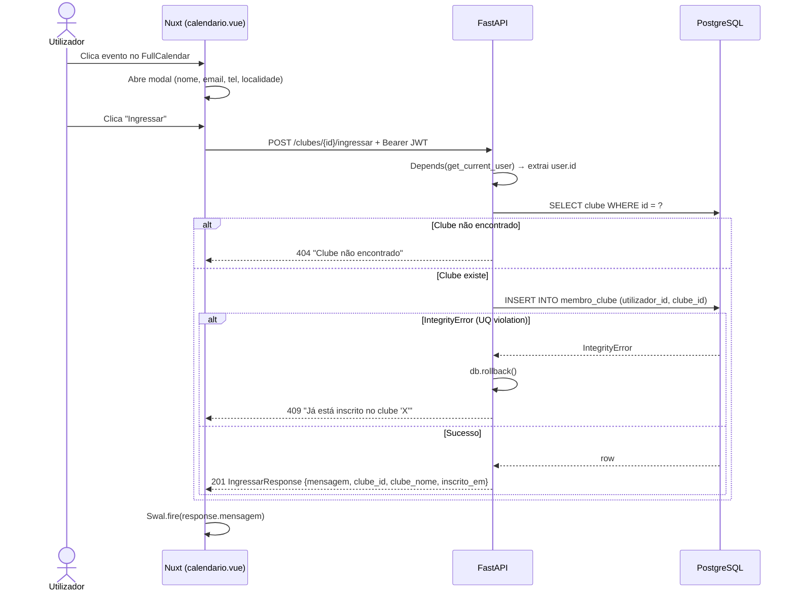
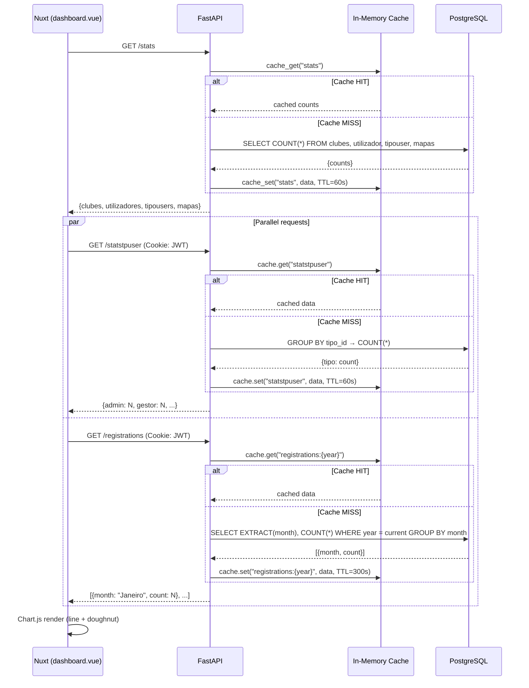

# Manueli's Clubes

Plataforma web full-stack de gestão de clubes — **Nuxt 4** + **FastAPI** + **PostgreSQL**.


---

## Tech Stack

| Camada     | Tecnologia                    | Versão    |
|------------|-------------------------------|-----------|
| Runtime    | Python                        | 3.10+     |
| API        | FastAPI + Uvicorn              | 0.115.6   |
| ORM        | SQLAlchemy                     | 2.0.36    |
| DB         | PostgreSQL (psycopg2)          | 15+       |
| Auth       | python-jose (JWT) + Argon2     | —         |
| Frontend   | Nuxt 4 (Vue 3, SSR)           | 4.x       |
| UI         | Bootstrap 5, SweetAlert2       | —         |
| Viz        | Chart.js, Leaflet.js, FullCalendar | —     |

---

## Arquitetura — Diagramas C4

### Nível 1 — Contexto do Sistema



### Nível 2 — Containers



### Nível 3 — Componentes (API)



---

## Modelo de Dados (ER)



> **Constraint:** `UniqueConstraint("utilizador_id", "clube_id")` em `membro_clube` — impede inscrição duplicada a nível de BD.

---

## Sequence Diagrams

### Autenticação (Login + Acesso Protegido)

```mermaid
sequenceDiagram
    actor U as Utilizador
    participant F as Nuxt Frontend
    participant A as FastAPI /auth
    participant DB as PostgreSQL

    U->>F: Preenche username, password, tipo_id
    F->>A: POST /auth/token (FormData, credentials: include)
    A->>DB: SELECT utilizador WHERE username = ?
    DB-->>A: row | null

    alt Utilizador não existe
        A-->>F: 401 Unauthorized
    else Password inválida (Argon2 verify fail)
        A-->>F: 401 Unauthorized
    else tipo_id não corresponde
        A-->>F: 401 Unauthorized
    else Credenciais válidas
        A->>A: jwt.encode({sub, id, tipo_id, exp+30min}, SECRET_KEY, HS256)
        A-->>F: 200 Set-Cookie: access_token=<JWT>; HttpOnly; Secure; SameSite=Lax; Path=/; Max-Age=1800
    end

    F->>F: navigateTo("/dashboard")

    Note over F,A: Pedidos subsequentes — cookie enviado automaticamente

    F->>A: GET /clubes (Cookie: access_token=<JWT>)
    A->>A: jwt.decode(request.cookies["access_token"])
    alt Token inválido/expirado
        A-->>F: 401 Unauthorized
    else Token válido
        A->>DB: SELECT * FROM clubes
        DB-->>A: [rows]
        A-->>F: 200 [ClubeResponse]
    end
```

### Logout (Invalidação do Cookie)

```mermaid
sequenceDiagram
    actor U as Utilizador
    participant F as Nuxt Frontend
    participant A as FastAPI /auth

    U->>F: Clica "Sair"
    F->>A: POST /auth/logout (credentials: include)
    A-->>F: 200 Set-Cookie: access_token=""; HttpOnly; Max-Age=0; Path=/
    F->>F: navigateTo("/login")
```

### CRUD — Criar Clube



### Inscrição em Clube (via Calendário)



### Dashboard — Carregamento de Estatísticas



---

## Endpoints da API

### Auth (`/auth`)

| Método | Rota           | Body / Params                              | Response          | Auth |
|--------|----------------|--------------------------------------------|-------------------|------|
| POST   | `/auth/`       | `{username, password, tipo_id}`            | `201` message     | —    |
| POST   | `/auth/token`  | FormData: `username, password, tipo_id`    | `{access_token, token_type}` | — |

### Clubes (`/clubes`)

| Método | Rota                     | Body / Params       | Response            | Auth  | Status Codes     |
|--------|--------------------------|---------------------|---------------------|-------|------------------|
| POST   | `/clubes`                | `ClubeCreate`       | `ClubeResponse`     | JWT   | 200              |
| GET    | `/clubes`                | —                   | `[ClubeResponse]`   | JWT   | 200              |
| PUT    | `/clubes/{id}`           | `ClubeCreate`       | `ClubeResponse`     | JWT   | 200, 404         |
| DELETE | `/clubes/{id}`           | —                   | —                   | JWT   | 204, 404         |
| POST   | `/clubes/{id}/ingressar` | —                   | `IngressarResponse` | JWT   | 201, 404, 409    |

### Utilizadores (`/utilizadores`)

| Método | Rota                  | Body / Params       | Response               | Auth | Status Codes |
|--------|-----------------------|---------------------|------------------------|------|--------------|
| GET    | `/utilizadores`       | —                   | `[UtilizadorResponse]` | JWT  | 200          |
| PUT    | `/utilizadores/{id}`  | `UtilizadorCreate`  | `UtilizadorResponse`   | JWT  | 200, 404     |
| DELETE | `/utilizadores/{id}`  | —                   | —                      | JWT  | 204, 404     |

### Tipos de Utilizador (`/tipouser`)

| Método | Rota              | Body / Params    | Response             | Auth | Status Codes |
|--------|--------------------|------------------|----------------------|------|--------------|
| POST   | `/tipouser`        | `TipoUserCreate` | `TipoUserResponse`  | JWT  | 200          |
| GET    | `/tipouser`        | —                | `[TipoUserResponse]` | —    | 200          |
| PUT    | `/tipouser/{id}`   | `TipoUserCreate` | `TipoUserResponse`  | JWT  | 200, 404     |
| DELETE | `/tipouser/{id}`   | —                | —                    | JWT  | 204, 404     |

### Mapas (`/mapas`)

| Método | Rota           | Body / Params | Response          | Auth | Status Codes |
|--------|----------------|---------------|-------------------|------|--------------|
| POST   | `/mapas`       | `MapaCreate`  | `MapaResponse`    | JWT  | 200, 404     |
| GET    | `/mapas`       | —             | `[MapaResponse]`  | JWT  | 200          |
| PUT    | `/mapas/{id}`  | `MapaCreate`  | `MapaResponse`    | JWT  | 200, 404     |
| DELETE | `/mapas/{id}`  | —             | message           | JWT  | 200, 404     |

### Estatísticas

| Método | Rota             | Response                                        | Auth |
|--------|-------------------|-------------------------------------------------|------|
| GET    | `/stats`          | `{clubes, utilizadores, tipousers, mapas}`      | —    |
| GET    | `/statstpuser`    | `{tipo_descricao: count, ...}`                  | JWT  |
| GET    | `/registrations`  | `[{month: str, count: int}]` (12 meses)        | JWT  |

---

## Pydantic Schemas (Contratos)

```python
# Request
class ClubeCreate(BaseModel):
    nome: str
    email: str | None = None
    telefone: str | None = None
    localidade: str | None = None
    evento_at: Optional[date] = None

class UtilizadorCreate(BaseModel):
    username: str
    password: str
    tipo_id: int

class TipoUserCreate(BaseModel):
    descricao: str

class MapaCreate(BaseModel):
    descricao: str | None = None
    latitude: float
    longitude: float
    clube_id: int

# Response
class ClubeResponse(ClubeCreate):        # herda campos + id
    id: int

class UtilizadorResponse(BaseModel):      # inclui nested TipoUserResponse
    id: int
    username: str
    tipo: TipoUserResponse
    created_at: datetime

class IngressarResponse(BaseModel):       # resposta de inscrição
    mensagem: str
    clube_id: int
    clube_nome: str
    inscrito_em: datetime
```

---

## Testes

### Estrutura de Testes (pytest + httpx)

```
api/
├── tests/
│   ├── conftest.py          # Fixtures: TestClient, BD em memória, token helper
│   ├── test_auth.py         # Registo, login, token inválido
│   ├── test_clubes.py       # CRUD clubes + inscrição + duplicação
│   ├── test_utilizadores.py # CRUD utilizadores
│   ├── test_tipouser.py     # CRUD tipos
│   ├── test_mapas.py        # CRUD mapas
│   └── test_stats.py        # Endpoints de estatísticas
```

### `conftest.py` — Fixtures

```python
import pytest
from fastapi.testclient import TestClient
from sqlalchemy import create_engine
from sqlalchemy.orm import sessionmaker
from database import Base, get_db
from main import app

SQLALCHEMY_TEST_URL = "sqlite:///./test.db"
engine = create_engine(SQLALCHEMY_TEST_URL, connect_args={"check_same_thread": False})
TestSession = sessionmaker(autocommit=False, autoflush=False, bind=engine)


@pytest.fixture(autouse=True)
def setup_db():
    Base.metadata.create_all(bind=engine)
    yield
    Base.metadata.drop_all(bind=engine)


@pytest.fixture
def db():
    session = TestSession()
    try:
        yield session
    finally:
        session.close()


@pytest.fixture
def client(db):
    def override_get_db():
        yield db
    app.dependency_overrides[get_db] = override_get_db
    with TestClient(app) as c:
        yield c
    app.dependency_overrides.clear()


@pytest.fixture
def auth_headers(client):
    """Regista utilizador e devolve headers com JWT."""
    client.post("/tipouser", json={"descricao": "admin"},
                headers=_get_temp_token(client))
    client.post("/auth/", json={"username": "testuser", "password": "Str0ng!Pass", "tipo_id": 1})
    resp = client.post("/auth/token", data={"username": "testuser", "password": "Str0ng!Pass", "tipo_id": "1"})
    token = resp.json()["access_token"]
    return {"Authorization": f"Bearer {token}"}
```

### `test_auth.py` — Autenticação

```python
def test_register_success(client):
    # Arrange: criar tipo primeiro
    # ...setup tipo_id=1...
    
    # Act
    resp = client.post("/auth/", json={
        "username": "newuser",
        "password": "Str0ng!Pass",
        "tipo_id": 1
    })
    
    # Assert
    assert resp.status_code == 201
    assert resp.json()["message"] == "Utilizador Criado com Sucesso"


def test_register_duplicate_username(client):
    # Registar 2x o mesmo username → 400
    client.post("/auth/", json={"username": "dup", "password": "Pass1!", "tipo_id": 1})
    resp = client.post("/auth/", json={"username": "dup", "password": "Pass2!", "tipo_id": 1})
    assert resp.status_code == 400


def test_login_returns_jwt(client):
    # ...após registo...
    resp = client.post("/auth/token", data={
        "username": "testuser",
        "password": "Str0ng!Pass",
        "tipo_id": "1"
    })
    assert resp.status_code == 200
    body = resp.json()
    assert "access_token" in body
    assert body["token_type"] == "bearer"


def test_login_wrong_password(client):
    resp = client.post("/auth/token", data={
        "username": "testuser",
        "password": "wrong",
        "tipo_id": "1"
    })
    assert resp.status_code == 401


def test_protected_route_without_token(client):
    resp = client.get("/clubes")
    assert resp.status_code == 401
```

### `test_clubes.py` — CRUD + Inscrição

```python
def test_create_clube(client, auth_headers):
    resp = client.post("/clubes", json={
        "nome": "Clube Teste",
        "email": "teste@clube.pt",
        "telefone": "912345678",
        "localidade": "Lisboa",
        "evento_at": "2026-06-15"
    }, headers=auth_headers)

    assert resp.status_code == 200
    data = resp.json()
    assert data["nome"] == "Clube Teste"
    assert data["id"] is not None


def test_list_clubes(client, auth_headers):
    client.post("/clubes", json={"nome": "C1"}, headers=auth_headers)
    client.post("/clubes", json={"nome": "C2"}, headers=auth_headers)

    resp = client.get("/clubes", headers=auth_headers)
    assert resp.status_code == 200
    assert len(resp.json()) == 2


def test_update_clube(client, auth_headers):
    create = client.post("/clubes", json={"nome": "Old"}, headers=auth_headers)
    cid = create.json()["id"]

    resp = client.put(f"/clubes/{cid}", json={"nome": "New"}, headers=auth_headers)
    assert resp.status_code == 200
    assert resp.json()["nome"] == "New"


def test_delete_clube(client, auth_headers):
    create = client.post("/clubes", json={"nome": "ToDelete"}, headers=auth_headers)
    cid = create.json()["id"]

    resp = client.delete(f"/clubes/{cid}", headers=auth_headers)
    assert resp.status_code == 204


def test_delete_clube_404(client, auth_headers):
    resp = client.delete("/clubes/9999", headers=auth_headers)
    assert resp.status_code == 404


def test_ingressar_clube(client, auth_headers):
    create = client.post("/clubes", json={"nome": "Ingresso"}, headers=auth_headers)
    cid = create.json()["id"]

    resp = client.post(f"/clubes/{cid}/ingressar", headers=auth_headers)
    assert resp.status_code == 201
    data = resp.json()
    assert data["clube_id"] == cid
    assert "inscrito_em" in data


def test_ingressar_duplicate_409(client, auth_headers):
    create = client.post("/clubes", json={"nome": "Dup"}, headers=auth_headers)
    cid = create.json()["id"]

    client.post(f"/clubes/{cid}/ingressar", headers=auth_headers)
    resp = client.post(f"/clubes/{cid}/ingressar", headers=auth_headers)
    assert resp.status_code == 409


def test_ingressar_clube_inexistente_404(client, auth_headers):
    resp = client.post("/clubes/9999/ingressar", headers=auth_headers)
    assert resp.status_code == 404
```

### Executar Testes

```bash
cd api
pip install pytest httpx
pytest tests/ -v --tb=short
```

```
tests/test_auth.py::test_register_success          PASSED
tests/test_auth.py::test_register_duplicate         PASSED
tests/test_auth.py::test_login_returns_jwt          PASSED
tests/test_auth.py::test_login_wrong_password       PASSED
tests/test_auth.py::test_protected_route_no_token   PASSED
tests/test_clubes.py::test_create_clube             PASSED
tests/test_clubes.py::test_ingressar_clube          PASSED
tests/test_clubes.py::test_ingressar_duplicate_409  PASSED
...
```

### Cobertura

```bash
pytest tests/ --cov=. --cov-report=term-missing
```

| Módulo       | Cobertura Alvo |
|--------------|----------------|
| `auth.py`    | ≥ 90%          |
| `main.py`    | ≥ 85%          |
| `models.py`  | ≥ 95%          |
| `database.py`| ≥ 80%          |

---

## Architecture Decision Records (ADR)

### ADR-001: FastAPI em vez de Django REST / Flask

**Status:** Aceite  
**Contexto:** O sistema precisa de uma API REST com validação de schemas, documentação automática e suporte assíncrono. Django REST Framework traz overhead de um ORM opinado e admin desnecessário. Flask requer muitos plugins adicionais.  
**Decisão:** Usar FastAPI com Pydantic para validação e SQLAlchemy como ORM independente.  
**Consequências:**
- (+) Documentação OpenAPI gerada automaticamente (`/docs`)
- (+) Validação request/response via Pydantic com type hints nativos
- (+) Dependency injection nativo (`Depends()`) para DB sessions e auth
- (+) Performance superior (Starlette + Uvicorn ASGI)
- (−) Ecossistema mais pequeno que Django (menos packages prontos)
- (−) Sem admin panel built-in

### ADR-002: Argon2 em vez de bcrypt para hashing de passwords

**Status:** Aceite  
**Contexto:** O sistema armazena passwords de utilizadores. bcrypt é o standard de facto, mas tem limitações conhecidas (truncagem a 72 bytes, sem resistência a side-channel em GPUs).  
**Decisão:** Usar Argon2id via `passlib[argon2]` + `argon2_cffi`.  
**Consequências:**
- (+) Vencedor da Password Hashing Competition (2015) — resistente a GPU/ASIC/side-channel
- (+) Parâmetros configuráveis: memory cost, time cost, parallelism
- (+) `passlib.CryptContext` permite migração transparente de algoritmos (`deprecated="auto"`)
- (−) Requer `argon2_cffi` como dependência nativa (compilação C)
- (−) Ligeiramente mais lento que bcrypt por default (por design — é a feature)

### ADR-003: JWT em httpOnly cookie em vez de localStorage

**Status:** Aceite (supersede versão anterior com localStorage)  
**Contexto:** A arquitetura é SPA + API separada. O token JWT precisa de ser persistido no cliente entre requests. Existem duas abordagens comuns:

| Abordagem | XSS | CSRF | JS Access |
|-----------|-----|------|-----------|
| `localStorage` | Vulnerável — qualquer script acede ao token | Imune — token não é enviado automaticamente | Sim |
| `httpOnly cookie` | Imune — JS não consegue ler o cookie | Requer mitigação (`SameSite`, CSRF token) | Não |

**Decisão:** JWT transportado em cookie `httpOnly; Secure; SameSite=Lax` com `Max-Age=1800` (30 min). O backend faz `Set-Cookie` no login e lê `request.cookies["access_token"]` nos endpoints protegidos. Logout = `Set-Cookie` com `Max-Age=0`.

**Implementação:**

```python
# auth.py — login response
from fastapi.responses import JSONResponse

@router.post("/token")
async def login(form_data, db):
    user = authenticate_user(db, form_data.username, form_data.password, form_data.tipo_id)
    if not user:
        raise HTTPException(status_code=401, detail="Invalid credentials")
    token = create_access_token(user, timedelta(minutes=30))
    response = JSONResponse(content={"message": "Login efetuado"})
    response.set_cookie(
        key="access_token",
        value=token,
        httponly=True,          # inacessível a document.cookie / JS
        secure=True,            # só enviado sobre HTTPS
        samesite="lax",         # protege contra CSRF cross-site
        max_age=1800,           # 30 min — alinhado com exp do JWT
        path="/",
    )
    return response

# auth.py — get_current_user lê do cookie
from fastapi import Request

async def get_current_user(request: Request):
    token = request.cookies.get("access_token")
    if not token:
        raise HTTPException(status_code=401, detail="Not authenticated")
    try:
        payload = jwt.decode(token, SECRET_KEY, algorithms=[ALGORITHM])
        ...
    except JWTError:
        raise HTTPException(status_code=401, detail="Invalid token")

# auth.py — logout
@router.post("/logout")
async def logout():
    response = JSONResponse(content={"message": "Logout efetuado"})
    response.delete_cookie(key="access_token", path="/")
    return response
```

```javascript
// Frontend — fetch com credentials
const resp = await fetch(`${API}/auth/token`, {
  method: 'POST',
  body: formData,
  credentials: 'include'   // envia e recebe cookies cross-origin
})

// Pedidos protegidos — cookie é enviado automaticamente
const clubes = await fetch(`${API}/clubes`, {
  credentials: 'include'
})
```

**Consequências:**
- (+) **XSS-safe** — `httpOnly` impede `document.cookie` e qualquer acesso por JavaScript ao token
- (+) **Sem gestão manual** — browser envia cookie automaticamente (sem `Authorization` header explícito)
- (+) Stateless mantido — o servidor continua a não guardar estado de sessão
- (+) Logout limpo — `delete_cookie` força `Max-Age=0`
- (+) `SameSite=Lax` bloqueia envio em POST cross-site (mitigação CSRF)
- (−) Requer `credentials: 'include'` em todos os `fetch` no frontend
- (−) CORS precisa de `allow_credentials=True` + origin explícita (não pode ser `*`)
- (−) Token continua não revogável antes do `exp` (sem blacklist)
- (−) Sem refresh token — re-login após 30 min

**CORS necessário (atualizado):**
```python
app.add_middleware(
    CORSMiddleware,
    allow_origins=["http://localhost:3000"],  # origin explícita obrigatória
    allow_credentials=True,                    # permite Set-Cookie cross-origin
    allow_methods=["*"],
    allow_headers=["*"],
)
```

> **Nota:** `allow_origins=["*"]` + `allow_credentials=True` é inválido por spec CORS. O origin tem de ser explícito.

### ADR-004: UniqueConstraint na tabela de inscrição (membro_clube)

**Status:** Aceite  
**Contexto:** Utilizadores podem inscrever-se em clubes. Sem constraint, o mesmo utilizador pode inscrever-se N vezes no mesmo clube (bugs de UI, double-click, replay de requests).  
**Decisão:** `UniqueConstraint("utilizador_id", "clube_id")` a nível de BD + catch de `IntegrityError` na API com rollback e HTTP 409.  
**Consequências:**
- (+) Integridade garantida a nível de BD — impossível bypass via SQL direto ou race conditions
- (+) A API trata o erro graciosamente com mensagem localizada
- (+) Mais robusto que validação apenas em application layer (que sofre de TOCTOU)
- (−) Requer `try/except IntegrityError` + `db.rollback()` explícito no endpoint

```python
# Implementação do padrão
try:
    db.commit()
except IntegrityError:
    db.rollback()
    raise HTTPException(status_code=409, detail=f"Já está inscrito no clube '{clube.nome}'")
```

### ADR-005: SSR (Nuxt) com `<ClientOnly>` para componentes DOM-dependent

**Status:** Aceite  
**Contexto:** O Nuxt 4 usa SSR por default para SEO e performance. Mas bibliotecas como FullCalendar e Leaflet manipulam o DOM diretamente e falham em ambiente Node.js (sem `window`/`document`).  
**Decisão:** Usar `<ClientOnly>` wrapper do Nuxt para componentes incompatíveis com SSR, com skeleton de fallback.  
**Consequências:**
- (+) SSR funciona para páginas estáticas (index, aboutus, login) — melhor First Contentful Paint
- (+) Componentes client-only (calendar, maps) renderizam apenas no browser
- (+) Skeleton mantém layout estável durante hidratação (evita CLS)
- (−) Conteúdo client-only invisível para crawlers sem JavaScript
- (−) Ligeiro flash durante hidratação em conexões lentas

### ADR-006: CORS com origin explícita + credentials

**Status:** Aceite (atualizado por ADR-003)  
**Contexto:** Com a adoção de `httpOnly cookies` (ADR-003), o browser precisa de `credentials: 'include'` nos fetch. A spec CORS exige que `allow_credentials=True` acompanhe um `allow_origins` **explícito** — wildcard `*` é rejeitado.  
**Decisão:** `allow_origins=["http://localhost:3000"]` com `allow_credentials=True` em dev. Em produção, apontar para o domínio real.  
**Consequências:**
- (+) Cookies `Set-Cookie` e `Cookie` funcionam cross-origin
- (+) Sem wildcard — superfície de ataque reduzida mesmo em dev
- (−) Novo domínio = nova entrada em `allow_origins`
- (−) Em ambientes com múltiplos frontends (staging, preview), requer lista dinâmica via env var

```python
# Configuração recomendada
allowed_origins = os.getenv("ALLOWED_ORIGINS", "http://localhost:3000").split(",")
app.add_middleware(
    CORSMiddleware,
    allow_origins=allowed_origins,
    allow_credentials=True,
    allow_methods=["*"],
    allow_headers=["*"],
)
```

### ADR-007: Monólito modular em vez de microserviços

**Status:** Aceite  
**Contexto:** O projeto é desenvolvido por uma equipa pequena. A complexidade operacional de microserviços (deploy, networking, service discovery) não se justifica.  
**Decisão:** Monólito com separação clara em módulos (`main.py`, `auth.py`, `models.py`, `database.py`) e repositório único (monorepo).  
**Consequências:**
- (+) Deploy simples — um processo `uvicorn` serve toda a API
- (+) Sem latência de rede entre serviços
- (+) Refactoring fácil — tudo no mesmo codebase
- (+) Frontend e backend no mesmo repo — versionamento conjunto
- (−) Escalabilidade limitada a vertical (mitigado pelo ASGI Uvicorn com workers)
- (−) Se o projeto crescer significativamente, pode precisar de decomposição

### ADR-008: Caching in-memory com invalidação por write

**Status:** Aceite  
**Contexto:** Os endpoints de estatísticas (`/stats`, `/statstpuser`, `/registrations`) executam queries agregadas (`COUNT`, `GROUP BY`, `EXTRACT`) em cada request. Estas queries são caras relativa­mente ao overhead de um simples SELECT, mas os dados mudam pouco (novos registos são esporádicos).  
**Decisão:** Cache in-memory (dict Python) com TTL, invalidado em operações de escrita (POST/PUT/DELETE). Sem Redis — o deploy mantém-se single-process.

**Implementação:**

```python
# cache.py
import time
from typing import Any

_cache: dict[str, tuple[float, Any]] = {}

def cache_get(key: str) -> Any | None:
    """Devolve valor se existir e não tiver expirado."""
    entry = _cache.get(key)
    if entry is None:
        return None
    expires_at, value = entry
    if time.monotonic() > expires_at:
        del _cache[key]
        return None
    return value

def cache_set(key: str, value: Any, ttl: int = 60) -> None:
    """Guarda valor com TTL em segundos."""
    _cache[key] = (time.monotonic() + ttl, value)

def cache_invalidate(*prefixes: str) -> None:
    """Invalida todas as keys que começam com qualquer dos prefixos."""
    keys_to_delete = [
        k for k in _cache
        if any(k.startswith(p) for p in prefixes)
    ]
    for k in keys_to_delete:
        del _cache[k]
```

**Estratégia por endpoint:**

| Endpoint           | Cache Key              | TTL   | Invalidado por                       |
|--------------------|------------------------|-------|--------------------------------------|
| `GET /stats`       | `stats`                | 60s   | POST/PUT/DELETE em clubes, utilizadores, mapas |
| `GET /statstpuser` | `statstpuser`          | 60s   | POST/PUT/DELETE em utilizadores, tipouser |
| `GET /registrations`| `registrations:{year}`| 300s  | POST /auth/ (novo registo)           |
| `GET /clubes`      | `clubes:list`          | 30s   | POST/PUT/DELETE em clubes            |
| `GET /tipouser`    | `tipouser:list`        | 120s  | POST/PUT/DELETE em tipouser          |

**Padrão de uso nos endpoints:**

```python
from cache import cache_get, cache_set, cache_invalidate

@app.get("/stats")
def get_stats(db: Session = Depends(get_db)):
    cached = cache_get("stats")
    if cached is not None:
        return cached

    result = {
        "clubes": db.query(ClubeModel).count(),
        "utilizadores": db.query(UtilizadorModel).count(),
        "tipousers": db.query(TipoUserModel).count(),
        "mapas": db.query(MapaModel).count(),
    }
    cache_set("stats", result, ttl=60)
    return result

@app.post("/clubes", response_model=ClubeResponse)
def create_clube(clube: ClubeCreate, db = Depends(get_db), user = Depends(get_current_user)):
    db_clube = ClubeModel(**clube.dict())
    db.add(db_clube)
    db.commit()
    db.refresh(db_clube)
    cache_invalidate("stats", "clubes:")   # invalida stats e lista de clubes
    return db_clube
```

**Consequências:**
- (+) Queries agregadas executam no máximo 1x por TTL — redução de ~90% de queries em endpoints de leitura frequente
- (+) Zero dependências externas (sem Redis/Memcached)
- (+) Invalidação cirúrgica — write operations limpam apenas keys afetadas
- (+) `time.monotonic()` imune a alterações de relógio do sistema
- (−) Cache não partilhada entre workers — se `uvicorn --workers N > 1`, cada worker tem cache independente (aceitável para single-process dev)
- (−) Sem LRU/maxsize — em cenários extremos, a memória pode crescer (mitigado pelo número finito de cache keys)

**Evolução:** Migrar para Redis quando o deploy usar múltiplos workers ou instâncias. A interface `cache_get/cache_set/cache_invalidate` permite substituir a implementação sem alterar os endpoints.

---

## Estrutura do Projeto

```
-Manueli-s-Clubes/
├── README.md
├── EXPLICACAO.md
├── package.json                     # deps globais (Bootstrap, Chart.js, Leaflet)
│
├── api/                             # Backend (FastAPI)
│   ├── main.py                      # App factory, CRUD routes, stats, inscrições
│   ├── auth.py                      # Router /auth, JWT, Argon2
│   ├── models.py                    # ORM models + Pydantic schemas
│   ├── database.py                  # Engine, SessionLocal, get_db(), init_db()
│   ├── requirements.txt
│   └── tests/                       # pytest + httpx
│       ├── conftest.py
│       ├── test_auth.py
│       ├── test_clubes.py
│       ├── test_utilizadores.py
│       ├── test_tipouser.py
│       ├── test_mapas.py
│       └── test_stats.py
│
└── nuxt-app/                        # Frontend (Nuxt 4)
    ├── nuxt.config.js
    ├── package.json
    ├── tsconfig.json
    ├── components/
    │   └── Header.vue               # Nav global
    ├── pages/
    │   ├── index.vue                # Landing (SSR) — stats públicas
    │   ├── login.vue                # Auth — FormData → /auth/token
    │   ├── dashboard.vue            # KPIs + Chart.js (line + doughnut)
    │   ├── clubes.vue               # CRUD table + permissões por tipo_id
    │   ├── mapas.vue                # Leaflet <ClientOnly> + CRUD pontos
    │   ├── calendario.vue           # FullCalendar <ClientOnly> + ingressar
    │   ├── chat.vue                 # Chat
    │   └── aboutus.vue              # Sobre nós — stats em tempo real
    ├── assets/{css,js,images}/      # Bootstrap 5 (source + minified)
    └── public/robots.txt
```

---

## Setup

### Variáveis de Ambiente (`api/.env`)

```env
MYSQL_HOST=localhost
MYSQL_PORT=5432
MYSQL_USER=<user>
MYSQL_PASSWORD=<password>
MYSQL_DATABASE=clubes_db
SECRET_KEY=<random-256-bit-hex>
ALGORITHM=HS256
```

### Backend

```bash
cd api
pip install -r requirements.txt
uvicorn main:app --host 0.0.0.0 --port 8000 --reload
# → http://localhost:8000/docs (Swagger UI)
```

### Frontend

```bash
cd nuxt-app
npm install
npm run dev
# → http://localhost:3000
```

---

## Autor

**Manuel Silvestre**
