<div align="center">

# ✦ Manueli's Clubes

**Full-stack SaaS for club management** — real Stripe payments, async webhooks, multi-tenancy and RBAC

*Create clubs · Manage members · Event calendar · Interactive map · Subscription plans · Email notifications*

If you are a Tech Lead -> 🔗 [Full Technical Documentation](README_TECH.md)

<p>
  <code>Full-stack SaaS with real payments (Stripe)</code> · <code>Multi-tenancy + RBAC + async webhooks (Celery)</code><br>
  <code>93% test coverage + CI/CD with quality gates</code> · <code>Docker ready (5 services)</code>
</p>


<p>
  <a href="https://github.com/Wand-DenaXy/-Manueli-s-Clubes/actions"></a>
  
  
  
  
  
  
</p>

</div>

---

## ✦ Why this project?

This is not another academic CRUD — it is a **real product** with payments, multi-tenancy and RBAC.
Sports clubs have members, events, maps and subscriptions — enough complexity to justify the stack.
Goal: take an idea from **zero to production** using the same practices as a company.

---

## ✦ Project in Numbers

| Architecture & Features | Quality & Infrastructure |
|---|---|
| **34 REST endpoints** — auth, CRUD, stats, payments, webhooks | **72 tests** · 93% coverage · CI gate ≥ 75% |
| **9 ORM models** + 16 Pydantic schemas | **Stripe Checkout** (subscriptions) + Celery webhooks |
| **RBAC** — Admin · Manager · Client | **Redis** cache TTL + invalidation + Celery broker |
| **Multi-tenancy** by organization | **Docker Compose** — 5 production-ready containers |
| **Automatic emails** on every payment | **CI/CD** — tests + lint + Docker build on every push |

<details>
<summary><strong>API Endpoints</strong></summary>

### Auth (`/auth`)

| Method | Route          | Body / Params                              | Response          | Auth |
|--------|----------------|--------------------------------------------|-------------------|----- |
| POST   | `/auth/`       | `{username, password, tipo_id}`            | `201` message     | —    |
| POST   | `/auth/token`  | FormData: `username, password, tipo_id`    | `{access_token, token_type}` | — |

### Profile (`/me`)

| Method | Route              | Body / Params | Response            | Auth | Status Codes |
|--------|--------------------|---------------|---------------------|------|--------------|
| GET    | `/me`              | —             | `UtilizadorResponse`| JWT  | 200          |
| PUT    | `/me/plano/{id}`   | —             | `UtilizadorResponse`| JWT  | 200, 404     |

### Clubs (`/clubes`)

| Method | Route                    | Body / Params       | Response            | Auth          | Status Codes     | Cache                              |
|--------|--------------------------|---------------------|---------------------|---------------|------------------|-------------------------------------|
| POST   | `/clubes`                | `ClubeCreate`       | `ClubeResponse`     | Admin/Manager | 201, 403, 409    | invalidate `stats`, `clubes:`       |
| GET    | `/clubes`                | —                   | `[ClubeResponse]`   | JWT           | 200              | `clubes:org:{id}:list` TTL 30 s     |
| GET    | `/clubesAdmin`           | —                   | `[ClubeResponse]`   | Admin         | 200              | `clubes:admin:list` TTL 30 s        |
| PUT    | `/clubes/{id}`           | `ClubeCreate`       | `ClubeResponse`     | Admin/Manager | 200, 404         | invalidate `stats`, `clubes:`       |
| DELETE | `/clubes/{id}`           | —                   | —                   | Admin         | 204, 404         | invalidate `stats`, `clubes:`       |
| POST   | `/clubes/{id}/ingressar` | —                   | `IngressarResponse` | JWT           | 201, 404, 409    | —                                   |

### Users (`/utilizadores`)

| Method | Route                 | Body / Params       | Response               | Auth  | Status Codes | Cache                                        |
|--------|-----------------------|---------------------|------------------------|-------|--------------|----------------------------------------------|
| GET    | `/utilizadores`       | —                   | `[UtilizadorResponse]` | Admin | 200          | `utilizadores:list` TTL 30 s                 |
| PUT    | `/utilizadores/{id}`  | `UtilizadorCreate`  | `UtilizadorResponse`   | Admin | 200, 404     | invalidate `stats`, `statstpuser`            |
| DELETE | `/utilizadores/{id}`  | —                   | —                      | Admin | 204, 404     | invalidate `stats`, `statstpuser`, `registrations:` |

### User Types (`/tipouser`)

| Method | Route              | Body / Params    | Response             | Auth | Status Codes | Cache                                         |
|--------|--------------------|------------------|----------------------|------|--------------|-----------------------------------------------|
| POST   | `/tipouser`        | `TipoUserCreate` | `TipoUserResponse`  | JWT  | 200          | invalidate `stats`, `statstpuser`, `tipouser:` |
| GET    | `/tipouser`        | —                | `[TipoUserResponse]` | —    | 200          | `tipouser:list` TTL 120 s                     |
| PUT    | `/tipouser/{id}`   | `TipoUserCreate` | `TipoUserResponse`  | JWT  | 200, 404     | invalidate `stats`, `statstpuser`, `tipouser:` |
| DELETE | `/tipouser/{id}`   | —                | —                    | JWT  | 204, 404     | invalidate `stats`, `statstpuser`, `tipouser:` |

### Maps (`/mapas`)

| Method | Route          | Body / Params | Response          | Auth          | Status Codes | Cache                          |
|--------|----------------|---------------|-------------------|---------------|--------------|--------------------------------|
| POST   | `/mapas`       | `MapaCreate`  | `MapaResponse`    | Admin/Manager | 200, 404     | invalidate `stats`, `mapas:`   |
| GET    | `/mapas`       | —             | `[MapaResponse]`  | JWT           | 200          | `mapas:list` TTL 60 s          |
| PUT    | `/mapas/{id}`  | `MapaCreate`  | `MapaResponse`    | Admin/Manager | 200, 404     | invalidate `stats`, `mapas:`   |
| DELETE | `/mapas/{id}`  | —             | message           | Admin/Manager | 200, 404     | invalidate `stats`, `mapas:`   |

### Plans (`/planos`)

| Method | Route          | Body / Params | Response           | Auth | Status Codes | Cache                  |
|--------|----------------|---------------|--------------------|------|--------------|------------------------|
| GET    | `/planos`      | —             | `[PlanoResponse]`  | —    | 200          | `planos:list` TTL 120 s|
| POST   | `/planos`      | `PlanoCreate` | `PlanoResponse`    | JWT  | 201          | invalidate `planos:`   |
| PUT    | `/planos/{id}` | `PlanoCreate` | `PlanoResponse`    | JWT  | 200, 404     | invalidate `planos:`   |
| DELETE | `/planos/{id}` | —             | —                  | JWT  | 204, 404     | invalidate `planos:`   |

### Organizations (`/organizations`)

| Method | Route              | Body / Params | Response  | Auth  | Status Codes |
|--------|--------------------|---------------|-----------|-------|--------------|
| POST   | `/organizations`   | `nome`        | Org data  | Admin | 201          |
| GET    | `/organizations`   | —             | `[Org]`   | Admin | 200          |

### Payments and Webhooks (Stripe)

| Method | Route                      | Body / Params    | Response     | Auth | Status Codes       |
|--------|----------------------------|------------------|--------------|------|--------------------|  
| POST   | `/create-checkout-session` | `{plano_id}`     | `{url}`      | JWT  | 200, 400, 404, 502 |
| POST   | `/stripe/webhook`          | Stripe payload   | `{status}`   | —    | 200, 400           |

### Notifications (`/notificacoes`)

| Method | Route           | Body / Params | Response                | Auth | Status Codes |
|--------|-----------------|---------------|-------------------------|------|--------------|
| GET    | `/notificacoes` | —             | `[NotificacaoResponse]` | JWT  | 200          |

### Statistics

| Method | Route             | Response                                        | Auth | Cache                          |
|--------|-------------------|-------------------------------------------------|------|--------------------------------|
| GET    | `/stats`          | `{clubes, utilizadores, tipousers, mapas}`      | —    | `stats` TTL 60 s               |
| GET    | `/statstpuser`    | `{tipo_descricao: count, ...}`                  | JWT  | `statstpuser` TTL 60 s         |
| GET    | `/registrations`  | `[{month: str, count: int}]` (12 months)       | JWT  | `registrations:{year}` TTL 300 s |

### Cache — Redis with TTL and Prefix Invalidation

Redis serves as cache (`SETEX` + `SCAN`/`DEL` by prefix) and Celery broker in a single instance.

| Resource         | Cache Key              | TTL    | Invalidated by       |
|------------------|------------------------|--------|----------------------|
| `/stats`         | `stats`                | 60 s   | CRUD clubs/users     |
| `/clubes`        | `clubes:org:{id}:list` | 30 s   | CRUD clubs           |
| `/tipouser`      | `tipouser:list`        | 120 s  | CRUD tipouser        |
| `/mapas`         | `mapas:list`           | 60 s   | CRUD maps            |
| `/planos`        | `planos:list`          | 120 s  | CRUD plans           |
| `/utilizadores`  | `utilizadores:list`    | 30 s   | PUT /me/plano, DEL   |

</details>

---

## ✦ Subscription Plans

Recurring subscriptions via **Stripe Checkout** (`mode=subscription`). Limits enforced server-side.

| Plan | Price/month | Clubs | Maps | Payment |
|------|-------------|-------|------|---------|
| **Free** | €0 | 3 | 1 | — |
| **Pro** | €9.99 | 15 | 20 | Stripe Checkout → webhook → email |
| **Enterprise** | €29.99 | ∞ | ∞ | Stripe Checkout → webhook → email |

On every payment, the system sends an automatic **HTML email**:
- ✅ **Success** → payment confirmation
- ❌ **Failure** → warning + plan reverted to Free + link to update at `/planos`

Webhooks processed via **Celery** with retry (exponential backoff, max 5), idempotency by `event_id`.

---

## ✦ Stack

| Backend | Frontend | Infra |
|---------|----------|-------|
| Python 3.11 · FastAPI · SQLAlchemy | Nuxt 3 · Vue 3 · Bootstrap 5 | PostgreSQL 15 · Redis 7 |
| Celery 5.4 · Stripe 8.4 | Chart.js · Leaflet · FullCalendar | Docker Compose · GitHub Actions |
| JWT (HS256) · Argon2id · SMTP | SweetAlert2 | ruff (lint) · pytest-cov |

---

## ✦ Tests & CI

[](https://github.com/Wand-DenaXy/-Manueli-s-Clubes/actions)

```
72 tests · 93% coverage · lint clean · Docker build OK
```

Every push/PR triggers **3 required jobs** — all must pass for the Docker build to run:

| Job | Fails if… |
|-----|-----------|
| **Tests + Coverage** | Any test fails **or** coverage < 75% |
| **Lint (ruff)** | Any code violation |
| **Docker Build** | Image fails to build |

Edge cases: forged JWT → 401 · duplicate username → 400 · plan limit → 403 · duplicate join → 409 · invalid webhook → 400 · duplicate event → idempotency · Stripe API error → 502 · SMTP off → no-op.

> 📂 [ci.yml](.github/workflows/ci.yml) · 🔗 [GitHub Actions](https://github.com/Wand-DenaXy/-Manueli-s-Clubes/actions)


## ✦ Screenshots

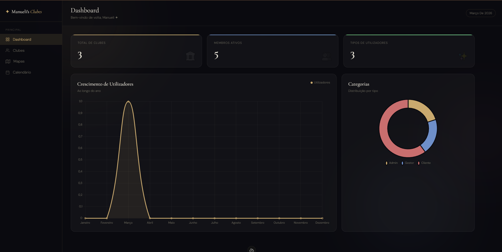

> **Dashboard** — Real-time KPIs + Chart.js (line + doughnut). Redis cache.

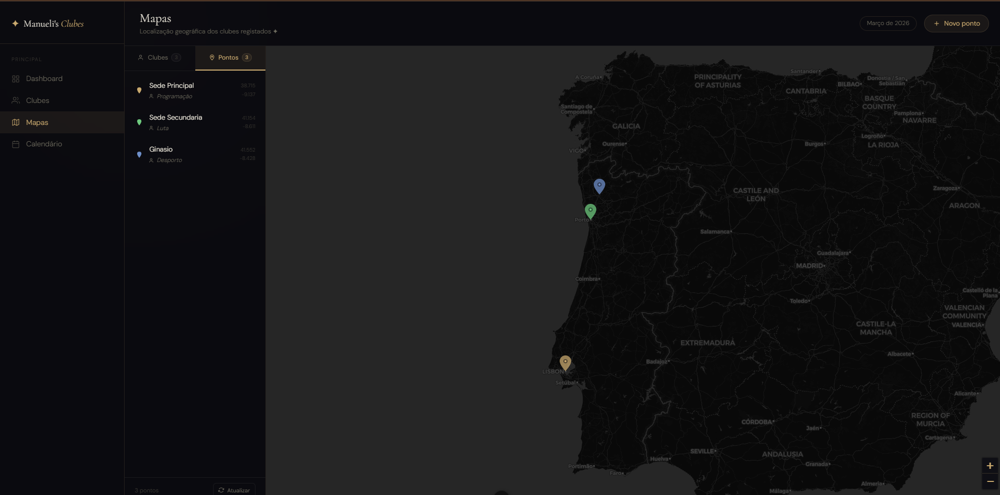

> **Interactive Map** — Leaflet.js, club GPS markers, side panel.

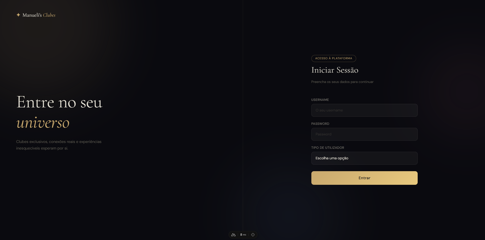

> **Login** — 3 roles · Argon2id · JWT 30 min.

---

## Quick Start

```bash
git clone https://github.com/Wand-DenaXy/-Manueli-s-Clubes.git
cd -Manueli-s-Clubes
docker compose up --build          # 5 containers ready
# Frontend → http://localhost:3000   API Docs → http://localhost:8000/docs
```

---

## ✦ Project Structure

```
-Manueli-s-Clubes/
├── docker-compose.yml               # Orchestration: db + redis + api + worker + frontend
├── .env                             # Variables for Docker Compose (MYSQL_USER, etc.)
├── package.json                     # global deps (Bootstrap, Chart.js, Leaflet)
├── .github/
│   └── workflows/
│       └── ci.yml                   # CI pipeline: tests + lint + Docker build
│
├── api/                             # Backend (FastAPI + Celery)
│   ├── Dockerfile                   # python:3.11-slim → uvicorn :8000
│   ├── .env                         # API variables (DB, Stripe, SMTP, JWT)
│   ├── app/
│   │   ├── main.py                  # 34 endpoints: CRUD, stats, memberships, payments, webhooks, RBAC, cache
│   │   ├── auth.py                  # JWT + Argon2 + get_current_user + require_roles
│   │   ├── models.py                # 9 ORM models + 16 Pydantic schemas
│   │   ├── database.py              # PostgreSQL connection pool (SQLAlchemy)
│   │   ├── cache.py                 # Redis cache with TTL + prefix invalidation
│   │   ├── celery_app.py            # Celery config (Redis broker)
│   │   ├── task.py                  # Async task: Stripe webhook processing
│   │   ├── email_service.py         # HTML email sending via SMTP (TLS)
│   │   └── requirements.txt
│   └── tests/                       # 72 tests (pytest + httpx)
│       ├── conftest.py
│       ├── test_auth.py
│       ├── test_clubes.py
│       ├── test_email.py
│       ├── test_endpoints.py
│       ├── test_mapas.py
│       ├── test_stats.py
│       ├── test_tipouser.py
│       ├── test_utilizadores.py
│       └── test_webhooks.py
│
└── nuxt-app/                        # Frontend (Nuxt 3)
    ├── Dockerfile                   # node:20 → :3000
    ├── pages/
    │   ├── index.vue                # Landing — public stats
    │   ├── login.vue                # Auth
    │   ├── dashboard.vue            # KPIs + Chart.js
    │   ├── clubes.vue               # CRUD table (scoped by organization)
    │   ├── mapas.vue                # Leaflet map
    │   ├── calendario.vue           # FullCalendar + join
    │   ├── planos.vue               # Stripe subscriptions (Free/Pro/Enterprise)
    │   └── aboutus.vue              # About us
    └── components/
        ├── Header.vue               # Global header
        └── Navbar.vue               # Nav sidebar
```

---

<!-- ═══════════════════════════════════════════════════════════ -->
<!-- DEEP DIVE — Technical documentation in collapsible details   -->
<!-- ═══════════════════════════════════════════════════════════ -->

<details>
<summary><strong>✦ Technical Documentation</strong></summary>

### Architecture — C4 Diagrams

#### Level 1 — System Context

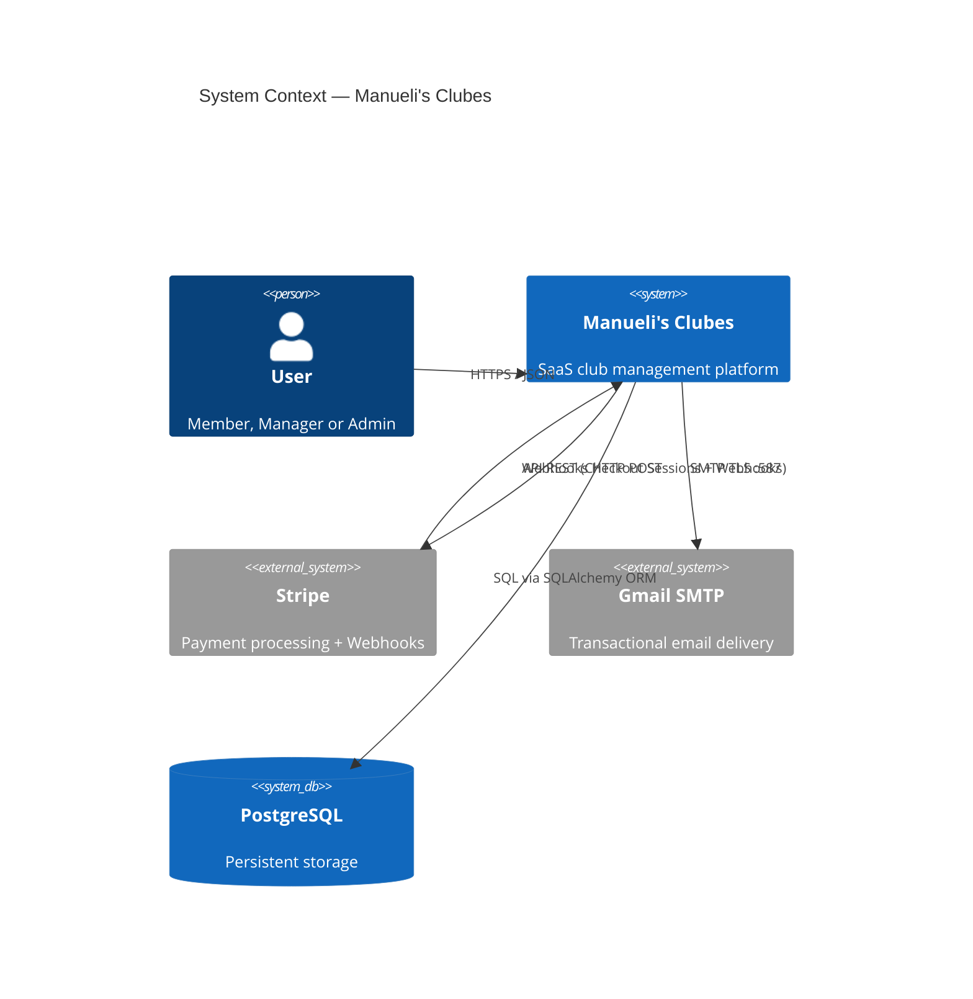
```mermaid
C4Context
    title System Context — Manueli's Clubes

    Person(user, "User", "Member, Manager or Admin")
    System(sys, "Manueli's Clubes", "SaaS club management platform")
    System_Ext(stripe, "Stripe", "Payment processing + Webhooks")
    System_Ext(smtp, "Gmail SMTP", "Transactional email delivery")
    SystemDb(db, "PostgreSQL", "Persistent storage")

    Rel(user, sys, "HTTPS / JSON")
    Rel(sys, db, "SQL via SQLAlchemy ORM")
    Rel(sys, stripe, "API REST (Checkout Sessions + Webhooks)")
    Rel(sys, smtp, "SMTP TLS :587")
    Rel(stripe, sys, "Webhooks HTTP POST")
```

#### Level 2 — Containers

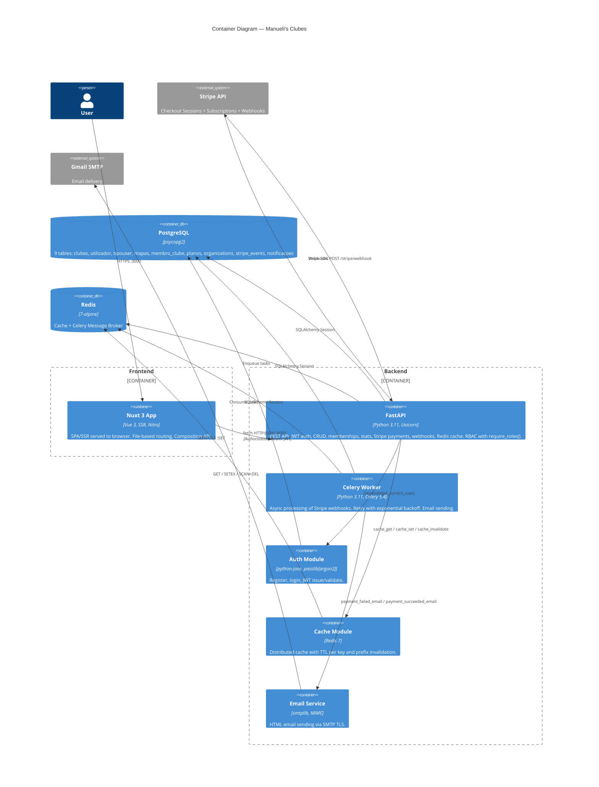
```mermaid
C4Container
    title Container Diagram — Manueli's Clubes

    Person(user, "User")

    Container_Boundary(frontend, "Frontend") {
        Container(nuxt, "Nuxt 3 App", "Vue 3, SSR, Nitro", "SPA/SSR served to browser. File-based routing, Composition API.")
    }

    Container_Boundary(backend, "Backend") {
        Container(api, "FastAPI", "Python 3.11, Uvicorn", "REST API. JWT auth, CRUD, memberships, stats, Stripe payments, webhooks. Redis cache. RBAC with require_roles().")
        Container(worker, "Celery Worker", "Python 3.11, Celery 5.4", "Async processing of Stripe webhooks. Retry with exponential backoff. Email sending.")
        Container(auth_mod, "Auth Module", "python-jose, passlib[argon2]", "Register, login, JWT issue/validate.")
        Container(cache_mod, "Cache Module", "Redis 7", "Distributed cache with TTL per key and prefix invalidation.")
        Container(email_mod, "Email Service", "smtplib, MIME", "HTML email sending via SMTP TLS.")
    }

    System_Ext(stripe, "Stripe API", "Checkout Sessions + Subscriptions + Webhooks")
    System_Ext(smtp, "Gmail SMTP", "Email delivery")

    ContainerDb(db, "PostgreSQL", "psycopg2", "9 tables: clubes, utilizador, tipouser, mapas, membro_clube, planos, organizations, stripe_events, notificacoes")
    ContainerDb(redis, "Redis", "7-alpine", "Cache + Celery Message Broker")

    Rel(user, nuxt, "HTTPS :3000")
    Rel(nuxt, api, "fetch HTTP/JSON :8000", "Authorization: Bearer JWT")
    Rel(api, auth_mod, "Depends(get_current_user)")
    Rel(api, cache_mod, "cache_get / cache_set / cache_invalidate")
    Rel(api, stripe, "Stripe SDK")
    Rel(api, db, "SQLAlchemy Session")
    Rel(api, redis, "Enqueue tasks")
    Rel(worker, redis, "Consume tasks")
    Rel(worker, db, "SQLAlchemy Session")
    Rel(worker, email_mod, "payment_failed_email / payment_succeeded_email")
    Rel(email_mod, smtp, "SMTP TLS :587")
    Rel(stripe, api, "Webhooks POST /stripe/webhook")
    Rel(auth_mod, db, "SQLAlchemy Session")
    Rel(cache_mod, redis, "GET / SETEX / SCAN+DEL")
```

#### Level 3 — Components (API)

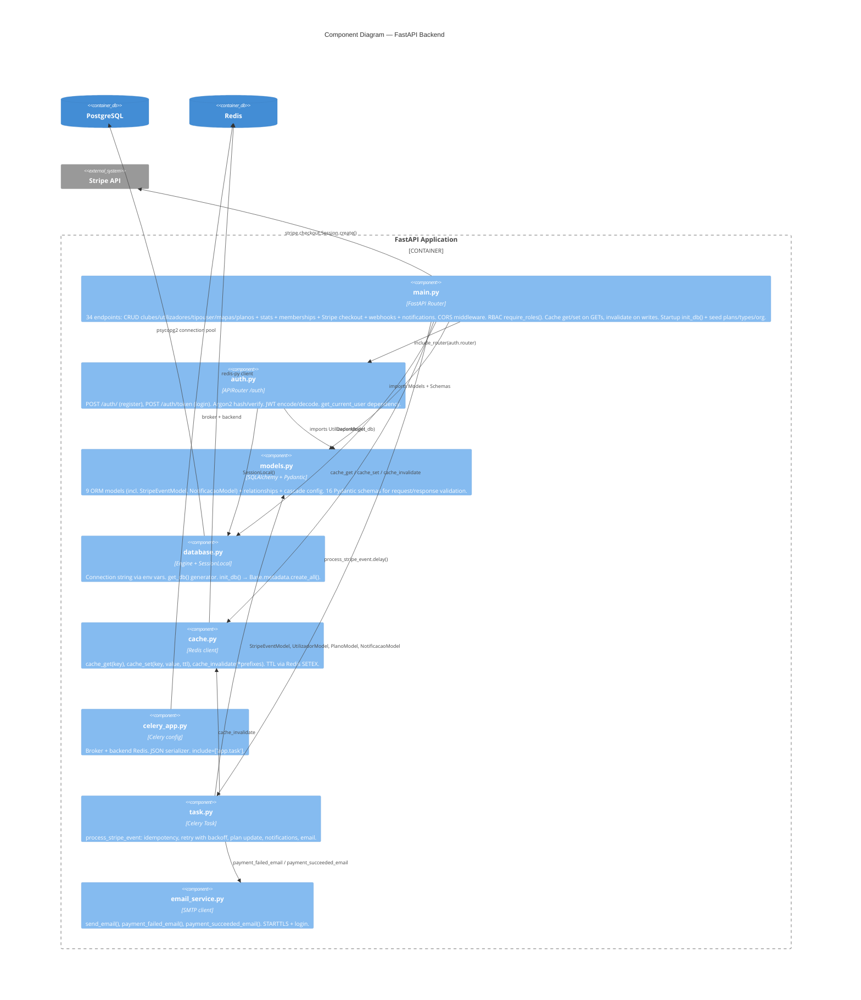
```mermaid
C4Component
    title Component Diagram — FastAPI Backend

    Container_Boundary(api, "FastAPI Application") {
        Component(main, "main.py", "FastAPI Router", "34 endpoints: CRUD clubes/utilizadores/tipouser/mapas/planos + stats + memberships + Stripe checkout + webhooks + notifications. CORS middleware. RBAC require_roles(). Cache get/set on GETs, invalidate on writes. Startup init_db() + seed plans/types/org.")
        Component(auth, "auth.py", "APIRouter /auth", "POST /auth/ (register), POST /auth/token (login). Argon2 hash/verify. JWT encode/decode. get_current_user dependency.")
        Component(models, "models.py", "SQLAlchemy + Pydantic", "9 ORM models (incl. StripeEventModel, NotificacaoModel) + relationships + cascade config. 16 Pydantic schemas for request/response validation.")
        Component(database, "database.py", "Engine + SessionLocal", "Connection string via env vars. get_db() generator. init_db() → Base.metadata.create_all().")
        Component(cache, "cache.py", "Redis client", "cache_get(key), cache_set(key, value, ttl), cache_invalidate(*prefixes). TTL via Redis SETEX.")
        Component(celery_app, "celery_app.py", "Celery config", "Broker + backend Redis. JSON serializer. include=['app.task'].")
        Component(task, "task.py", "Celery Task", "process_stripe_event: idempotency, retry with backoff, plan update, notifications, email.")
        Component(email, "email_service.py", "SMTP client", "send_email(), payment_failed_email(), payment_succeeded_email(). STARTTLS + login.")
    }

    ContainerDb(db, "PostgreSQL")
    ContainerDb(redis, "Redis")
    System_Ext(stripe, "Stripe API")

    Rel(main, auth, "include_router(auth.router)")
    Rel(main, models, "imports Models + Schemas")
    Rel(main, database, "Depends(get_db)")
    Rel(main, cache, "cache_get / cache_set / cache_invalidate")
    Rel(main, stripe, "stripe.checkout.Session.create()")
    Rel(main, task, "process_stripe_event.delay()")
    Rel(task, models, "StripeEventModel, UtilizadorModel, PlanoModel, NotificacaoModel")
    Rel(task, email, "payment_failed_email / payment_succeeded_email")
    Rel(task, cache, "cache_invalidate")
    Rel(auth, models, "imports UtilizadorModel")
    Rel(auth, database, "SessionLocal()")
    Rel(database, db, "psycopg2 connection pool")
    Rel(cache, redis, "redis-py client")
    Rel(celery_app, redis, "broker + backend")
```

---

### Data Model (ER)

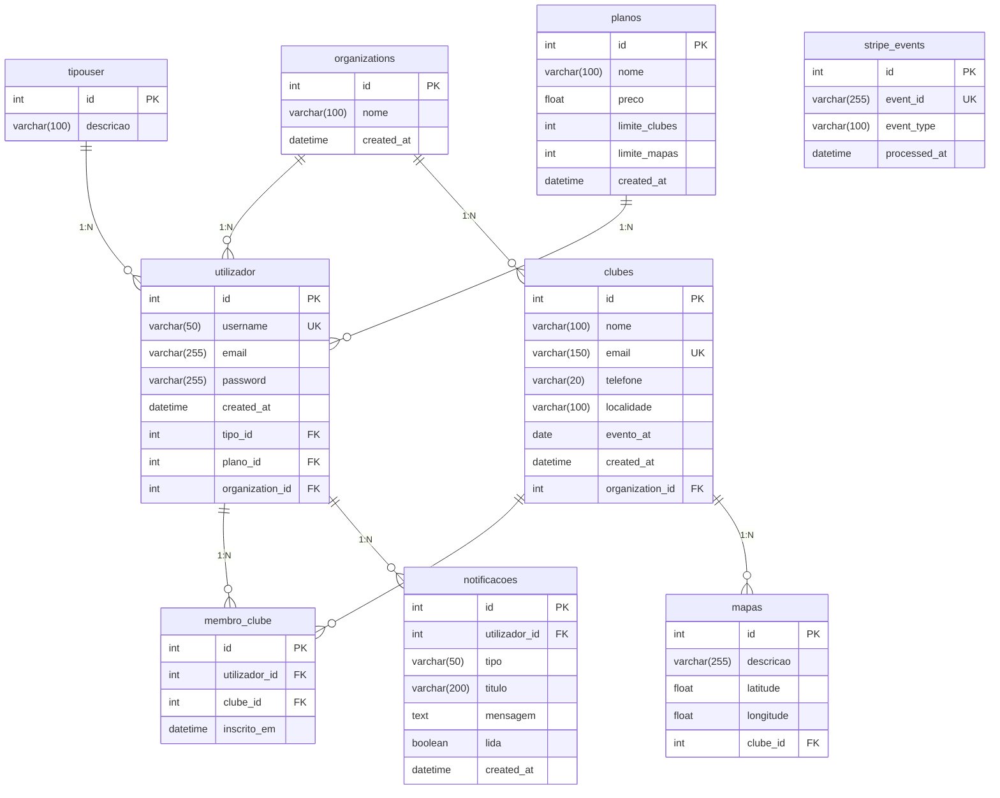
```mermaid
erDiagram
    organizations ||--o{ utilizador : "1:N"
    organizations ||--o{ clubes : "1:N"
    tipouser ||--o{ utilizador : "1:N"
    planos ||--o{ utilizador : "1:N"
    utilizador ||--o{ membro_clube : "1:N"
    utilizador ||--o{ notificacoes : "1:N"
    clubes ||--o{ membro_clube : "1:N"
    clubes ||--o{ mapas : "1:N"

    organizations {
        int id PK
        varchar(100) nome
        datetime created_at
    }

    planos {
        int id PK
        varchar(100) nome
        float preco
        int limite_clubes
        int limite_mapas
        datetime created_at
    }

    tipouser {
        int id PK
        varchar(100) descricao
    }

    utilizador {
        int id PK
        varchar(50) username UK
        varchar(255) email
        varchar(255) password
        datetime created_at
        int tipo_id FK
        int plano_id FK
        int organization_id FK
    }

    clubes {
        int id PK
        varchar(100) nome
        varchar(150) email UK
        varchar(20) telefone
        varchar(100) localidade
        date evento_at
        datetime created_at
        int organization_id FK
    }

    membro_clube {
        int id PK
        int utilizador_id FK
        int clube_id FK
        datetime inscrito_em
    }

    mapas {
        int id PK
        varchar(255) descricao
        float latitude
        float longitude
        int clube_id FK
    }

    stripe_events {
        int id PK
        varchar(255) event_id UK
        varchar(100) event_type
        datetime processed_at
    }

    notificacoes {
        int id PK
        int utilizador_id FK
        varchar(50) tipo
        varchar(200) titulo
        text mensagem
        boolean lida
        datetime created_at
    }
```

> **Constraints:** `UniqueConstraint("utilizador_id", "clube_id")` on `membro_clube` — prevents duplicate membership at DB level. `unique=True` on `utilizador.username`, `clubes.email` and `stripe_events.event_id` (webhook idempotency).

---

### Sequence Diagrams

#### Authentication (Login + Protected Access)

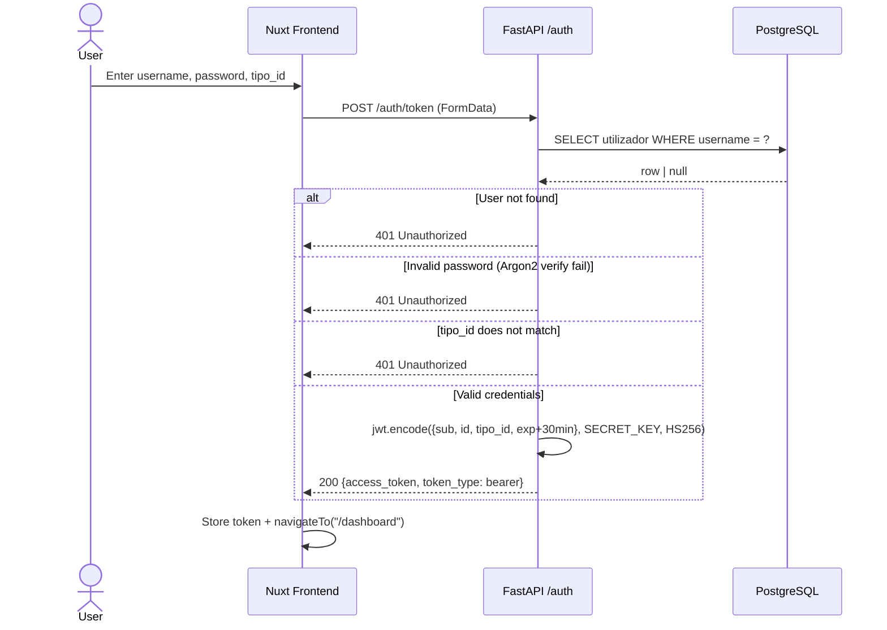
```mermaid
sequenceDiagram
    actor U as User
    participant F as Nuxt Frontend
    participant A as FastAPI /auth
    participant DB as PostgreSQL

    U->>F: Enter username, password, tipo_id
    F->>A: POST /auth/token (FormData)
    A->>DB: SELECT utilizador WHERE username = ?
    DB-->>A: row | null

    alt User not found
        A-->>F: 401 Unauthorized
    else Invalid password (Argon2 verify fail)
        A-->>F: 401 Unauthorized
    else tipo_id does not match
        A-->>F: 401 Unauthorized
    else Valid credentials
        A->>A: jwt.encode({sub, id, tipo_id, exp+30min}, SECRET_KEY, HS256)
        A-->>F: 200 {access_token, token_type: bearer}
    end

    F->>F: Store token + navigateTo("/dashboard")
```

#### Stripe Checkout — Plan Subscription

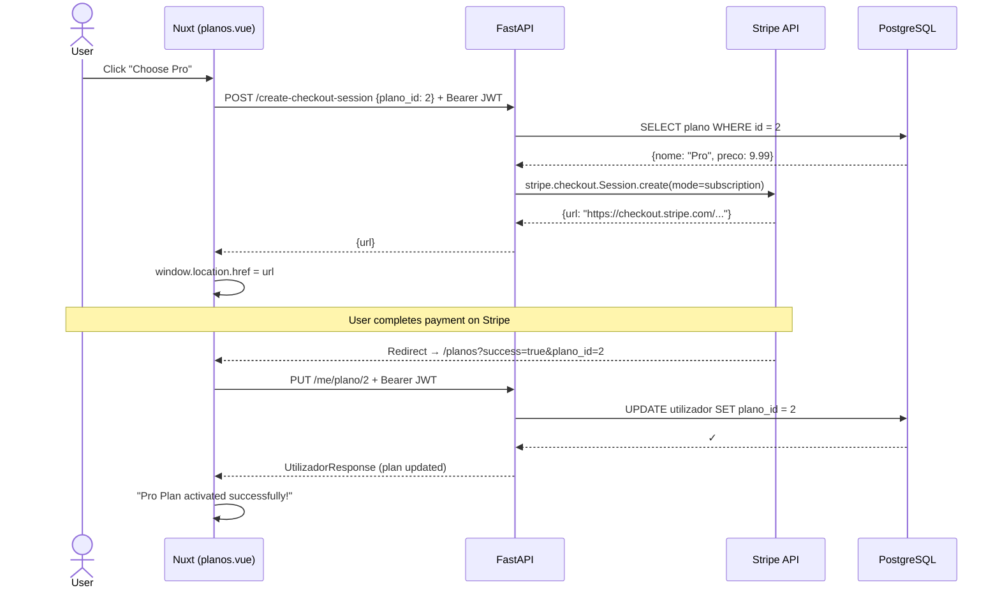
```mermaid
sequenceDiagram
    actor U as User
    participant P as Nuxt (planos.vue)
    participant API as FastAPI
    participant S as Stripe API
    participant DB as PostgreSQL

    U->>P: Click "Choose Pro"
    P->>API: POST /create-checkout-session {plano_id: 2} + Bearer JWT
    API->>DB: SELECT plano WHERE id = 2
    DB-->>API: {nome: "Pro", preco: 9.99}
    API->>S: stripe.checkout.Session.create(mode=subscription)
    S-->>API: {url: "https://checkout.stripe.com/..."}
    API-->>P: {url}
    P->>P: window.location.href = url

    Note over U,S: User completes payment on Stripe

    S-->>P: Redirect → /planos?success=true&plano_id=2
    P->>API: PUT /me/plano/2 + Bearer JWT
    API->>DB: UPDATE utilizador SET plano_id = 2
    DB-->>API: ✓
    API-->>P: UtilizadorResponse (plan updated)
    P->>P: "Pro Plan activated successfully!"
```

#### Stripe Webhook — Async Event Processing

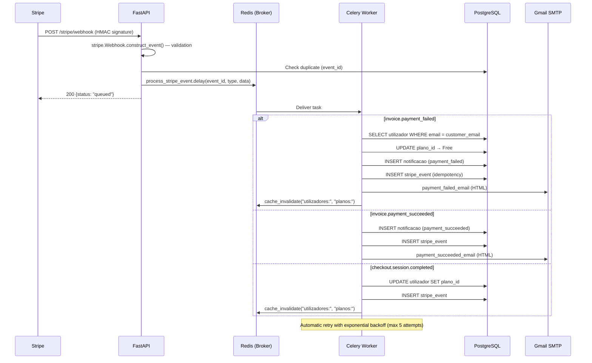
```mermaid
sequenceDiagram
    participant S as Stripe
    participant API as FastAPI
    participant R as Redis (Broker)
    participant W as Celery Worker
    participant DB as PostgreSQL
    participant SMTP as Gmail SMTP

    S->>API: POST /stripe/webhook (HMAC signature)
    API->>API: stripe.Webhook.construct_event() — validation
    API->>DB: Check duplicate (event_id)
    API->>R: process_stripe_event.delay(event_id, type, data)
    API-->>S: 200 {status: "queued"}

    R->>W: Deliver task

    alt invoice.payment_failed
        W->>DB: SELECT utilizador WHERE email = customer_email
        W->>DB: UPDATE plano_id → Free
        W->>DB: INSERT notificacao (payment_failed)
        W->>DB: INSERT stripe_event (idempotency)
        W->>SMTP: payment_failed_email (HTML)
        W->>R: cache_invalidate("utilizadores:", "planos:")
    else invoice.payment_succeeded
        W->>DB: INSERT notificacao (payment_succeeded)
        W->>DB: INSERT stripe_event
        W->>SMTP: payment_succeeded_email (HTML)
    else checkout.session.completed
        W->>DB: UPDATE utilizador SET plano_id
        W->>DB: INSERT stripe_event
        W->>R: cache_invalidate("utilizadores:", "planos:")
    end

    Note over W: Automatic retry with exponential backoff (max 5 attempts)
```

#### CRUD — Create Club (with RBAC + plan limits)

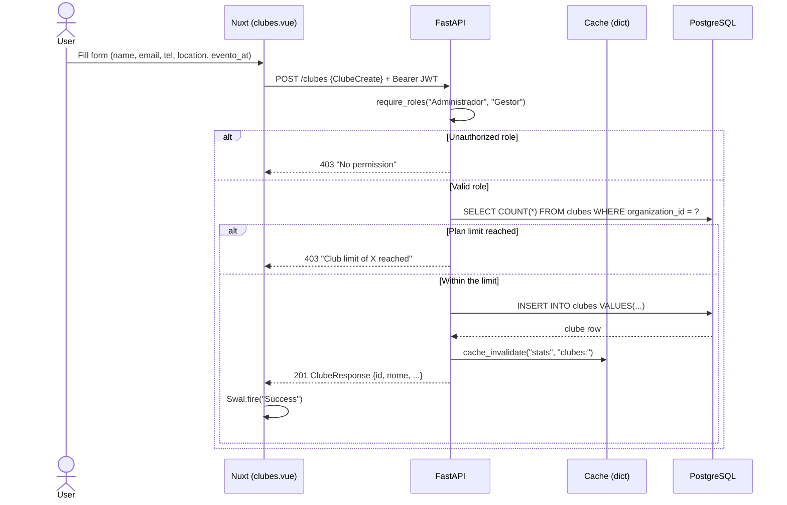
```mermaid
sequenceDiagram
    actor U as User
    participant F as Nuxt (clubes.vue)
    participant API as FastAPI
    participant C as Cache (dict)
    participant DB as PostgreSQL

    U->>F: Fill form (name, email, tel, location, evento_at)
    F->>API: POST /clubes {ClubeCreate} + Bearer JWT
    API->>API: require_roles("Administrador", "Gestor")

    alt Unauthorized role
        API-->>F: 403 "No permission"
    else Valid role
        API->>DB: SELECT COUNT(*) FROM clubes WHERE organization_id = ?
        alt Plan limit reached
            API-->>F: 403 "Club limit of X reached"
        else Within the limit
            API->>DB: INSERT INTO clubes VALUES(...)
            DB-->>API: clube row
            API->>C: cache_invalidate("stats", "clubes:")
            API-->>F: 201 ClubeResponse {id, nome, ...}
            F->>F: Swal.fire("Success")
        end
    end
```

#### Club Join (via Calendar)

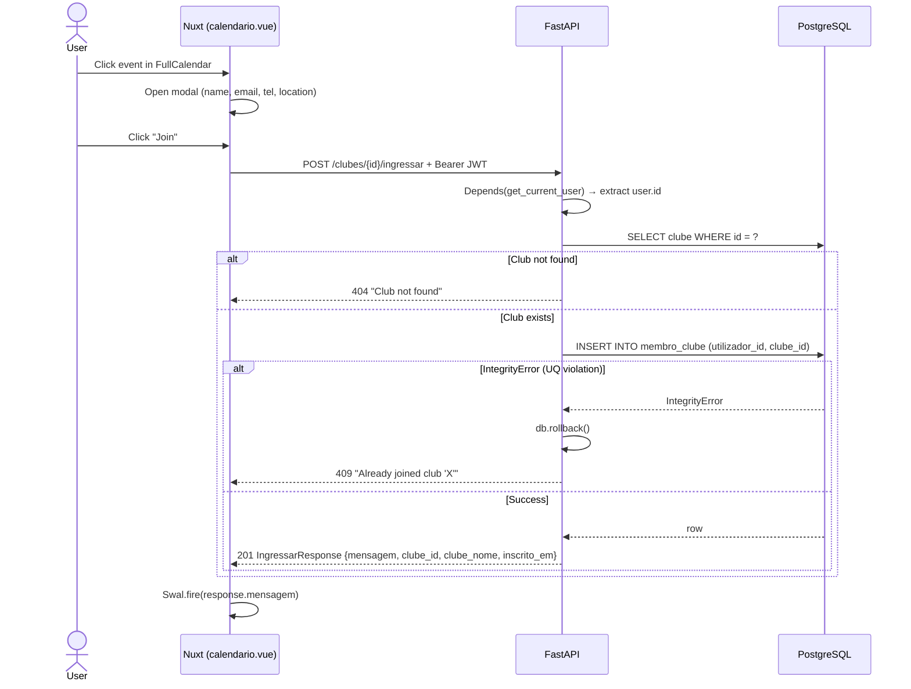
```mermaid
sequenceDiagram
    actor U as User
    participant C as Nuxt (calendario.vue)
    participant API as FastAPI
    participant DB as PostgreSQL

    U->>C: Click event in FullCalendar
    C->>C: Open modal (name, email, tel, location)
    U->>C: Click "Join"
    C->>API: POST /clubes/{id}/ingressar + Bearer JWT

    API->>API: Depends(get_current_user) → extract user.id
    API->>DB: SELECT clube WHERE id = ?
    
    alt Club not found
        API-->>C: 404 "Club not found"
    else Club exists
        API->>DB: INSERT INTO membro_clube (utilizador_id, clube_id)
        
        alt IntegrityError (UQ violation)
            DB-->>API: IntegrityError
            API->>API: db.rollback()
            API-->>C: 409 "Already joined club 'X'"
        else Success
            DB-->>API: row
            API-->>C: 201 IngressarResponse {mensagem, clube_id, clube_nome, inscrito_em}
        end
    end

    C->>C: Swal.fire(response.mensagem)
```

#### Dashboard — Stats Loading (with Redis cache)

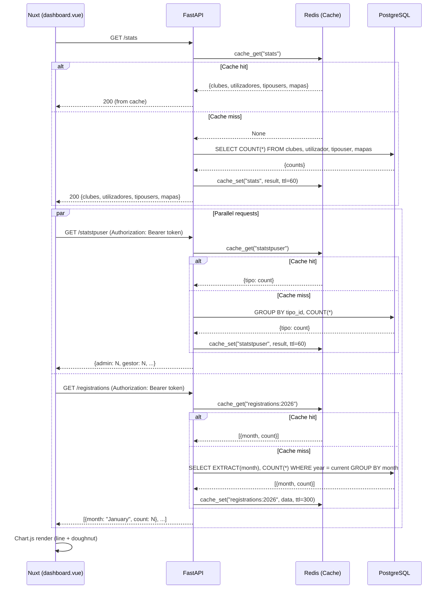
```mermaid
sequenceDiagram
    participant F as Nuxt (dashboard.vue)
    participant API as FastAPI
    participant C as Redis (Cache)
    participant DB as PostgreSQL

    F->>API: GET /stats
    API->>C: cache_get("stats")
    alt Cache hit
        C-->>API: {clubes, utilizadores, tipousers, mapas}
        API-->>F: 200 (from cache)
    else Cache miss
        C-->>API: None
        API->>DB: SELECT COUNT(*) FROM clubes, utilizador, tipouser, mapas
        DB-->>API: {counts}
        API->>C: cache_set("stats", result, ttl=60)
        API-->>F: 200 {clubes, utilizadores, tipousers, mapas}
    end

    par Parallel requests
        F->>API: GET /statstpuser (Authorization: Bearer token)
        API->>C: cache_get("statstpuser")
        alt Cache hit
            C-->>API: {tipo: count}
        else Cache miss
            API->>DB: GROUP BY tipo_id, COUNT(*)
            DB-->>API: {tipo: count}
            API->>C: cache_set("statstpuser", result, ttl=60)
        end
        API-->>F: {admin: N, gestor: N, ...}
    and
        F->>API: GET /registrations (Authorization: Bearer token)
        API->>C: cache_get("registrations:2026")
        alt Cache hit
            C-->>API: [{month, count}]
        else Cache miss
            API->>DB: SELECT EXTRACT(month), COUNT(*) WHERE year = current GROUP BY month
            DB-->>API: [{month, count}]
            API->>C: cache_set("registrations:2026", data, ttl=300)
        end
        API-->>F: [{month: "January", count: N}, ...]
    end

    F->>F: Chart.js render (line + doughnut)
```

---

### Tests — Strategy & Edge Cases

#### Strategy

- **SQLite** for test DB (no PostgreSQL)
- **Redis mocked** in conftest (`_redis = MagicMock()`) — tests pass without local Redis
- **Redis service container** in CI (GitHub Actions)
- **Dependency override** of `get_db` to inject test session
- **Celery tasks** tested directly (no broker) with mocked `SessionLocal`
- Startup event disabled in tests (`on_startup.clear()`)
- Coverage gate: build fails if < 75%

#### Breakdown by file

```
test_auth.py          7 passed   register, JWT, wrong password, tampered token, ...
test_clubes.py        9 passed   CRUD, ingressar, duplicate 409, plan limit 403
test_email.py         5 passed   SMTP config, send ok/fail, payment emails
test_endpoints.py    14 passed   /me, /clubesAdmin, /organizations, /notificacoes, /planos CRUD
test_mapas.py         7 passed   CRUD + 404s
test_stats.py         5 passed   stats, statstpuser, registrations + no auth
test_tipouser.py      6 passed   CRUD + 404s
test_utilizadores.py  4 passed   CRUD + 404
test_webhooks.py     15 passed   webhook validation, checkout flow, Celery task processing
```

#### Tested Edge Cases

| Scenario | Status Code | File |
|----------|-------------|------|
| Forged/tampered JWT token | 401 | `test_auth.py` |
| Login with non-existent user | 401 | `test_auth.py` |
| Access protected route without token | 401 | `test_auth.py` |
| Duplicate username on register | 400 | `test_auth.py` |
| Club plan limit reached | 403 | `test_clubes.py` |
| Duplicate club join (UniqueConstraint) | 409 | `test_clubes.py` |
| CRUD on non-existent resource (club, map, type, user, plan) | 404 | `test_*.py` |
| Empty webhook secret (not configured) | 500 | `test_webhooks.py` |
| Invalid Stripe payload | 400 | `test_webhooks.py` |
| Invalid Stripe signature (HMAC) | 400 | `test_webhooks.py` |
| Duplicate webhook event (idempotency) | 200 duplicate | `test_webhooks.py` |
| Checkout on free plan (price = 0) | 400 | `test_webhooks.py` |
| Stripe API error during checkout | 502 | `test_webhooks.py` |
| Task: duplicate event in Celery worker | skipped | `test_webhooks.py` |
| Task: incomplete metadata in checkout | skipped | `test_webhooks.py` |
| Task: user not found in payment_failed | skipped | `test_webhooks.py` |
| SMTP not configured | False (no-op) | `test_email.py` |
| SMTP send failure | False | `test_email.py` |

</details>

<details>
<summary><strong>✦ ADRs · Docker · Local Setup</strong></summary>

### Technical Decisions (ADR)

| Decision | Why |
|----------|-----|
| **FastAPI** vs Django/Flask | Automatic OpenAPI, native Pydantic validation, DI with `Depends()`, ASGI async |
| **Argon2id** vs bcrypt | PHC winner, GPU/ASIC resistant |
| **Stripe Checkout** (hosted) | Zero PCI compliance, recurring subscriptions with redirect flow |
| **Celery + Redis** for webhooks | Response < 200 ms to Stripe, retry with backoff, idempotency by `event_id` |
| **Multi-tenancy** by organization | `WHERE organization_id = user.organization_id` in queries, no schema separation |
| **RBAC** via `require_roles()` | FastAPI Dependency, server-side enforcement (3 roles: Admin/Manager/Client) |
| **UniqueConstraint** on `membro_clube` | Anti-duplication at DB level, catch `IntegrityError` → 409 |

---

### Docker — Overview

| Service    | Image              | Port  | Role                              |
|------------|--------------------|-------|-----------------------------------|
| `db`       | `postgres:15`      | 5432  | PostgreSQL + healthcheck          |
| `redis`    | `redis:7-alpine`   | 6379  | Cache + Celery broker             |
| `api`      | `python:3.11-slim` | 8000  | FastAPI + Uvicorn                 |
| `worker`   | `python:3.11-slim` | —     | Celery worker (webhooks + emails) |
| `frontend` | `node:20`          | 3000  | Nuxt 3 SSR                        |

```bash
docker compose up --build        # starts the 5 containers
docker compose logs -f api       # backend logs
```

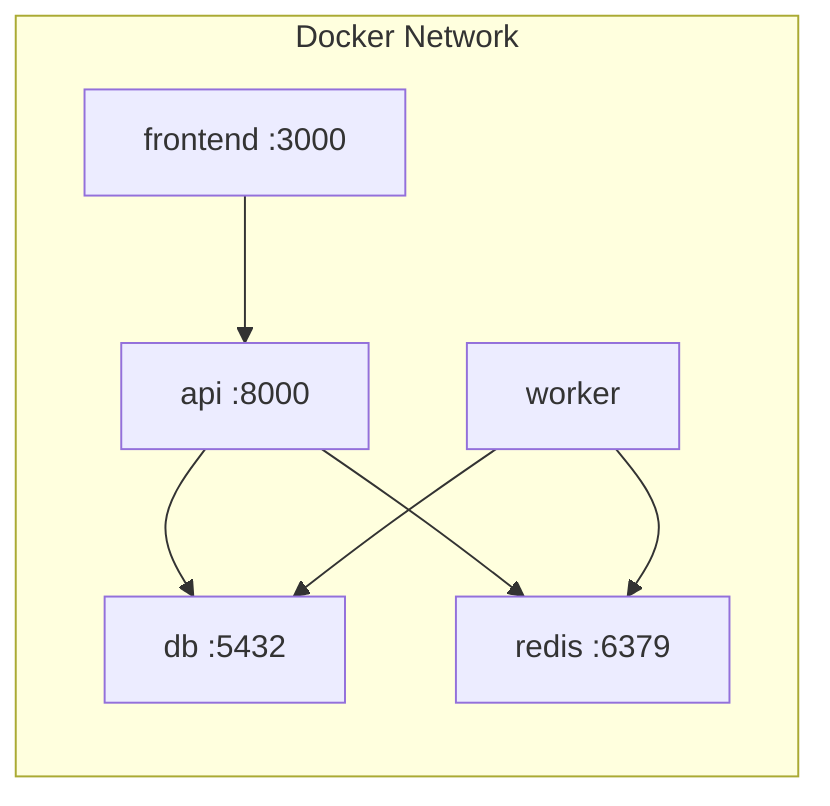
```mermaid
graph LR
    subgraph clubes_net [Docker Network]
        DB["db :5432"]
        RD["redis :6379"]
        API["api :8000"]
        WK["worker"]
        FE["frontend :3000"]
    end
    FE --> API --> DB
    API --> RD
    WK --> DB
    WK --> RD
```

---

### Local Setup (without Docker)

```bash
# Copy example .env and fill it in
cp api/.env.example api/.env

# Backend
cd api/app && pip install -r requirements.txt
uvicorn main:app --host 0.0.0.0 --port 8000
# → http://localhost:8000/docs

# Worker (another tab)
cd api && celery -A app.celery_app:celery worker --loglevel=info

# Frontend (another tab)
cd nuxt-app && npm install && npm run dev
# → http://localhost:3000

# Stripe local webhooks (another tab)
stripe listen --forward-to localhost:8000/stripe/webhook
```

Required variables: `MYSQL_HOST`, `MYSQL_PORT`, `MYSQL_USER`, `MYSQL_PASSWORD`, `MYSQL_DATABASE`, `SECRET_KEY`, `ALGORITHM`, `STRIPE_SECRET_KEY`, `STRIPE_WEBHOOK_SECRET`, `REDIS_URL`, `SMTP_*`.

</details>

---

## Author

**Manuel Silvestre**
